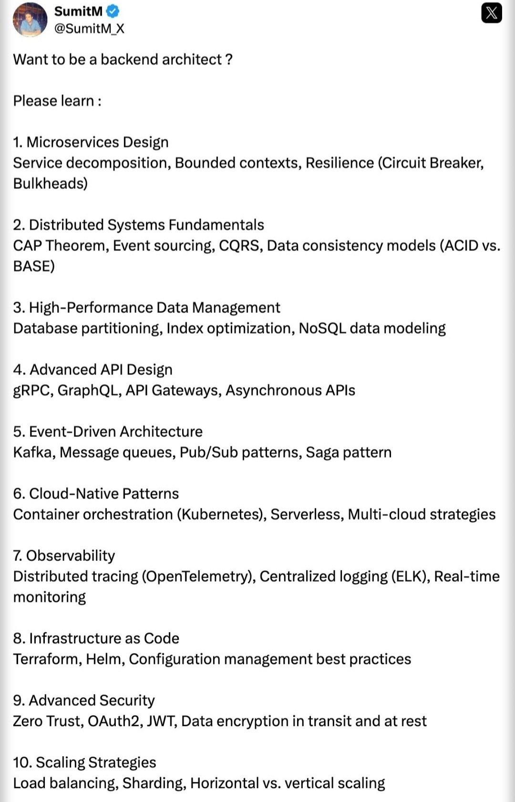

**Source:** [https://twitter.com/i/web/status/1885379904188866994](https://twitter.com/i/web/status/1885379904188866994)
**Original Post Date:** 2025-05-27 15:58:51

# Essential Skills for Becoming a Backend Architect: Comprehensive Roadmap

## Introduction
Becoming a backend architect requires mastering complex system design principles and advanced technologies. This knowledge base item provides a structured roadmap covering critical areas from foundational concepts like microservices architecture to advanced topics such as distributed tracing and zero-trust security. These skills are essential for designing scalable, reliable, and secure backend systems.

## Microservices Design Fundamentals

Service decomposition is critical in breaking down monolithic applications into independent, manageable services that can evolve independently.

- Implement bounded contexts to ensure service autonomy and loose coupling
- Apply circuit breakers and bulkheads for resilience against cascading failures

## Distributed Systems Principles

Understanding the CAP theorem is fundamental when designing distributed systems. You must balance consistency, availability, and partition tolerance based on your specific use case.

- Implement CQRS for read-write separation in high-performance scenarios
- Choose between ACID and BASE consistency models based on requirements

## High-Performance Data Management

Database partitioning and index optimization are crucial for managing large-scale datasets efficiently.

- Design optimal NoSQL schemas using document, key-value, or columnar models

## Cloud-Native Architecture

Container orchestration with Kubernetes and serverless computing are essential for modern cloud deployments.

- Implement multi-cloud strategies to avoid vendor lock-in

## Security and Observability

Zero-trust security model ensures comprehensive protection by never trusting anything implicitly.

- Implement JWT for secure API authentication
- Set up distributed tracing with OpenTelemetry

## Key Takeaways

- Microservices architecture enables independent service evolution and scaling
- Distributed systems require careful consideration of consistency vs availability tradeoffs
- Cloud-native patterns are essential for modern scalable applications
- Security must be integrated at all layers using zero-trust principles

## Conclusion
Mastering these core areas provides a solid foundation for designing robust backend architectures. Focus on understanding both theoretical concepts and practical implementations of each topic.

## External References

- [Kubernetes Documentation](https://kubernetes.io/docs/home/)
- [CAP Theorem Explanation](https://en.wikipedia.org/wiki/CAP_theorem)

## Media

**Image Description:** The image is a screenshot of a tweet by a user named **SumitM** (@SumitM_X) on X (formerly Twitter). The tweet provides a detailed list of topics and skills that one should learn to become a **backend architect**. The content is structured as a numbered list, covering various technical areas essential for backend architecture. Below is a detailed breakdown of the image and its content:

### **Header Information**
- **Profile Picture**: The user's profile picture is visible on the top left, showing a person in a casual setting.
- **Username**: The username is **@SumitM_X**.
- **Verification**: The profile is verified, indicated by a blue checkmark next to the username.
- **Platform**: The tweet is posted on X (formerly Twitter).

### **Main Content**
The tweet begins with a question:  
**"Want to be a backend architect?"**  
This sets the context for the content that follows, which is a comprehensive list of skills and topics to learn.

### **List of Skills and Topics**
The list is numbered from 1 to 10, each covering a specific area of backend architecture. Below is a detailed breakdown of each point:

#### **1. Microservices Design**
- **Service Decomposition**: Breaking down large applications into smaller, independent services.
- **Bounded Contexts**: Defining the boundaries of each service to ensure they are self-contained and loosely coupled.
- **Resilience**: Techniques to ensure services remain functional under failure conditions, including:
  - **Circuit Breaker**: A pattern to prevent cascading failures by stopping requests to a failing service.
  - **Bulkheads**: Isolating services to limit the impact of failures.

#### **2. Distributed Systems Fundamentals**
- **CAP Theorem**: Understanding the trade-offs between Consistency, Availability, and Partition Tolerance in distributed systems.
- **Event Sourcing**: A pattern where the state of a system is derived from a sequence of events.
- **CQRS (Command Query Responsibility Segregation)**: Separating read and write operations to optimize performance and scalability.
- **Data Consistency Models**: Comparing ACID (Atomicity, Consistency, Isolation, Durability) and BASE (Basically Available, Soft state, Eventually consistent) models.

#### **3. High-Performance Data Management**
- **Database Partitioning**: Techniques to distribute data across multiple databases for scalability.
- **Index Optimization**: Optimizing database indexes to improve query performance.
- **NoSQL Data Modeling**: Designing data models for NoSQL databases, which are often schema-less and optimized for specific use cases.

#### **4. Advanced API Design**
- **gRPC**: A high-performance, open-source RPC framework.
- **GraphQL**: A query language for APIs that allows clients to request only the data they need.
- **API Gateways**: Centralized entry points for APIs, often used for routing, authentication, and rate limiting.
- **Asynchronous APIs**: APIs that handle requests and responses asynchronously, improving scalability and responsiveness.

#### **5. Event-Driven Architecture**
- **Kafka**: A distributed streaming platform used for building real-time data pipelines and microservices.
- **Message Queues**: Systems for storing and transmitting messages between services.
- **Pub/Sub Patterns**: Publish-Subscribe patterns for event-driven communication.
- **Saga Pattern**: A pattern for handling distributed transactions in microservices architectures.

#### **6. Cloud-Native Patterns**
- **Container Orchestration (Kubernetes)**: Managing containerized applications at scale.
- **Serverless**: Computing models where the cloud provider dynamically manages the allocation of machine resources.
- **Multi-Cloud Strategies**: Strategies for deploying applications across multiple cloud providers.

#### **7. Observability**
- **Distributed Tracing (OpenTelemetry)**: Tools for monitoring distributed systems and tracing requests across services.
- **Centralized Logging (ELK Stack)**: Using Elastic Stack (Elasticsearch, Logstash, Kibana) for centralized logging and analysis.
- **Real-Time Monitoring**: Tools and techniques for monitoring system performance in real-time.

#### **8. Infrastructure as Code (IaC)**
- **Terraform**: A tool for building, changing, and versioning infrastructure safely and efficiently.
- **Helm**: A package manager for Kubernetes that simplifies the deployment of applications.

#### **9. Advanced Security**
- **Zero Trust**: A security model where no entity is trusted by default, and all requests are verified.
- **Configuration Management**: Best practices for managing and securing configurations in distributed systems.
- **Authentication and Authorization**: Techniques such as OAuth2, JWT (JSON Web Tokens), and data encryption for securing data in transit and at rest.

#### **10. Scaling Strategies**
- **Load Balancing**: Distributing traffic across multiple servers to ensure high availability and performance.
- **Sharding**: Partitioning data across multiple databases or servers.
- **Horizontal vs. Vertical Scaling**: Techniques for scaling systems horizontally (adding more servers) or vertically (increasing server capacity).

### **Visual Layout**
- The text is presented in a clean, readable format with clear numbering and bullet points.
- The content is organized logically, starting from foundational concepts (e.g., Microservices Design) to more advanced topics (e.g., Scaling Strategies).
- The use of bold and capitalized terms emphasizes key concepts and technologies.

### **Relevance**
The tweet is highly relevant for individuals interested in backend architecture, providing a roadmap of essential skills and technologies. It covers a broad spectrum of topics, from microservices and distributed systems to cloud-native patterns and security, making it a comprehensive guide for aspiring backend architects.

### **Conclusion**
The image is a well-structured tweet that serves as an educational resource for those looking to advance their skills in backend architecture. It highlights the importance of understanding both foundational and advanced concepts in building scalable, secure, and efficient backend systems.
