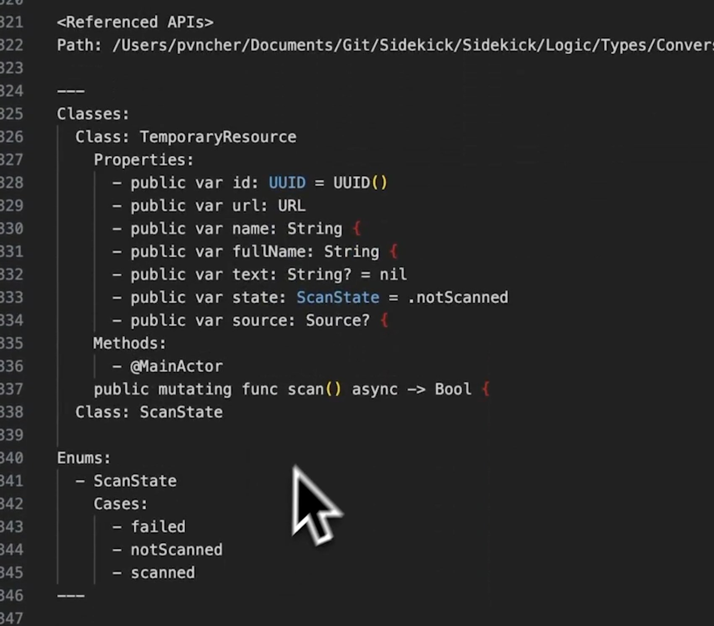

**Source:** [https://twitter.com/i/web/status/1890774044758147223](https://twitter.com/i/web/status/1890774044758147223)
**Original Post Date:** 2025-05-28 01:05:17

# Swift Code Analysis: TemporaryResource Class Pattern with State Management

## Introduction
Understanding code structure is crucial for maintaining scalable software systems. This analysis examines a sophisticated implementation of a resource management system using modern Swift features. The code demonstrates best practices for state management, asynchronous programming, and type safety through careful class and enum design. This example comes from the Sidekick project's converter logic layer, showcasing production-ready patterns.

## Class Structure Analysis

The TemporaryResource class exemplifies modern Swift design principles with a clear separation of concerns. It manages temporary resources through well-defined properties and state tracking mechanisms.

Property initialization leverages value semantics, with UUID for unique identification and optional types (marked with '?') to handle potential nil states gracefully.

```swift
public class TemporaryResource {
    public let id: UUID = UUID()
    public var url: URL
    public var name, fullName: String
    public var text: String?
    public var state: ScanState = .notScanned
    public var source: Source?
}
```

_The @MainActor attribute ensures thread-safe UI updates while performing asynchronous operations_

```swift
@MainActor
func scan() async -> Bool {
    // Implementation
}
```

## State Management with Enums

The ScanState enum demonstrates a robust approach to state management through type safety and exhaustiveness checks. Each case represents a distinct stage in the scanning lifecycle.

This pattern prevents invalid states and enables compile-time guarantees about all possible conditions.

```swift
public enum ScanState {
    case failed
    case notScanned
    case scanned
}
```

## Technical Implementation Details

The code incorporates several Swift language features that enhance type safety and concurrency handling. The use of @MainActor ensures proper thread isolation for UI-related operations.

Optional types are strategically used for properties that may not always have a value, following Swift's strong typing philosophy.

## Key Takeaways

- Implement state management using enums to ensure type safety and exhaustiveness
- Leverage @MainActor for safe UI updates in async operations
- Use optional types strategically to handle nil cases explicitly
- Structure classes with clear separation of concerns and proper access modifiers

## Conclusion
This analysis demonstrates effective use of Swift's modern features to build robust, maintainable code. The patterns shown - from state management to concurrency handling - represent best practices for contemporary iOS development.

## External References

- [Apple Developer Documentation: @MainActor](https://developer.apple.com/documentation/swift/mainactor)
- [Swift Programming Language Guide: Enums](https://docs.swift.org/swift-book/LanguageGuide/Enumerations.html)


## Media

**Image Description:** The image shows a code snippet written in a programming language that appears to be Swift, based on the syntax and structure. The code is displayed in a code editor with a dark theme, where text is highlighted in various colors to indicate different elements such as keywords, types, and comments. Below is a detailed breakdown of the content:

### **Main Subject: Code Structure**
The code defines a class named `TemporaryResource` along with its properties, methods, and an associated enum `ScanState`. The structure is organized into sections labeled `Classes` and `Enums`.

---

### **1. Classes Section**
#### **Class: TemporaryResource**
- **Properties:**
  - `id`: A public property of type `UUID` initialized with `UUID()`.
  - `url`: A public property of type `URL`.
  - `name`: A public property of type `String`.
  - `fullName`: A public property of type `String`.
  - `text`: A public property of type `String?` (optional), initialized to `nil`.
  - `state`: A public property of type `ScanState`, initialized to `.notScanned`.
  - `source`: A public property of type `Source?` (optional).

- **Methods:**
  - `scan()`: An asynchronous method marked with `@MainActor` that returns a `Bool`. The method is intended to perform some operation related to scanning, as suggested by its name and the associated `ScanState` property.

---

### **2. Enums Section**
#### **Enum: ScanState**
- **Cases:**
  - `failed`: Represents a state where the scan has failed.
  - `notScanned`: Represents a state where the scan has not yet been performed.
  - `scanned`: Represents a state where the scan has been completed successfully.

---

### **Additional Observations**
1. **File Path:**
   - The file path is shown at the top of the code snippet:  
     `/Users/pvncher/Documents/Documents/Git/Sidekick/Sidekick/Logic/Types/Converters/...`  
     This indicates that the code is part of a project named `Sidekick`, located in a Git repository.

2. **Syntax and Style:**
   - The code follows Swift's syntax conventions, including:
     - Use of `public` access modifiers for properties and methods.
     - Optional types (`?`) for properties like `text` and `source`.
     - Initialization of properties with default values (e.g., `UUID()`, `.notScanned`).
     - Use of `async` and `@MainActor` for asynchronous operations.

3. **Color Highlighting:**
   - The editor uses color coding to distinguish different elements:
     - **Keywords** (e.g., `public`, `var`, `func`, `async`, `Bool`, `String`, `UUID`, `URL`) are highlighted in one color.
     - **Types** (e.g., `ScanState`, `Source`) are highlighted in another color.
     - **Comments** and other structural elements are in neutral colors.

4. **Cursor Position:**
   - The cursor is positioned near the `ScanState` enum, specifically near the `notScanned` case, indicating that the user might be focusing on this part of the code.

---

### **Summary**
The code defines a class `TemporaryResource` that manages resources with properties such as `id`, `url`, `name`, `fullName`, `text`, `state`, and `source`. The `state` property uses an enum `ScanState` to track the status of a scanning operation, which can be `failed`, `notScanned`, or `scanned`. The class includes an asynchronous method `scan()` to perform the scanning operation. The overall structure is clean and follows Swift's modern conventions, including async/await and actor isolation. The file path suggests that this code is part of a larger project named `Sidekick`.
