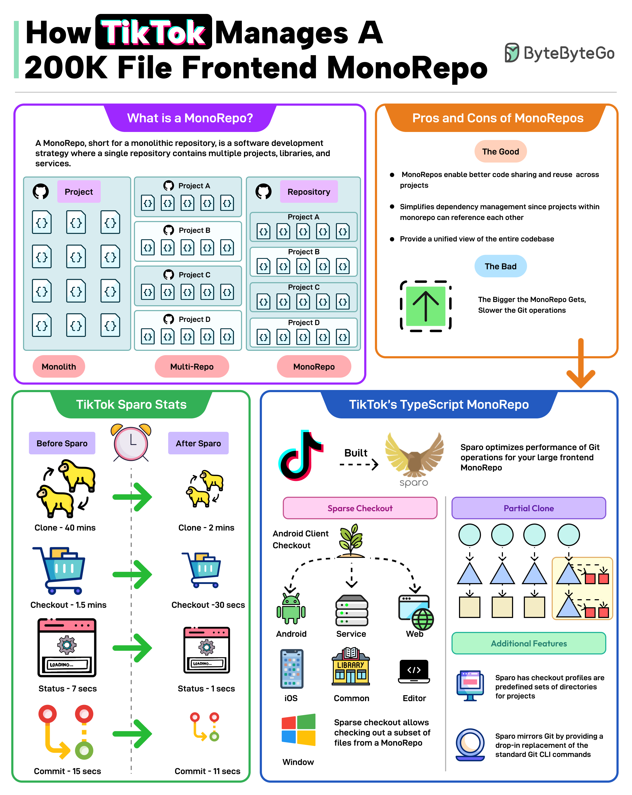

**Source:** [https://twitter.com/i/web/status/1879210653363413375](https://twitter.com/i/web/status/1879210653363413375)
**Original Post Date:** 2025-05-27 16:02:07

# TikTok Frontend Architecture: Managing a 200K File Monorepo with Sparo

## Introduction
Monorepos present unique challenges in modern software development, particularly when managing large-scale applications. This document examines TikTok's approach to managing a 200K-file monorepo through the Sparo tool, focusing on their TypeScript-based architecture and optimization strategies for efficient Git operations across multiple platforms.

## Understanding Monorepos

A monorepo is an architectural pattern where multiple projects, services, and libraries reside in a single repository. Unlike traditional multi-repo setups or monolithic applications, monorepos enable unified dependency management while maintaining project separation.

- Unified codebase for Android client development
- Shared iOS component libraries
- Cross-platform web services
- Common utility modules

## Monorepo Considerations

While monorepos offer significant advantages in code sharing and dependency management, they introduce challenges. The primary concern is performance degradation in Git operations as the repository size increases.

- Enhanced code reuse across projects
- Streamlined dependency management
- Simplified CI/CD pipeline configuration

- Git operation latency increases with scale
- Local repository size management challenges
- Need for specialized tooling like Sparo

## Sparo Optimization Metrics

TikTok's implementation of Sparo demonstrated significant improvements in Git operation performance, reducing clone time from 40 minutes to 2 minutes and checkout time from 1.5 minutes to 30 seconds.

> **Note/Tip:** Sparo's sparse checkout feature reduces local repository size by up to 90%

> **Note/Tip:** Partial clones enable developers to work with only necessary project components

## Technical Implementation Details

The Sparo tool provides a Git-like interface for managing monorepo operations, including sparse checkout and partial cloning capabilities.

Checkout profiles streamline the process by predefining directory sets for different project components.

- Sparse Checkout: Selective file retrieval from remote repository
- Partial Clone: Targeted downloading of specific directories
- Checkout Profiles: Preconfigured directory selections

## Key Takeaways

- Monorepos require specialized tooling to maintain performance at scale
- Sparo significantly improves Git operation efficiency in large repositories
- Checkout profiles and partial cloning are essential for managing monorepo complexity
- TypeScript-based architecture enables consistent type checking across platforms

## Conclusion
TikTok's implementation of a TypeScript monorepo with Sparo demonstrates how modern tooling can effectively manage large-scale frontend codebases. The combination of sparse checkout, partial cloning, and preconfigured profiles provides an efficient solution to the challenges of monorepo maintenance.

## External References

- [Sparo GitHub Repository](https://github.com/bytedance/sparo)
- [TikTok Engineering Blog - Monorepo Implementation](https://engineering.tiktok.com/)

## Media

**Image Description:** ### Image Description: How TikTok Manages a 200K File Frontend MonoRepo

This image is an infographic that explains how TikTok manages a large monorepo (a single repository containing multiple projects, libraries, and services) with over 200,000 files. The infographic is divided into several sections, each focusing on different aspects of monorepos, their pros and cons, and how TikTok optimizes their usage.

---

### **1. What is a MonoRepo?**
- **Definition**: A monorepo is a software development strategy where a single repository contains multiple projects, libraries, and services.
- **Comparison**:
  - **Monolith**: A single large application with all code in one repository.
  - **Multi-Repo**: Multiple repositories, each containing separate projects or services.
  - **MonoRepo**: A single repository containing multiple projects, libraries, and services.
- **Visual Representation**:
  - A monorepo is depicted as a single repository containing multiple projects (e.g., Project A, Project B, Project C, etc.), each with its own files and dependencies.

---

### **2. Pros and Cons of MonoRepos**
- **The Good**:
  - **Code Sharing and Reuse**: Enables better code sharing and reuse across projects.
  - **Dependency Management**: Simplifies dependency management since projects within the monorepo can reference each other.
  - **Unified View**: Provides a unified view of the entire codebase.
- **The Bad**:
  - **Git Operations Slow Down**: As the monorepo grows larger, Git operations (e.g., cloning, checking out) become slower.

---

### **3. TikTok Sparo Stats**
- **Before Sparo**:
  - **Clone**: 40 minutes.
  - **Checkout**: 1.5 minutes.
  - **Status**: 7 seconds.
  - **Commit**: 15 seconds.
- **After Sparo**:
  - **Clone**: 2 minutes.
  - **Checkout**: 30 seconds.
  - **Status**: 1 second.
  - **Commit**: 11 seconds.
- **Key Improvements**:
  - Significant reduction in time for clone, checkout, status, and commit operations.
  - Visualized with before-and-after comparisons using icons (e.g., clock, shopping cart, gear, etc.).

---

### **4. TikTok's TypeScript MonoRepo**
- **Overview**:
  - TikTok uses a TypeScript-based monorepo for its frontend codebase.
  - The monorepo contains multiple projects, including:
    - **Android Client**
    - **iOS Client**
    - **Web**
    - **Service**
    - **Common Libraries**
    - **Editor Tools**
  - **Sparo Tool**:
    - **Sparse Checkout**: Allows developers to check out only the necessary parts of the monorepo, reducing the size of the local repository.
    - **Partial Clone**: Enables cloning only specific directories or files, further optimizing the repository size.
    - **Checkout Profiles**: Predefined sets of directories for projects, making it easier to manage different parts of the monorepo.
    - **Drop-in Replacement**: Sparo mirrors Git commands, providing a seamless experience for developers.

---

### **5. Technical Details**
- **Sparse Checkout**:
  - Allows developers to check out only specific parts of the monorepo, reducing the size of the local repository.
- **Partial Clone**:
  - Enables cloning only specific directories or files, optimizing the repository size.
- **Checkout Profiles**:
  - Predefined sets of directories for projects, making it easier to manage different parts of the monorepo.
- **Sparo CLI Commands**:
  - Sparo provides CLI commands that mirror standard Git commands, ensuring a seamless developer experience.

---

### **Visual Elements**
- **Icons and Symbols**:
  - TikTok logo is prominently displayed.
  - Sparo logo (an owl) is used to represent the tool.
  - Git-related icons (e.g., clone, checkout, commit) are used to illustrate the improvements.
- **Color Coding**:
  - Different sections are color-coded for clarity:
    - Purple for "What is a MonoRepo?"
    - Orange for "Pros and Cons of MonoRepos"
    - Green for "TikTok Sparo Stats"
    - Blue for "TikTok's TypeScript MonoRepo"
- **Arrows and Flow**:
  - Arrows are used to show the before-and-after improvements in Git operations.
  - Flow diagrams illustrate the structure of the monorepo and how Sparo optimizes it.

---

### **Conclusion**
The infographic provides a comprehensive overview of how TikTok manages a large monorepo using the Sparo tool. It highlights the benefits and challenges of monorepos, showcases the significant improvements in Git operations with Sparo, and explains how TikTok's TypeScript-based monorepo is structured and optimized. The use of visuals and clear comparisons makes the technical details accessible and easy to understand.
