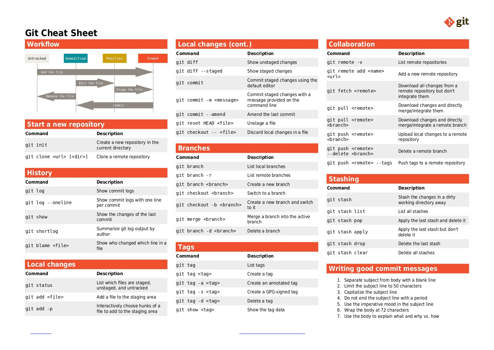

**Source:** [https://twitter.com/i/web/status/1868207061147992094](https://twitter.com/i/web/status/1868207061147992094)
**Original Post Date:** 2025-07-15 12:10:16

# Git Cheat Sheet: Comprehensive Guide for Version Control Operations

## Introduction
This Git cheat sheet provides a comprehensive reference for Git commands and workflows. It is organized into sections focusing on specific aspects of Git usage, including workflow, starting a new repository, history management, local changes, branches, collaboration, stashing, tags, and writing good commit messages. The layout is clean and structured, with clear headings, commands, and descriptions to facilitate quick reference.

## Workflow

This section illustrates the Git workflow using a flowchart, showing key stages such as untracked, unmodified, modified, staged, and committed files. The diagram demonstrates actions like adding, editing, staging, committing, and removing files.

- Untracked: Files not tracked by Git.
- Unmodified: Tracked but unchanged files.
- Modified: Changed but unstaged files.
- Staged: Files added to the staging area.
- Commit: Changes committed to the local repository.

> **Note/Tip:** Understanding the workflow helps in managing changes efficiently and collaborating with others.

## Start a New Repository

This section provides commands to initialize and clone repositories. `git init` initializes a new Git repository, while `git clone <url> [dir]` clones a remote repository into a local directory.

_The first command initializes a new Git repository in the current directory, and the second clones a remote repository into a specified local directory._

```bash
git init
 git clone <url> [dir]
```

## History

Commands to view and analyze commit history include `git log`, which displays the commit history, and `git log --oneline`, which shows it in a concise format. Other commands like `git shortlog` summarize history by author, while `git show` details the last or specific commits.

_These commands help in viewing and analyzing commit history, understanding changes over time, and tracking who made specific modifications._

```bash
git log
 git log --oneline
 git shortlog
 git show
 git blame <file>
```

## Local Changes

`git status` shows the state of the working directory and staging area. `git add <file>` adds a file to the staging area, while `git diff` shows differences between the working directory and the staging area.

_These commands manage changes in the working directory and staging area, allowing for precise control over what gets staged and committed._

```bash
git status
 git add <file>
 git add -A
 git diff
 git diff --staged
 git reset HEAD <file>
 git checkout -- <file>
```

## Local Changes (Continued)

`git commit` commits staged changes using the default editor. `git commit -m "<message>"` allows committing with a provided message, while `git commit --amend` amends the last commit.

_These commands are essential for committing changes to the local repository, with options to provide messages and amend previous commits._

```bash
git commit
 git commit -m "<message>"
 git commit --amend
```

## Branches

`git branch` lists local branches, while `git branch -r` lists remote branches. Creating a new branch can be done with `git branch <branch>`, and switching to it with `git checkout <branch>`.

_These commands manage branches, allowing for the creation, switching, merging, and deletion of branches to facilitate parallel development._

```bash
git branch
 git branch -r
 git branch <branch>
 git checkout <branch>
 git checkout -b <branch>
 git merge <branch>
 git branch -d <branch>
```

## Collaboration

`git remote -v` lists remote repositories. Adding a new remote repository is done with `git remote add <name> <url>`, while `git fetch <remote>` downloads changes without merging.

_These commands facilitate collaboration by managing remote repositories, fetching and pulling changes, and pushing local changes to a remote repository._

```bash
git remote -v
 git remote add <name> <url>
 git fetch <remote>
 git pull <remote>
 git push <remote> <branch>
 git push <remote> --delete <branch>
 git push <remote> --tags
```

## Stashing

`git stash` saves changes in a dirty working directory. `git stash list` lists all stashes, while `git stash pop` applies the last stash and deletes it.

_These commands allow for temporarily saving and restoring changes, which is useful when switching branches or applying patches._

```bash
git stash
 git stash list
 git stash pop
 git stash apply
 git stash drop
 git stash clear
```

## Tags

`git tag` lists all tags. Creating a lightweight tag can be done with `git tag <tag>`, while an annotated tag uses `git tag -a <tag>`.

_These commands manage tags, which are used to mark specific points in the repository's history._

```bash
git tag
 git tag <tag>
 git tag -a <tag>
 git tag -s <tag>
 git tag -d <tag>
 git show <tag>
```

## Writing Good Commit Messages

Guidelines for crafting effective commit messages include separating the subject from the body with a blank line, limiting the subject line to 50 characters, and using the imperative mood in the subject line.

1. Separate the subject from the body with a blank line.
1. Limit the subject line to 50 characters.
1. Capitalize the subject line.
1. Do not end the subject line with a period.
1. Use the imperative mood in the subject line.
1. Wrap the body at 72 characters.
1. Use the body to explain what, why, and how the changes were made.

> **Note/Tip:** Following these guidelines ensures that commit messages are clear, concise, and informative.

## Key Takeaways

- Understanding Git workflow stages is crucial for efficient version control.
- Essential commands for initializing, cloning, and managing repositories are fundamental.
- Viewing and analyzing commit history helps in tracking changes over time.
- Managing local changes involves staging, committing, and amending commits.
- Branches facilitate parallel development and collaboration.
- Collaboration commands enable working with remote repositories effectively.
- Stashing allows for temporarily saving changes without committing them.
- Tags mark specific points in the repository's history for easy reference.
- Writing good commit messages ensures clarity and informativeness.

## Conclusion
This Git cheat sheet covers essential commands, workflows, and best practices for version control. It is organized into sections focusing on specific aspects of Git usage, including workflow, starting a new repository, history management, local changes, branches, collaboration, stashing, tags, and writing good commit messages. The layout is clean and structured, with clear headings, commands, and descriptions to facilitate quick reference.

## External References

- [Git Official Documentation](https://git-scm.com/doc)
- [Pro Git Book](https://git-scm.com/book/en/v2)


## Media

**Image Description:** ### Description of the Image: Git Cheat Sheet

The image is a comprehensive **Git Cheat Sheet** designed to provide a quick reference for Git commands and workflows. It is organized into several sections, each focusing on a specific aspect of Git usage. The layout is clean and structured, with clear headings, commands, and descriptions. Below is a detailed breakdown of the content:

---

### **Main Sections**

#### **1. Workflow**
- **Description**: This section illustrates the Git workflow using a flowchart.
- **Key Stages**:
  - **Untracked**: Files that are not being tracked by Git.
  - **Unmodified**: Files that are tracked but have not been changed.
  - **Modified**: Files that have been changed but not staged.
  - **Staged**: Files that have been added to the staging area.
  - **Commit**: Changes that have been committed to the local repository.
- **Flowchart**: The diagram shows the flow of actions such as adding, editing, staging, committing, and removing files.

---

#### **2. Start a New Repository**
- **Description**: Commands to initialize and clone repositories.
- **Commands**:
  - `git init`: Initializes a new Git repository in the current directory.
  - `git clone <url> [dir]`: Clones a remote repository into a local directory.

---

#### **3. History**
- **Description**: Commands to view and analyze commit history.
- **Commands**:
  - `git log`: Displays the commit history.
  - `git log --oneline`: Shows the commit history in a concise, one-line format.
  - `git shortlog`: Summarizes the commit history by author.
  - `git show`: Displays details of the last commit or a specific commit.
  - `git blame <file>`: Shows which commit and author changed each line in a file.

---

#### **4. Local Changes**
- **Description**: Commands to manage changes in the working directory and staging area.
- **Commands**:
  - `git status`: Shows the state of the working directory and staging area.
  - `git add <file>`: Adds a file to the staging area.
  - `git add -A`: Adds all changes (staged and unstaged) to the staging area.
  - `git diff`: Shows differences between the working directory and the staging area.
  - `git diff --staged`: Shows differences between the staging area and the last commit.
  - `git reset HEAD <file>`: Unstages a file from the staging area.
  - `git checkout -- <file>`: Discards local changes in a file.

---

#### **5. Local Changes (Continued)**
- **Description**: Commands related to committing changes.
- **Commands**:
  - `git commit`: Commits staged changes using the default editor.
  - `git commit -m "<message>"`: Commits staged changes with a provided message.
  - `git commit --amend`: Amends the last commit (modifies its message or content).

---

#### **6. Branches**
- **Description**: Commands to manage branches.
- **Commands**:
  - `git branch`: Lists local branches.
  - `git branch -r`: Lists remote branches.
  - `git branch <branch>`: Creates a new branch.
  - `git checkout <branch>`: Switches to a branch.
  - `git checkout -b <branch>`: Creates a new branch and switches to it.
  - `git merge <branch>`: Merges a branch into the active branch.
  - `git branch -d <branch>`: Deletes a branch.

---

#### **7. Collaboration**
- **Description**: Commands for working with remote repositories.
- **Commands**:
  - `git remote -v`: Lists remote repositories.
  - `git remote add <name> <url>`: Adds a new remote repository.
  - `git fetch <remote>`: Downloads changes from a remote repository without merging.
  - `git pull <remote>`: Downloads and merges changes from a remote repository.
  - `git push <remote> <branch>`: Uploads local changes to a remote repository.
  - `git push <remote> --delete <branch>`: Deletes a remote branch.
  - `git push <remote> --tags`: Pushes tags to a remote repository.

---

#### **8. Stashing**
- **Description**: Commands to temporarily save and restore changes.
- **Commands**:
  - `git stash`: Saves changes in a dirty working directory.
  - `git stash list`: Lists all stashes.
  - `git stash pop`: Applies the last stash and deletes it.
  - `git stash apply`: Applies the last stash without deleting it.
  - `git stash drop`: Deletes the last stash.
  - `git stash clear`: Deletes all stashes.

---

#### **9. Tags**
- **Description**: Commands to manage tags.
- **Commands**:
  - `git tag`: Lists all tags.
  - `git tag <tag>`: Creates a lightweight tag.
  - `git tag -a <tag>`: Creates an annotated tag.
  - `git tag -s <tag>`: Creates a signed tag.
  - `git tag -d <tag>`: Deletes a tag.
  - `git show <tag>`: Displays the tag data.

---

#### **10. Writing Good Commit Messages**
- **Description**: Guidelines for crafting effective commit messages.
- **Guidelines**:
  1. Separate the subject from the body with a blank line.
  2. Limit the subject line to 50 characters.
  3. Capitalize the subject line.
  4. Do not end the subject line with a period.
  5. Use the imperative mood in the subject line.
  6. Wrap the body at 72 characters.
  7. Use the body to explain what, why, and how the changes were made.

---

### **Design and Layout**
- **Color Coding**:
  - **Red Header**: Used for section titles (e.g., Workflow, History, Branches).
  - **Gray Background**: Used for command descriptions to improve readability.
- **Icons**: The Git logo is present in the top-right corner, reinforcing the Git theme.
- **Structure**: The sheet is organized into columns and sections for easy navigation.

---

### **Purpose**
This cheat sheet serves as a quick reference guide for Git users, providing essential commands and best practices for version control tasks. It is particularly useful for developers who need to perform Git operations efficiently.

---

This detailed description covers the main content and structure of the Git Cheat Sheet, highlighting its technical details and organization.
