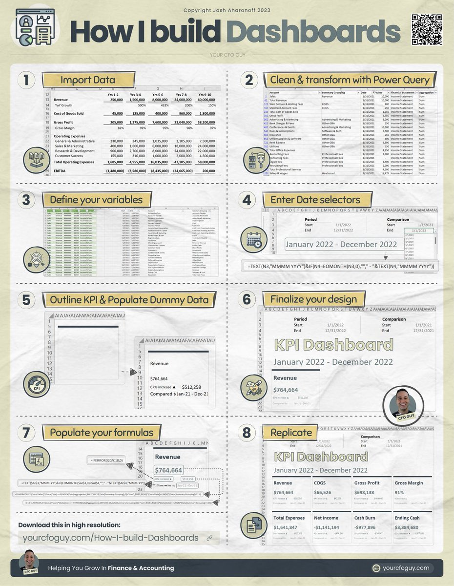

**Source:** [https://twitter.com/i/web/status/1870041134342234138](https://twitter.com/i/web/status/1870041134342234138)
**Original Post Date:** 2025-07-12 21:36:17

# Building Dashboards: A Step-by-Step Guide by Josh Aharonoff

## Introduction
This knowledge base item provides a detailed breakdown of the infographic 'How I Build Dashboards' by Josh Aharonoff. The infographic offers a step-by-step guide for creating financial dashboards, targeting finance professionals, accountants, or anyone interested in data visualization and reporting. Below is a structured analysis of each section and step presented in the infographic.

## Main Title and Layout

The infographic titled 'How I Build Dashboards' by Josh Aharonoff provides a step-by-step guide for creating financial dashboards. The main title is prominently displayed at the top in bold, black text.

The copyright notice indicates that the infographic is copyrighted by Josh Aharonoff in 2023. The author is identified as 'YOUR CFO GUY,' with a logo featuring a smiling man in a circular frame.

The purpose of the infographic is to help users create financial dashboards efficiently.

> **Note/Tip:** Ensure that the title and layout are clear and professional to engage the audience effectively.

## Step-by-Step Guide

The infographic is divided into 8 steps, each with a corresponding icon, title, and visual example. Below is a detailed breakdown of each step:

1. Import Data: This step involves importing historical financial data into the dashboard.
1. Clean & Transform with Power Query: Focus on cleaning and transforming raw data using Power Query.
1. Define Your Variables: Define variables and parameters that will be used in the dashboard.
1. Enter Date Selectors: Set up date selectors to allow users to filter data by specific time periods.
1. Outline KPI & Populate Dummy Data: Outline key performance indicators (KPIs) and populate the dashboard with dummy data for testing and visualization.
1. Finalize Your Design: Refine the dashboard's design, ensuring it is visually appealing and user-friendly.
1. Populate Your Formulas: Embed formulas to calculate and display dynamic data in the dashboard.
1. Replicate: Replicate the dashboard for different departments, time periods, or other use cases.

> **Note/Tip:** Each step is clearly defined with visual examples to guide the reader through the dashboard-building process.

## Additional Elements

The footer includes a call-to-action to download the infographic in high resolution from the website: yourcfcoguy.com/How-I-build-Dashboards.

The footer also features the tagline: 'Helping You Grow In Finance & Accounting.'

A QR code is present in the top-right corner, likely linking to more resources or the author's website.

> **Note/Tip:** Utilize additional elements like footers and QR codes to provide further resources and engage with the audience.

## Overall Design

The infographic is well-organized, using a combination of text, icons, and visual examples to guide the reader through the dashboard-building process.

Each step is clearly defined, and the visual examples provide practical insights into how to implement each step effectively.

> **Note/Tip:** Ensure that the design is clean, professional, and easy to follow for maximum impact.

## Purpose

The primary purpose of this infographic is to educate readers on how to build financial dashboards using tools like Excel and Power Query.

It is targeted at finance professionals, accountants, or anyone looking to improve their data visualization and reporting skills.

> **Note/Tip:** Understand the target audience and purpose of the infographic to tailor the content effectively.

## Key Takeaways

- The infographic provides a comprehensive guide for building financial dashboards using Excel and Power Query.
- Each step is clearly defined with visual examples, making it easy to follow and implement.
- Additional elements like footers and QR codes provide further resources and engage with the audience.
- The design is clean, professional, and well-organized, ensuring clarity and practicality for both beginners and experienced users.

## Conclusion
In summary, 'How I Build Dashboards' by Josh Aharonoff offers a detailed and practical guide for creating financial dashboards. The step-by-step approach, combined with visual examples and additional resources, makes it an invaluable tool for finance professionals and anyone interested in data visualization and reporting.

## External References

- [Josh Aharonoff's website](https://www.yourcfcoguy.com/How-I-build-Dashboards)

## Media

**Image Description:** This image is a detailed infographic titled **"How I Build Dashboards"** by Josh Aharonoff, as indicated at the top of the image. The infographic provides a step-by-step guide for creating financial dashboards, likely aimed at finance professionals, accountants, or anyone interested in data visualization and reporting. Below is a detailed breakdown of the image:

### **Main Title and Layout**
- **Title**: "How I Build Dashboards" is prominently displayed at the top in bold, black text.
- **Copyright**: The infographic is copyrighted by Josh Aharonoff in 2023.
- **Brand/Author**: The author is identified as "YOUR CFO GUY," with a logo featuring a smiling man in a circular frame.
- **Purpose**: The infographic is designed to help users create financial dashboards efficiently.

### **Step-by-Step Guide**
The infographic is divided into **8 steps**, each with a corresponding icon, title, and visual example. Here’s a detailed breakdown of each step:

#### **Step 1: Import Data**
- **Icon**: A book or document icon.
- **Title**: "Import Data."
- **Description**: This step involves importing historical financial data into the dashboard.
- **Visual Example**: A table showing revenue, cost of goods sold (COGS), gross profit, and other financial metrics over multiple years (e.g., Yrs 1-2, Yrs 3-4, etc.). The data is presented in a tabular format with columns for different time periods.

#### **Step 2: Clean & Transform with Power Query**
- **Icon**: A light bulb icon.
- **Title**: "Clean & Transform with Power Query."
- **Description**: This step focuses on cleaning and transforming raw data using Power Query, a tool in Excel.
- **Visual Example**: A screenshot of a Power Query editor showing data transformation steps, such as grouping, filtering, and summarizing financial data.

#### **Step 3: Define Your Variables**
- **Icon**: A gear icon.
- **Title**: "Define Your Variables."
- **Description**: This step involves defining variables and parameters that will be used in the dashboard, such as time periods, financial metrics, etc.
- **Visual Example**: A table showing defined variables, such as revenue, COGS, and other financial metrics.

#### **Step 4: Enter Date Selectors**
- **Icon**: A calendar icon.
- **Title**: "Enter Date Selectors."
- **Description**: This step involves setting up date selectors to allow users to filter data by specific time periods.
- **Visual Example**: A table showing date ranges (e.g., January 2022 - December 2022) and formulas for dynamic date selection.

#### **Step 5: Outline KPI & Populate Dummy Data**
- **Icon**: A KPI icon.
- **Title**: "Outline KPI & Populate Dummy Data."
- **Description**: This step involves outlining key performance indicators (KPIs) and populating the dashboard with dummy data for testing and visualization.
- **Visual Example**: A bar chart showing revenue data for a specific period (e.g., January 2022 - December 2022) with a comparison to a previous period.

#### **Step 6: Finalize Your Design**
- **Icon**: A paintbrush icon.
- **Title**: "Finalize Your Design."
- **Description**: This step focuses on refining the dashboard's design, ensuring it is visually appealing and user-friendly.
- **Visual Example**: A polished dashboard layout showing revenue, COGS, gross profit, and other metrics in a clean, organized format.

#### **Step 7: Populate Your Formulas**
- **Icon**: A formula icon.
- **Title**: "Populate Your Formulas."
- **Description**: This step involves embedding formulas to calculate and display dynamic data in the dashboard.
- **Visual Example**: A formula bar showing an Excel formula for calculating revenue or other metrics.

#### **Step 8: Replicate**
- **Icon**: A document icon.
- **Title**: "Replicate."
- **Description**: This step involves replicating the dashboard for different departments, time periods, or other use cases.
- **Visual Example**: A dashboard showing multiple KPIs (e.g., revenue, COGS, gross profit, etc.) for a specific period.

### **Additional Elements**
- **Footer**: 
  - The footer includes a call-to-action to download the infographic in high resolution from the website: **yourcfcoguy.com/How-I-build-Dashboards**.
  - The footer also features the tagline: "Helping You Grow In Finance & Accounting."
- **QR Code**: A QR code is present in the top-right corner, likely linking to more resources or the author's website.
- **Color Scheme**: The infographic uses a clean, professional color scheme with yellow, black, and white, making it visually appealing and easy to read.

### **Overall Design**
The infographic is well-organized, using a combination of text, icons, and visual examples to guide the reader through the dashboard-building process. Each step is clearly defined, and the visual examples provide practical insights into how to implement each step effectively.

### **Purpose**
The primary purpose of this infographic is to educate readers on how to build financial dashboards using tools like Excel and Power Query. It is targeted at finance professionals, accountants, or anyone looking to improve their data visualization and reporting skills. The step-by-step approach ensures clarity and practicality, making it a valuable resource for both beginners and experienced users.
