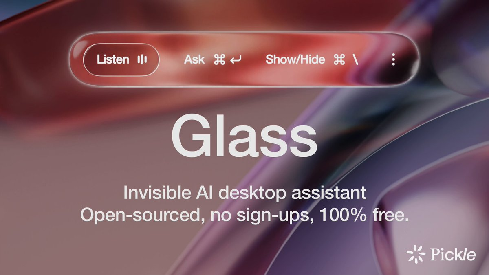

**Source:** [https://twitter.com/i/web/status/1940826326052769949](https://twitter.com/i/web/status/1940826326052769949)
**Original Post Date:** 2025-07-14 20:25:14

# Glass: Invisible AI Desktop Assistant - Technical Analysis

## Introduction
Glass is a conceptual design for an AI-powered desktop assistant that emphasizes invisibility, openness, and accessibility. This analysis delves into its key features, design elements, and technical implications.

## Product Overview

Glass is positioned as an 'Invisible AI desktop assistant', indicating a focus on unobtrusive, intelligent assistance for users. The product is described as open-sourced, free of charge, and requiring no sign-ups, which suggests a commitment to transparency and user convenience.

The central design element is the repetition of the word 'Glass' in large, bold white font against a dark gradient background. This emphasizes the product's name and creates visual impact.

> **Note/Tip:** The use of an invisible AI assistant implies a focus on user experience and minimalistic design.

> **Note/Tip:** The open-source nature of Glass suggests potential for community-driven development and customization.

## Key Features

Glass offers voice input functionality through a 'Listen' button with a microphone icon, indicating support for natural language processing and hands-free operation.

The 'Ask' button with a question mark icon suggests a query or search feature, likely powered by AI to provide relevant information or assistance.

- Show/Hide toggle for controlling the assistant's visibility.
- Additional icons and buttons for customization and settings.

## Design Elements

The design employs a dark gradient background with shades of red, purple, and brown, creating a modern and futuristic aesthetic.

White text ensures readability and focus on the product's key features.

_This HTML snippet represents the UI bar with interactive buttons for controlling Glass._

```html
<div class='ui-bar'>
  <button class='listen-btn'><i class='microphone-icon'></i> Listen</button>
  <button class='ask-btn'><i class='question-mark-icon'></i> Ask</button>
  <button class='toggle-btn'><i class='toggle-icon'></i> Show/Hide</button>
  <button class='settings-btn'><i class='gear-icon'></i></button>
  <button class='menu-btn'><i class='menu-icon'></i></button>
</div>
```

## Technical Implications

The emphasis on 'Invisible AI' suggests a focus on background processing and minimal user interface, which could imply advanced machine learning algorithms running in the background.

The open-source nature of Glass indicates potential for community collaboration, code transparency, and customization by users.

## Conclusion
Glass represents an innovative approach to AI-powered desktop assistants, focusing on invisibility, openness, and accessibility. Its design elements and key features suggest a commitment to user experience and community collaboration.

## External References

- [Open-source software](https://opensource.org/)
- [AI-powered assistants](https://en.wikipedia.org/wiki/Artificial_intelligence)


## Media

**Image Description:** The image appears to be a promotional or conceptual design for a software or application called **"Glass"**, which is described as an **"Invisible AI desktop assistant."** Below is a detailed description of the image:

### **Main Subject:**
The central focus of the image is the text and design elements that highlight the product, **"Glass."** The text is prominently displayed in the center of the image, with the word **"Glass"** written in large, bold, white font. The repetition of the word "Glass" emphasizes its importance.

### **Text Details:**
1. **"Glass"**:
   - The word "Glass" is repeated twice in large, bold, white font, making it the focal point of the image.
   - The repetition creates a visual emphasis and draws attention to the product name.

2. **Tagline**:
   - Below the product name, there is a tagline in smaller white text that reads:
     **"Invisible AI desktop assistant"**
   - This tagline describes the product's key features: it is AI-powered, designed for desktop use, and operates invisibly (likely implying minimalistic or unobtrusive functionality).

3. **Additional Text**:
   - Below the tagline, there is another line of text that reads:
     **"Open-sourced, no sign-ups, 100% free."**
   - This text highlights the product's openness, accessibility, and cost-free nature, emphasizing transparency and user convenience.

### **Design Elements:**
1. **Color Scheme**:
   - The background is a gradient of dark, muted colors, primarily shades of red, purple, and brown. This creates a modern and somewhat futuristic aesthetic.
   - The text is in white, which contrasts sharply with the dark background, ensuring readability and focus.

2. **UI Bar**:
   - At the top of the image, there is a red, rounded UI bar that resembles a control panel or interface element.
   - The bar contains several interactive buttons and icons:
     - **"Listen"**: A button with a microphone icon, suggesting voice input functionality.
     - **"Ask"**: A button with a question mark icon, indicating a query or search feature.
     - **"Show/Hide"**: A button with a toggle icon, likely for controlling the visibility of the assistant.
     - Additional icons and buttons are present, including a settings gear icon and a menu icon (three vertical dots), suggesting further customization options.

3. **Curved Shapes**:
   - The background features smooth, curved shapes that give the image a sleek, modern, and somewhat abstract appearance. These shapes add depth and a sense of motion, enhancing the futuristic feel.

### **Branding**:
- In the bottom-right corner, there is a logo with the text **"Pickle"** and a star-like symbol. This suggests that the product may be associated with or developed by a company or organization named "Pickle."

### **Technical Details:**
- The image appears to be a conceptual or promotional graphic rather than a functional interface. It is designed to convey the key features and benefits of the product in a visually appealing manner.
- The emphasis on "Invisible AI," "open-sourced," and "free" suggests that the product is intended to be user-friendly, accessible, and transparent.

### **Overall Impression:**
The image effectively communicates the core idea of **"Glass"** as an AI-powered desktop assistant that is invisible, open-sourced, and free. The design is modern and futuristic, with a focus on clean typography and a minimalistic interface. The use of gradients and smooth curves adds to the sleek and innovative feel of the product. The UI bar at the top provides a glimpse into the interactive features, making the concept more tangible for the viewer.
