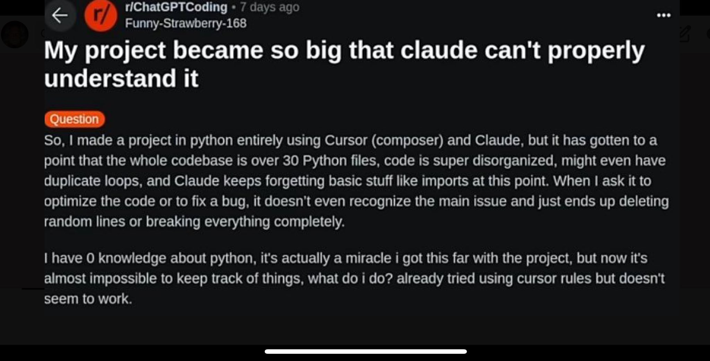

**Source:** [https://twitter.com/i/web/status/1890931202863116769](https://twitter.com/i/web/status/1890931202863116769)
**Original Post Date:** 2025-05-27 20:27:00

# Managing Large Python Codebases: Strategies for Organization and AI Assistant Integration

## Introduction
Developing complex software systems often leads to unwieldy codebases that become difficult to manage. This article explores strategies for organizing large-scale Python projects, addresses the challenges of using AI coding assistants like Claude, and provides practical approaches to maintain code quality while scaling development efforts. Drawing from real-world experiences similar to the described Reddit post scenario, we'll examine effective solutions for maintaining clean architecture and leveraging modern development tools.

## Understanding Codebase Complexity

Large Python projects typically evolve organically, often becoming disorganized without proper architectural planning. The described project with over 30 files exemplifies common challenges: duplicate code segments, missing imports, and general structural entropy.

When a codebase reaches this scale without proper organization, even experienced developers struggle to maintain context. AI assistants like Claude can become unreliable when presented with complex systems they don't fully understand.

1. Implement modular architecture using packages and submodules
1. Establish clear naming conventions for files and functions
1. Create a comprehensive project documentation system

> **Note/Tip:** Regular code reviews and refactoring sessions are crucial as the project grows.

> **Note/Tip:** Use tools like `import-linter` or `pylint` to enforce import consistency.

## Effective AI Assistant Integration

AI coding assistants can be valuable development partners but require proper configuration and usage strategies. The described issues with Claude highlight common pitfalls when using such tools.

To maximize effectiveness, structure requests carefully and verify all suggestions through code review.

```python
# Example of a well-structured request to an AI assistant
# Goal: Refactor this function for better readability
def process_data(data):
    # Original messy implementation here
    return result
```

- Break down complex tasks into smaller, manageable requests
- Always verify AI-generated code with manual testing
- Use version control to track changes made by AI suggestions

## Code Organization Strategies

Implementing a clean architecture pattern helps manage complexity. The described project would benefit from restructuring into logical components with clear responsibilities.

Using dependency injection and modular design principles can improve code maintainability.

_Demonstrates separation of concerns using distinct modules for different functionality_

```python
# Example of modular structure
from src.data import DataProcessor
from src.analysis import AnalysisEngine
class Application:
    def __init__(self):
        self.processor = DataProcessor()
        self.analyzer = AnalysisEngine()
```

## Automation and Quality Assurance

Implement automated testing, linting, and documentation generation to maintain code quality.

Regular CI/CD pipelines can catch issues early in the development cycle.

1. Set up pytest for unit and integration tests
1. Configure pre-commit hooks for automated linting
1. Automate documentation generation using Sphinx

## Key Takeaways

- Implement modular architecture with clear package structures to manage complexity in large Python projects.
- Use AI assistants as development aids, not primary decision-makers; always verify their suggestions.
- Establish automated quality control processes including testing and linting.

## Conclusion
Managing large codebases requires a combination of strong architectural practices, effective use of modern tools, and disciplined coding standards. By implementing the strategies outlined here, developers can maintain clean, scalable systems even as projects grow in complexity.

## External References

- [Python Package Structure Guidelines](https://docs.python-guide.org/writing/structure/)
- [Clean Code Principles for Python Developers](https://realpython.com/clean-code-python/)


## Media

**Image Description:** The image is a screenshot of a Reddit post from the subreddit **r/ChatGPTCoding**. The post is authored by a user named **Funny-Strawberry-168** and was posted 7 days ago. The post is titled:

**"My project project became so big that claude can't properly understand it"**

### **Main Content of the Post:**

The post is a detailed description of a coding project and the challenges the user is facing. Here is a breakdown of the content:

#### **Title:**
- The title humorously emphasizes the complexity of the project and the difficulty in managing it, particularly mentioning that "Claude" (likely referring to a large language model or assistant) is struggling to understand the project.

#### **Body of the Post:**
1. **Project Overview:**
   - The user created a project entirely in Python.
   - The project uses **Cursor (Composer)** and **Claude** (a large language model or assistant).
   - The project has grown significantly in size and complexity.

2. **Current State of the Project:**
   - The codebase now consists of **over 30 Python files**.
   - The code is described as **super disorganized**, with potential issues such as:
     - **Duplicate loops**.
     - **Forgetting basic things like imports**.
     - **Claude forgetting basic stuff**.
   - When the user asks Claude to optimize the code or fix bugs:
     - Claude fails to recognize the main issues.
     - Claude ends up deleting random lines or breaking the code entirely.

3. **User's Knowledge and Challenges:**
   - The user claims to have **0 knowledge of Python**.
   - Despite this, they managed to get the project to this stage, which they describe as a "miracle."
   - The project has now become too complex to manage, and the user is struggling to keep track of things.

4. **Current Situation and Request for Help:**
   - The user has already tried using **Cursor rules** but found them ineffective.
   - The user is seeking advice on what to do next, as the project is becoming unmanageable.

#### **Technical Details:**
- **Programming Language:** Python.
- **Tools/Assistants Used:**
  - **Cursor (Composer):** Likely a code editor or assistant tool.
  - **Claude:** A large language model or assistant, possibly similar to ChatGPT, used for coding assistance.
- **Codebase Size:** Over 30 Python files.
- **Issues Identified:**
  - Disorganized code.
  - Duplicate loops.
  - Forgetting imports.
  - Assistant (Claude) failing to recognize issues or making things worse.

#### **Visual Elements:**
- The post is formatted in a typical Reddit layout:
  - **Title:** Bold and prominent at the top.
  - **Body:** Written in a standard text format with no images or additional media.
  - **Subreddit and Author Information:** Displayed at the top of the post.
  - **Timestamp:** Indicates the post was made 7 days ago.

### **Overall Tone:**
The post has a humorous yet frustrated tone. The user is struggling with the complexity of their project and the limitations of the tools they are using, particularly Claude. The repeated emphasis on the disorganization and the assistant's failures adds to the comedic element, but the underlying issue is a serious challenge in managing a large and complex codebase.

### **Key Takeaways:**
- The project is large and disorganized, with over 30 Python files.
- The user lacks Python knowledge but managed to get this far.
- The assistant (Claude) is failing to provide effective help and is making things worse.
- The user is seeking advice on how to manage and improve the project. 

This post is likely intended to elicit help or advice from the Reddit community regarding project management, code organization, and the use of AI assistants in coding.
