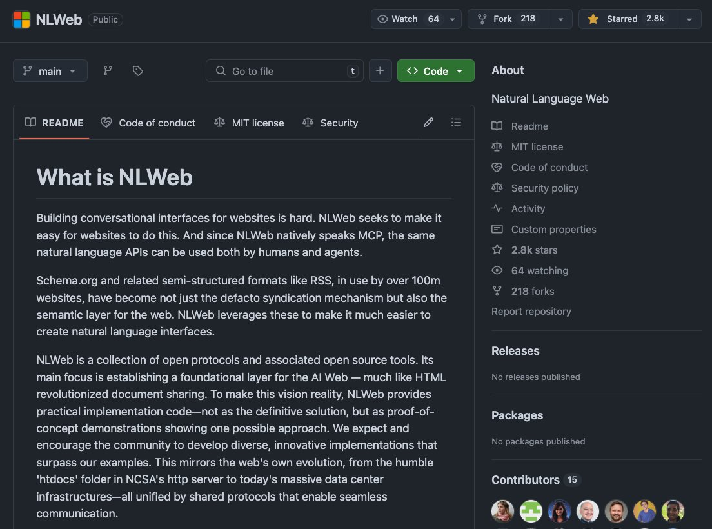

**Source:** [https://twitter.com/i/web/status/1925900575666733207](https://twitter.com/i/web/status/1925900575666733207)
**Original Post Date:** 2025-05-28 10:09:13

# NLWeb: Leveraging Machine Conversational Protocol (MCP) for AI-Driven Web Interfaces

## Introduction
NLWeb represents a groundbreaking initiative in the evolution of interactive web experiences. By implementing the Machine Conversational Protocol (MCP) alongside established semantic frameworks like Schema.org, NLWeb provides developers with tools to build sophisticated natural language interfaces that enhance user interactions on websites.

The project's architecture is designed to create an AI Web foundation layer, similar to how HTML revolutionized document sharing. Through open protocols and collaborative development practices, NLWeb aims to democratize the creation of conversational web experiences.

## Core Architecture Components

NLWeb's architecture is built on three fundamental pillars: MCP protocol for natural language interactions, Schema.org integration for semantic data representation, and open-source tools for implementation. This combination enables the creation of context-aware conversational interfaces.

The Machine Conversational Protocol (MCP) serves as the backbone of NLWeb's communication layer, providing structured methods for handling natural language queries and responses in web applications.

- MCP-based conversational framework
- Schema.org semantic integration
- Open-source toolchain
- Community-driven development

> **Note/Tip:** When implementing MCP, consider using Schema.org annotations to enhance contextual understanding of user queries.

> **Note/Tip:** Leverage the open-source tools provided by NLWeb to reduce development time for conversational interfaces.

## Technical Implementation Details

The integration process involves mapping website content through Schema.org annotations, which are then processed by MCP-enabled components. This creates a semantic layer that enables natural language understanding and response generation.

Developers can utilize the provided open-source tools to create custom implementations of conversational interfaces while maintaining compatibility with the core protocol.

1. Annotate website content using Schema.org microdata
1. Implement MCP handlers for conversation processing
1. Deploy conversational interface components

## Repository Structure and Community Aspects

The GitHub repository demonstrates significant community engagement with 2.8k stars, indicating strong interest in AI-driven web interfaces. The project's MIT License ensures flexibility for commercial and personal use.

Contributors can participate through code submissions, documentation improvements, or implementation examples, fostering an ecosystem of diverse conversational interface solutions.

## Key Takeaways

- MCP provides a structured approach to natural language interactions on the web
- Schema.org integration enables rich semantic understanding for conversational interfaces
- NLWeb's open-source nature encourages community-driven innovation and implementation diversity

## Conclusion
NLWeb represents a significant step toward democratizing AI-powered web experiences. By providing tools, protocols, and an open framework, it empowers developers to create sophisticated conversational interfaces while contributing to the broader evolution of the AI Web.

## External References

- [NLWeb GitHub Repository](https://github.com/nlweb-community/NLWeb)
- [Machine Conversational Protocol Specification](https://nlweb.org/mcp-specification)

## Media

**Image Description:** The image shows a GitHub repository page for a project named **NLWeb**. Below is a detailed description of the image, focusing on the main subject and relevant technical details:

### **Main Subject: NLWeb Repository**
The repository is titled **NLWeb**, and it is publicly available on GitHub. The page is structured in a typical GitHub repository format, with sections for navigation, description, and contributors.

#### **Header Section**
- **Repository Name**: "NLWeb" is prominently displayed at the top.
- **Owner**: The repository is hosted by a user or organization, but the specific owner is not visible in the image.
- **Public Access**: The repository is marked as "Public," indicating it is open to the public.
- **GitHub Actions**: There are icons for watching, forking, and starring the repository:
  - **Watch**: 64 users are watching the repository.
  - **Fork**: The repository has been forked 218 times.
  - **Star**: The repository has 2.8k stars, indicating its popularity.

#### **Main Content: README**
The central part of the page is the **README** file, which provides an overview of the NLWeb project. The README is written in Markdown format and is the primary source of information about the project.

##### **Title: What is NLWeb**
The README begins with a heading titled **"What is NLWeb"**, which introduces the project's purpose and goals.

##### **Description**
The description explains that building conversational interfaces for websites is challenging. NLWeb aims to simplify this process by providing tools and protocols to make it easier for websites to implement natural language interfaces. Key points include:
- **MCP (Machine Conversational Protocol)**: NLWeb natively uses MCP, a protocol for natural language interactions.
- **Schema.org and Related Formats**: The project leverages Schema.org and other semi-structured formats (e.g., RSS) to create a semantic layer for the web.
- **AI Web Foundation**: NLWeb seeks to establish a foundational layer for the AI Web, similar to how HTML revolutionized document sharing.
- **Open Protocols and Tools**: NLWeb is a collection of open protocols and open-source tools designed to facilitate the creation of natural language interfaces.
- **Community Involvement**: The project encourages the community to develop diverse and innovative implementations that surpass the provided examples.

##### **Technical Details**
- **Schema.org and RSS**: These are mentioned as foundational technologies used by NLWeb to create a semantic layer for the web.
- **MCP**: The Machine Conversational Protocol is highlighted as the native protocol used by NLWeb for natural language interactions.
- **Open Protocols and Tools**: The project emphasizes openness, aiming to provide a foundation for the AI Web.

#### **Sidebar**
The right sidebar contains additional information about the repository:

##### **About Section**
- **Natural Language Web**: This section provides a brief summary of the project's purpose, emphasizing its focus on natural language processing and web technologies.

##### **Navigation Links**
- **Readme**: Direct link to the README file.
- **MIT License**: The repository is licensed under the MIT License, indicating permissive open-source licensing.
- **Code of Conduct**: A link to the project's code of conduct.
- **Security Policy**: A link to the security policy for the project.
- **Activity**: A link to view the repository's activity.
- **Custom Properties**: A section for custom properties, though none are listed in this image.
- **Stars, Forks, and Watching**: Metrics showing the repository's popularity (2.8k stars, 218 forks, 64 watching).

##### **Releases**
- **No releases published**: Indicates that no official releases have been made for this repository yet.

##### **Packages**
- **No packages published**: Indicates that no packages have been published for this repository.

##### **Contributors**
- **15 Contributors**: The repository has 15 contributors, with avatars displayed at the bottom of the sidebar.

### **Visual Layout**
- **Dark Mode**: The GitHub interface is in dark mode, with a black background and white text.
- **Tabs**: The top navigation bar includes tabs for "Code," "Issues," "Pull requests," "Actions," "Projects," "Security," and "Insights," though only the "Code" tab is currently selected.
- **Search Bar**: A search bar is available for navigating files within the repository.

### **Summary**
The image depicts a GitHub repository for **NLWeb**, a project focused on building conversational interfaces for websites using natural language processing. The repository is open-source, licensed under the MIT License, and encourages community contributions. The README provides a detailed explanation of the project's goals, technical approach, and the role of Schema.org, RSS, and MCP in achieving its objectives. The repository has gained significant traction, with 2.8k stars, 218 forks, and 64 watchers. The sidebar provides additional navigation links and contributor information.
