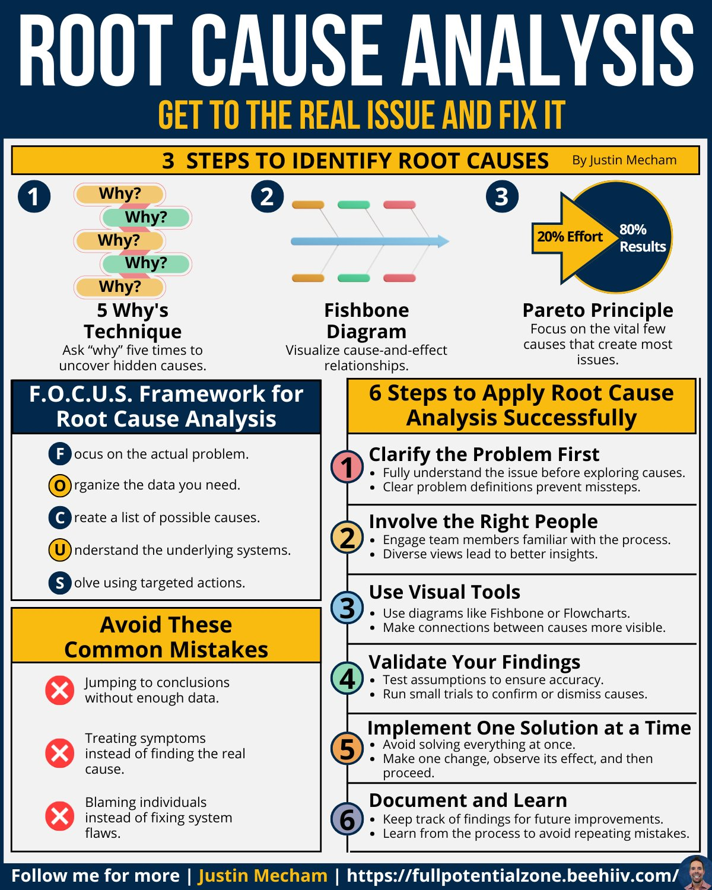

**Source:** [https://twitter.com/i/web/status/1869377365132108029](https://twitter.com/i/web/status/1869377365132108029)
**Original Post Date:** 2025-05-28 09:55:46

# Structured Root Cause Analysis: Advanced Techniques for Systemic Problem Solving

## Introduction
Root cause analysis (RCA) is a critical skill in software engineering that enables teams to move beyond symptom treatment and address underlying systemic causes of technical debt and recurring issues. This guide presents proven methodologies for conducting thorough RCA, focusing on three key techniques: the iterative '5 Whys' approach, visual Fishbone diagrams, and Pareto analysis. By mastering these tools within a structured framework, engineering teams can develop robust solutions that prevent future occurrences.

## Three Key Techniques for Identifying Root Causes

The '5 Whys' technique involves iteratively questioning the cause of an issue until reaching its fundamental root. Each 'why' deepens the investigation, revealing hidden systemic issues.

Fishbone diagrams (Ishikawa) organize potential causes into categories such as people, processes, technology, and environment, providing a visual framework for systematic analysis.

The Pareto Principle helps prioritize efforts by identifying the vital few causes responsible for 80% of problems. This enables focused problem-solving on high-impact areas.

> **Note/Tip:** Avoid jumping to solutions without completing all 'why' iterations

> **Note/Tip:** Use Fishbone diagrams collaboratively with cross-functional teams

## The F.O.C.U.S. Framework for Systematic Analysis

F: Focus on defining the precise problem boundary and scope to ensure targeted analysis.

O: Organize data collection from multiple sources including logs, metrics, and team feedback.

C: Create comprehensive lists of potential causes without early judgment or filtering.

1. Focus on the actual problem
1. Organize necessary data
1. Create cause list

## Implementing RCA in Practice

Begin with clear problem definition using SMART criteria (Specific, Measurable, Achievable, Relevant, Time-bound)

Engage stakeholders early to ensure diverse perspectives and avoid blind spots.

Document findings meticulously for knowledge sharing and future reference.

> **Note/Tip:** Validate assumptions through experiments or A/B testing

> **Note/Tip:** Implement solutions incrementally to monitor impact

## Key Takeaways

- Structured RCA methodologies provide a systematic approach to complex problem-solving in software engineering.
- Combining multiple techniques (5 Whys, Fishbone, Pareto) offers comprehensive coverage of potential causes.
- Success depends on thorough data collection and avoiding premature solution implementation.

## Conclusion
Effective root cause analysis requires both technical expertise and methodical thinking. By following these structured approaches and frameworks, engineering teams can develop sustainable solutions that prevent recurring issues, improve system reliability, and enhance overall operational efficiency.

## External References

- [Full Potential Zone](https://fullpotentialzone.com/)

## Media

**Image Description:** ### Description of the Image

The image is an infographic titled **"ROOT CAUSE ANALYSIS"**, designed to guide readers through the process of identifying and addressing the root causes of problems. The infographic is visually structured with clear sections, colors, and icons to enhance readability and comprehension. Below is a detailed breakdown of its content:

---

#### **Header**
- **Title**: "ROOT CAUSE ANALYSIS"
- **Subtitle**: "GET TO THE REAL ISSUE AND FIX IT"
- The title and subtitle are prominently displayed at the top in bold, white text against a dark blue background, emphasizing the main purpose of the infographic.

---

#### **Main Sections**

##### **1. Three Steps to Identify Root Causes**
- **Section Title**: "3 STEPS TO IDENTIFY ROOT CAUSES"
- **Byline**: "By Justin Mecham"
- This section outlines three key steps for identifying root causes, each represented with a numbered circle and a corresponding visual:

  1. **Step 1: 5 Whys Technique**
     - **Icon**: A series of interconnected "Why?" questions in different colors (pink, green, orange, etc.).
     - **Description**: The "5 Whys" technique involves asking "why" repeatedly (five times or more) to uncover hidden causes of a problem.
     - **Purpose**: To delve deeper into the root cause by questioning the underlying reasons for each identified issue.

  2. **Step 2: Fishbone Diagram**
     - **Icon**: A visual representation of a fishbone diagram with multiple branches.
     - **Description**: The Fishbone Diagram (also known as Ishikawa Diagram) is a tool used to visualize cause-and-effect relationships.
     - **Purpose**: To organize potential causes of a problem into categories (e.g., people, processes, systems) and identify the root cause.

  3. **Step 3: Pareto Principle**
     - **Icon**: A Pareto Chart (80/20 rule) with a blue arrow pointing to "80% Results" from "20% Effort."
     - **Description**: The Pareto Principle (80/20 rule) suggests that 80% of the effects come from 20% of the causes.
     - **Purpose**: To focus on the vital few causes that create the majority of the problems, ensuring efficient problem-solving.

---

##### **2. F.O.C.U.S. Framework for Root Cause Analysis**
- **Section Title**: "F.O.C.U.S. Framework for Root Cause Analysis"
- **Description**: This framework provides a structured approach to solving problems by breaking it into six steps:
  - **F**: Focus on the actual problem.
  - **O**: Organize the data you need.
  - **C**: Create a list of possible causes.
  - **U**: Understand the underlying systems.
  - **S**: Solve using targeted actions.

Each step is represented with a bullet point and a corresponding colored circle (blue, orange, yellow, etc.), making it visually distinct.

---

##### **3. Six Steps to Apply Root Cause Analysis**
- **Section Title**: "6 Steps to Apply Root Cause Analysis Successfully"
- This section outlines a step-by-step process for effectively applying root cause analysis:

  1. **Clarify the Problem**
     - **Icon**: A red circle with the number "1."
     - **Description**: Fully understand the issue before exploring causes. Clear problem definitions prevent missteps.
     - **Action**: Fully understand the issue and define it clearly.

  2. **Involve the Right People**
     - **Icon**: A yellow circle with the number "2."
     - **Description**: Engage team members familiar with the process. Diverse views lead to better insights.
     - **Action**: Involve stakeholders and subject matter experts.

  3. **Use Visual Tools**
     - **Icon**: A blue circle with the number "3."
     - **Description**: Use tools like Fishbone diagrams or flowcharts to visualize cause-and-effect relationships.
     - **Action**: Utilize visual tools to make connections between causes more visible.

  4. **Validate Your Findings**
     - **Icon**: A green circle with the number "4."
     - **Description**: Test assumptions and run small trials to confirm or dismiss causes.
     - **Action**: Validate findings through testing and data analysis.

  5. **Implement One Solution at a Time**
     - **Icon**: An orange circle with the number "5."
     - **Description**: Avoid solving everything at once. Make one change, observe its effect, and then proceed.
     - **Action**: Implement solutions incrementally and monitor their impact.

  6. **Document and Learn**
     - **Icon**: A blue circle with the number "6."
     - **Description**: Keep track of findings for future improvements and learn from the process.
     - **Action**: Document the process and outcomes to avoid repeating mistakes.

---

##### **4. Common Mistakes to Avoid**
- **Section Title**: "Avoid These Common Mistakes"
- This section highlights common pitfalls in root cause analysis:
  - **Jumping to conclusions without enough data**: Emphasizes the importance of thorough data collection.
  - **Treating symptoms instead of finding the root cause**: Stresses the need to address the underlying issue.
  - **Blaming individuals instead of fixing system flaws**: Encourages focusing on systemic improvements rather than assigning blame.

Each mistake is accompanied by a red "X" icon to draw attention to the pitfalls.

---

#### **Footer**
- **Call to Action**: "Follow me for more | Justin Mecham"
- **Website Link**: "[https://fullpotentialzone.com/"](https://fullpotentialzone.com/")
- **Author Image**: A small profile picture of the author (Justin Mecham) is included in the bottom-right corner.

---

#### **Design Elements**
- **Color Scheme**: The infographic uses a clean and professional color scheme with:
  - Dark blue for the header.
  - White for the main content background.
  - Bright colors (yellow, blue, green, red, etc.) for icons, circles, and text highlights.
- **Icons and Visuals**: Icons and diagrams (e.g., "5 Whys," Fishbone, Pareto Chart) are used to enhance understanding and break up text-heavy sections.
- **Typography**: Clear, bold fonts are used for headings and important points, while smaller fonts are used for detailed descriptions.

---

### Summary
The infographic provides a comprehensive guide to root cause analysis, breaking it down into three key steps for identification, a structured F.O.C.U.S. framework, and six steps for successful application. It also highlights common mistakes to avoid and includes visual aids to enhance comprehension. The design is clean, organized, and visually appealing, making it an effective educational tool.
