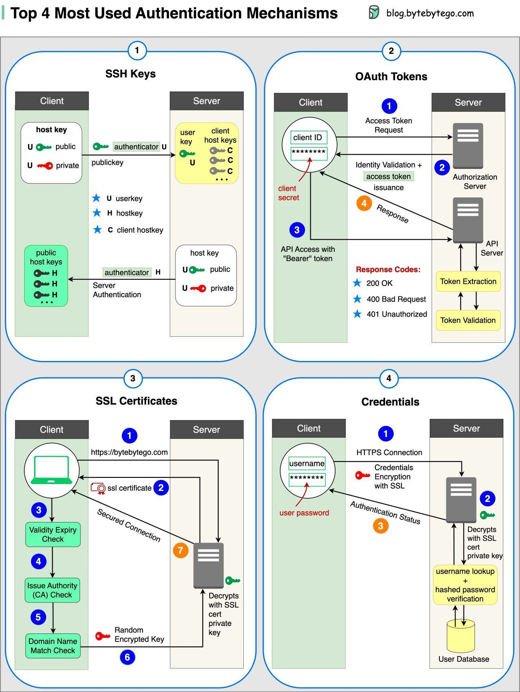

**Source:** [https://twitter.com/i/web/status/1886338847698518229](https://twitter.com/i/web/status/1886338847698518229)
**Original Post Date:** 2025-05-27 19:13:57

# Authentication Mechanisms for Secure Login Screens

## Introduction
Modern login systems require robust security measures to protect user data and system integrity. This article explores the top four authentication mechanisms used in secure login screens, examining their technical implementations, strengths, and appropriate use cases.

Understanding these methods is crucial for designing resilient systems that balance security with usability. We'll examine SSH keys, OAuth tokens, SSL certificates, and traditional credentials, providing detailed insights into each mechanism's operation.

## SSH Keys Authentication

SSH key-based authentication uses asymmetric cryptography for secure client-server communication. Each user generates a public-private key pair, with the server storing only the public component.

The authentication process involves the client signing a message with their private key and the server verifying it using the stored public key. This eliminates the need to transmit sensitive credentials over the network.

- Prevents credential theft through man-in-the-middle attacks
- Requires secure private key storage on client devices
- Suitable for automated and manual authentication scenarios

> **Note/Tip:** Always encrypt private keys with a strong passphrase

> **Note/Tip:** Implement key rotation policies to mitigate compromised credentials risk

## OAuth Token Authentication

OAuth token authentication enables secure third-party access delegation without sharing user credentials. Clients obtain temporary tokens from an authorization server, which validate these tokens for API requests.

This mechanism supports multiple grant types and scopes, allowing fine-grained control over resource access privileges.

1. Client applications must protect client secrets securely
1. Use refresh tokens for extended session management
1. Implement token expiration to minimize risk of unauthorized use

## SSL Certificate Authentication

SSL certificate authentication secures communication channels using X.509 certificates. The server presents its certificate during the TLS handshake, which clients validate against trusted Certificate Authorities.

This establishes mutual trust and encrypts all subsequent communications between client and server.

- Requires valid SSL certificates from trusted CAs
- Supports both one-way (server) and two-way (mutual) authentication
- Essential for securing HTTPS connections in production

> **Note/Tip:** Implement automatic certificate renewal to prevent service disruptions

> **Note/Tip:** Monitor certificate validity periods proactively

## Traditional Credential Authentication

Username/password authentication remains widely used due to its simplicity. Modern implementations store passwords as salted hashes and employ multi-factor authentication for added security.

The server validates credentials by comparing the stored hash of a provided password with the hash derived from user input.

1. Use strong hashing algorithms (e.g., bcrypt, Argon2)
1. Implement rate limiting to prevent brute-force attacks
1. Consider adding multi-factor authentication for sensitive applications

## Key Takeaways

- SSH keys provide secure automated and manual access without transmitting credentials
- OAuth tokens enable delegated access with controlled permissions and temporary validity
- SSL certificates establish trusted encrypted communication channels between clients and servers
- Traditional credential authentication requires proper hashing, salting, and additional security measures

## Conclusion
Choosing the appropriate authentication mechanism depends on specific use cases and security requirements. SSH keys excel in automated scenarios, OAuth enables secure delegation, SSL certificates provide transport-layer security, and traditional credentials remain viable with modern protection measures.

## Media

**Image Description:** The image is a detailed diagram illustrating the top four most commonly used authentication mechanisms in modern systems. Each mechanism is explained with a flowchart-like representation, showing the interaction between a **Client** and a **Server**. The mechanisms are:

1. **SSH Keys**
2. **OAuth Tokens**
3. **SSL Certificates**
4. **Credentials (Username/Password)**

### **1. SSH Keys**
- **Purpose**: Secure communication using public-key cryptography.
- **Components**:
  - **Client**: Holds a private key and a public key.
  - **Server**: Holds the public key of the client.
- **Process**:
  1. The client generates a key pair (private and public).
  2. The public key is shared with the server.
  3. During authentication, the client signs a message with its private key.
  4. The server verifies the signature using the client's public key.
- **Key Elements**:
  - **User Key**: Associated with the user.
  - **Host Key**: Associated with the server.
  - **Authentication**: Based on the verification of the digital signature.

### **2. OAuth Tokens**
- **Purpose**: Securely delegate access to resources without sharing credentials.
- **Components**:
  - **Client**: An application requesting access.
  - **Server**: The resource provider.
- **Process**:
  1. The client requests an access token from the server using its **client ID** and **client secret**.
  2. The server validates the client's identity and issues an access token.
  3. The client uses the access token to make API requests.
  4. The server validates the token and responds accordingly.
- **Key Elements**:
  - **Client ID**: Unique identifier for the client application.
  - **Client Secret**: Secret key used for authentication.
  - **Access Token**: Temporary token used for API access.
  - **Authorization Server**: Issues and manages tokens.
  - **API Server**: Handles API requests using the token.

### **3. SSL Certificates**
- **Purpose**: Secure communication over HTTPS using encryption.
- **Components**:
  - **Client**: Initiates the connection.
  - **Server**: Holds an SSL certificate.
- **Process**:
  1. The client initiates a connection to the server.
  2. The server presents its SSL certificate to the client.
  3. The client verifies the certificate's validity (e.g., expiration, domain name, CA authority).
  4. If valid, the client establishes a secure connection using encryption.
- **Key Elements**:
  - **SSL Certificate**: Contains the server's public key and is signed by a Certificate Authority (CA).
  - **CA Authority**: Verifies the authenticity of the certificate.
  - **Validity Check**: Ensures the certificate is not expired or revoked.
  - **Encryption**: Secures the communication using the server's public key.

### **4. Credentials (Username/Password)**
- **Purpose**: Traditional authentication method using username and password.
- **Components**:
  - **Client**: Provides a username and password.
  - **Server**: Stores hashed passwords in a database.
- **Process**:
  1. The client sends the username and password to the server.
  2. The server hashes the password and compares it with the stored hash in the database.
  3. If the hashes match, the server authenticates the user.
- **Key Elements**:
  - **Username**: Identifies the user.
  - **Password**: Secret used for authentication.
  - **Hashed Password**: Stored securely in the database to prevent plaintext exposure.
  - **User Database**: Stores user credentials.
  - **Authentication**: Based on the comparison of the hashed password.

### **Overall Layout and Design**
- The image is divided into four quadrants, each representing one of the authentication mechanisms.
- Each quadrant uses a flowchart-like structure with numbered steps to illustrate the process.
- Key components (e.g., client, server, tokens, certificates) are highlighted with distinct colors and labels.
- Arrows indicate the flow of data and actions between the client and server.
- Technical details such as "Bearer" tokens, SSL encryption, and hashed passwords are explicitly mentioned.

### **Summary**
The image provides a comprehensive overview of the top four authentication mechanisms, emphasizing their technical details and the flow of interactions between clients and servers. Each mechanism is explained with clear visual aids, making it easy to understand the underlying processes and security features.
