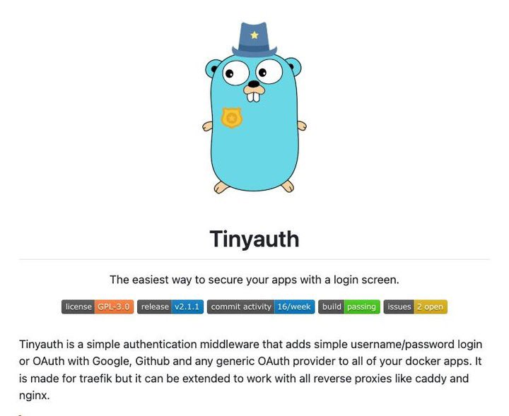

**Source:** [https://twitter.com/i/web/status/1908761746778529940](https://twitter.com/i/web/status/1908761746778529940)
**Original Post Date:** 2025-05-27 18:15:58

# Tinyauth Middleware: Secure Login Screens with Authentication Best Practices

## Introduction
This article explores the implementation of the Tinyauth middleware, a lightweight authentication solution designed to simplify login screen security in modern web applications. Built specifically for containerized environments with Docker and reverse proxies like Traefik, Tinyauth provides robust support for both traditional username/password authentication and OAuth integration. This guide covers configuration best practices, security considerations, and deployment strategies.

## Core Authentication Capabilities

Tinyauth serves as a versatile authentication middleware that enables seamless integration of login functionality across various application architectures. Its primary features include support for username/password authentication and OAuth-based login via Google, GitHub, and custom providers.

The middleware's design emphasizes simplicity while maintaining security standards through encrypted connections and standardized authentication protocols.

```yaml
---
http:
  routers:
    auth-frontend:
      rule: PathPrefix(`/auth`)
      service: tinyauth-service
      middlewares:
        - basic-auth-middleware
```

## Deployment and Configuration

Integration with Traefik is straightforward through reverse proxy configuration, requiring minimal setup while maintaining security standards.

The middleware supports both HTTP Basic Auth and OAuth flows, allowing flexible implementation based on application requirements.

- Supports Google OAuth integration
- GitHub authentication capabilities
- Custom OAuth provider configuration

## Security Considerations and Best Practices

Implementing Tinyauth requires careful attention to security best practices, including proper SSL/TLS configuration and secure credential storage.

Regular monitoring of build status and commit activity (16/week) ensures timely updates and vulnerability patches.

> **Note/Tip:** Always use HTTPS in production environments

> **Note/Tip:** Implement rate limiting for login attempts

> **Note/Tip:** Keep the middleware updated to the latest version

## Key Takeaways

- Tinyauth provides a lightweight, secure solution for authentication that integrates seamlessly with Docker and reverse proxies
- Support for both traditional password-based and OAuth authentication offers flexibility in security implementation
- Regular updates and monitoring of build status ensure the middleware remains secure against emerging threats

## Conclusion
Tinyauth represents an efficient approach to implementing login screen security in modern web applications. Its support for multiple authentication methods, combined with straightforward integration into Docker environments, makes it a valuable tool for developers prioritizing both security and ease of implementation.

## External References

- [Official Tinyauth Documentation](https://github.com/traefik/tiny-auth)
- [Traefik Middleware Configuration Guide](https://doc.traefik.io/traefik/middlewares/)


## Media

**Image Description:** ### Description of the Image

The image is a screenshot of a webpage or documentation for a software project called **Tinyauth**. The main subject of the image is a cartoon character, which is a blue, anthropomorphic creature resembling a gopher (commonly associated with the Go programming language). The gopher is depicted wearing a police-style hat and a badge, suggesting a theme of security or authentication.

#### **Main Subject: The Gopher Character**
- **Appearance**: 
  - The gopher is blue with large, expressive eyes and a small, friendly face.
  - It has a police-style hat with a star emblem, indicating a role related to security or enforcement.
  - The gopher is wearing a badge on its chest, further emphasizing its role in authentication or security.
  - The character has a simple, cartoonish design, making it approachable and visually appealing.

#### **Text Content**
The text is organized into sections, providing information about the **Tinyauth** project. Here is a detailed breakdown:

1. **Title:**
   - The title "Tinyauth" is prominently displayed below the gopher character. The font is bold and centered, making it the focal point of the text.

2. **Tagline:**
   - Below the title, there is a tagline that reads:
     > "The easiest way to secure your apps with a login screen."
   - This tagline highlights the primary purpose of the project: simplifying the process of adding authentication to applications.

3. **Project Description:**
   - The description provides more detailed information about Tinyauth:
     > "Tinyauth is a simple authentication middleware that adds simple username/password login or OAuth with Google, GitHub, and any generic OAuth provider to all of your Docker apps. It is made for Traefik but can be extended to work with all reverse proxies like Caddy and Nginx."
   - Key points from the description:
     - **Functionality**: Tinyauth is an authentication middleware that supports both username/password login and OAuth authentication.
     - **Compatibility**: It works seamlessly with Docker apps and is specifically designed for use with Traefik, a popular reverse proxy.
     - **Extensibility**: It can be adapted to work with other reverse proxies like Caddy and Nginx.

4. **Technical Details (Badges):**
   - Below the description, there are several badges providing additional technical information:
     - **License**: GPL-3.0
     - **Release**: v2.1.1
     - **Commit Activity**: 16/week (indicating active development)
     - **Build Status**: Passing (indicating that the project's build is successful)
     - **Issues**: 2 open (indicating the number of open issues in the project's issue tracker)

#### **Visual Layout**
- The layout is clean and minimalistic, with a white background that ensures the gopher character and text stand out.
- The text is well-organized, with clear headings and subheadings to guide the reader through the information.
- The badges are visually distinct, using colored backgrounds to draw attention to key details like the license, release version, and build status.

#### **Overall Impression**
The image effectively communicates the purpose and features of the Tinyauth project. The use of a friendly, cartoonish gopher character adds a touch of personality and approachability, making the technical content more engaging. The badges provide quick, at-a-glance information about the project's status and compatibility, which is valuable for potential users or contributors.

### Summary
The main subject of the image is the **Tinyauth** project, represented by a cartoon gopher character in a police-style hat and badge. The text provides a clear and concise description of Tinyauth's purpose, functionality, and technical details, supported by badges that highlight key aspects like the license, release version, and build status. The overall design is clean, organized, and visually appealing, effectively conveying the project's value proposition.
