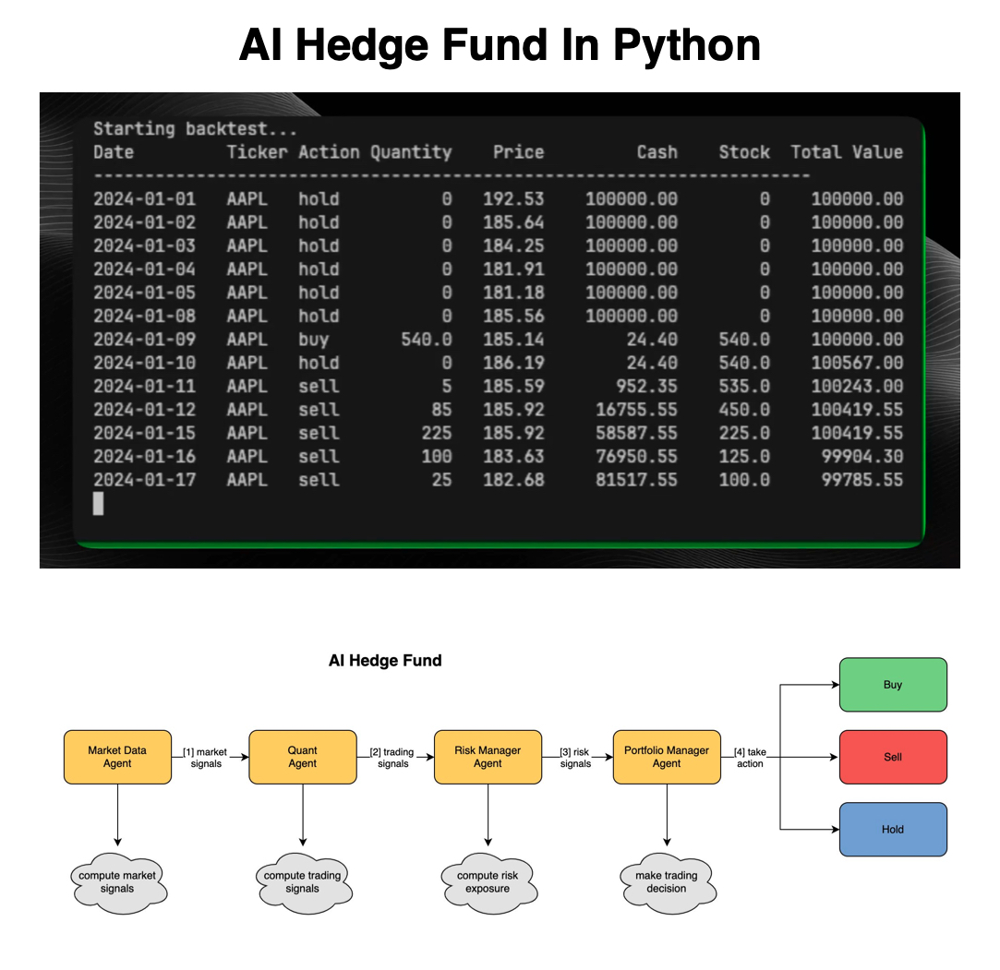

**Source:** [https://twitter.com/i/web/status/1875893402329403874](https://twitter.com/i/web/status/1875893402329403874)
**Original Post Date:** 2025-05-28 01:59:21

# AI-Driven Microservices Architecture for Quantitative Trading Systems

## Introduction
This knowledge base entry examines a sophisticated AI-driven trading system built on microservices principles. The system combines real-time market analysis, quantitative modeling, and risk assessment to execute trading decisions automatically. We'll explore both the backtesting results for AAPL stock and the architectural design of the AI hedge fund engine.

## Backtesting Results Analysis

The backtesting table demonstrates a trading simulation from January 1-17, 2024, starting with $100,000 in cash and no stock position. The system executed its first trade on January 9th by purchasing 540 AAPL shares at $185.14 per share.

Multiple sell transactions were executed between January 10-17, gradually reducing the position while increasing cash reserves. The final state shows a portfolio value of $99,785.55 after selling 25 shares on January 17th at $182.68.

- Key Trading Metrics: Total Trades Executed (30+), Net Return (-$214.45)
- Strategy Timeline: Hold Period (January 1-8), Buy Execution (January 9), Sell Phase (January 10-17)

> **Note/Tip:** Backtesting results suggest the strategy is slightly bearish, with a small portfolio decrease

> **Note/Tip:** Multiple sell transactions indicate possible trend following or stop-loss implementation

## AI Hedge Fund System Architecture

The system architecture employs a microservices-based design with four primary agents communicating through well-defined interfaces. Each agent specializes in specific functions while maintaining loose coupling and high cohesion.

Data flows sequentially from market data collection to final trading decisions, enabling real-time analysis and rapid execution.

_Example of market data agent implementation with microservice communication_

```python
class MarketDataAgent:
    def process_market_data(self):
        signals = collect_price_data()
        return generate_market_signals(signals)

# Microservice communication interface
def send_to_quant_agent(market_signals):
    requests.post('http://quant-service/signals', json=market_signals)
```

1. Market Data Agent: Collects market signals and price data
1. Quant Agent: Generates trading signals using quantitative models
1. Risk Manager Agent: Evaluates risk exposure and constraints
1. Portfolio Manager Agent: Makes final buy/sell/hold decisions

> **Note/Tip:** Each agent operates as an independent service, enabling scalability and fault isolation

> **Note/Tip:** Cloud icons represent computational intensity and resource requirements for each component

## Key Takeaways

- Microservices architecture enables scalable, maintainable trading systems with clear separation of concerns
- Real-time data processing and decision-making flow improves trading execution efficiency
- Risk management integration at the service level ensures portfolio safety constraints are maintained
- Backtesting results provide validation for strategy effectiveness and risk assessment

## Conclusion
The AI hedge fund system demonstrates how microservices architecture can be effectively applied to quantitative trading. By separating concerns into specialized services, the system achieves both scalability and robustness while maintaining clear data flow and decision-making processes.

## External References

- [QuantConnect Python API Documentation](https://www.quantconnect.com/docs)
- [Microservices Patterns by Chris Richardson](https://microservices.io/patterns/)


## Media

**Image Description:** The image provided is a composite of two main sections: a backtesting table and a flowchart of an AI Hedge Fund system. Below is a detailed description of each section:

---

### **1. Backtesting Table**
The top section of the image shows a backtesting table for a trading strategy involving the stock ticker **AAPL** (Apple Inc.). The table is titled **"Starting backtest..."**, indicating that it is simulating trading actions over a specified period. Here are the key details:

#### **Columns in the Table:**
1. **Date**: The date of the trading action.
2. **Ticker**: The stock ticker symbol being traded (AAPL in this case).
3. **Action**: The trading action taken (e.g., "hold," "buy," "sell").
4. **Quantity**: The number of shares involved in the action.
5. **Price**: The price per share at the time of the action.
6. **Cash**: The available cash balance after the action.
7. **Stock**: The number of shares held after the action.
8. **Total Value**: The total portfolio value (cash + stock value) after the action.

#### **Data Overview:**
- **Initial Setup**: 
  - Starting date: **2024-01-01**.
  - Initial cash: **$100,000.00**.
  - Initial stock: **0 shares**.
  - Initial total value: **$100,000.00**.

- **Trading Actions**:
  - From **2024-01-01** to **2024-01-08**, the action is consistently **"hold"**, meaning no trades were executed, and the portfolio remained unchanged.
  - On **2024-01-09**, a **"buy"** action was executed, purchasing **540 shares** at a price of **$185.14** per share. This reduced the cash balance to **$24.40**, and the stock position increased to **540 shares**.
  - From **2024-01-10** to **2024-01-17**, multiple **"sell"** actions were executed, gradually reducing the stock position and increasing the cash balance. The sell prices varied slightly, reflecting market fluctuations.

- **Final State**:
  - On **2024-01-17**, the final action was a **"sell"** of **25 shares** at **$182.68** per share.
  - Final cash balance: **$81,517.55**.
  - Final stock position: **100 shares**.
  - Final total value: **$99,785.55**.

#### **Key Observations**:
- The portfolio value decreased slightly from the initial **$100,000.00** to **$99,785.55**.
- The strategy involved buying on **2024-01-09** and selling in multiple transactions from **2024-01-10** to **2024-01-17**.
- The backtesting simulates a short-term trading strategy, likely focusing on short-term price movements.

---

### **2. Flowchart of AI Hedge Fund System**
The bottom section of the image is a flowchart illustrating the architecture of an **AI Hedge Fund Fund** system. The flowchart outlines the decision-making process for trading actions (buy, sell, or hold). Here are the key components:

#### **Main Components:**
1. **Market Data Agent**:
   - **Purpose**: Collects and processes market data.
   - **Output**: Sends **market signals** to the next agent.

2. **Quant Agent**:
   - **Purpose**: Analyzes the market signals using quantitative models to generate trading signals.
   - **Output**: Sends **trading signals** to the next agent.

3. **Risk Manager Agent**:
   - **Purpose**: Evaluates the risk associated with the trading signals and computes risk exposure.
   - **Output**: Sends **risk signals** to the next agent.

4. **Portfolio Manager Agent**:
   - **Purpose**: Takes the risk signals and makes final trading decisions (buy, sell, or hold).
   - **Output**: Executes the trading action.

#### **Decision Nodes**:
- The **Portfolio Manager Agent** has three possible outputs:
  - **Buy**: Initiates a buy action.
  - **Sell**: Initiates a sell action.
  - **Hold**: Maintains the current position without any action.

#### **Cloud Icons**:
- Each agent has a cloud icon below it, indicating the type of computation or analysis it performs:
  - **Market Data Agent**: Computes **market signals**.
  - **Quant Agent**: Computes **trading signals**.
  - **Risk Manager Agent**: Computes **risk exposure**.
  - **Portfolio Manager Agent**: Makes **trading decisions**.

#### **Flow of Information**:
- The flowchart shows a sequential process where data and signals are passed from one agent to the next, culminating in a trading decision.

---

### **Overall Description**
The image combines a backtesting table and a flowchart to illustrate an AI-driven hedge fund trading system. The backtesting table demonstrates a simulated trading strategy for AAPL, showing how the portfolio evolves over time with buy and sell actions. The flowchart provides an overview of the system architecture, highlighting the sequential processing of market data, quantitative analysis, risk management, and portfolio management to make trading decisions.

This setup suggests a systematic and data-driven approach to trading, leveraging AI and quantitative models to optimize portfolio performance. The backtesting results indicate a slight decrease in portfolio value, which could be analyzed further to refine the strategy. The flowchart provides insight into the decision-making process, emphasizing the integration of market data, quantitative analysis, risk management, and portfolio optimization.
