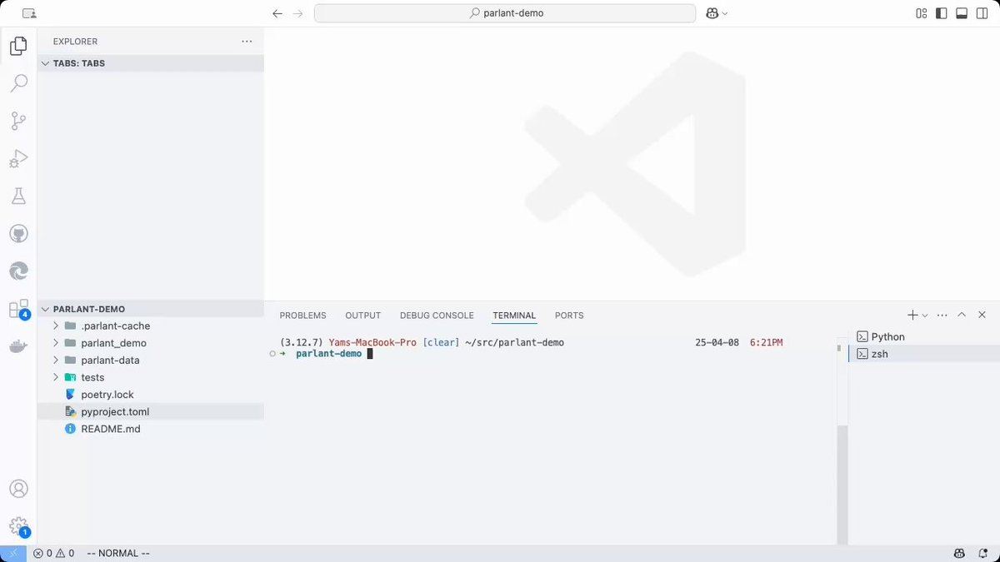

**Source:** [https://twitter.com/i/web/status/1915745404827959731](https://twitter.com/i/web/status/1915745404827959731)
**Original Post Date:** 2025-05-27 16:28:45

# Building Scalable Agent-Based Chat Systems with Parlant

## Introduction
This comprehensive guide explores the architecture and implementation of scalable agent-based chat systems, focusing on key components like session management, real-time communication, and state synchronization. We'll delve into Parlant's approach to building robust conversational interfaces that handle multiple agents and user interactions efficiently.

Understanding these principles is crucial for developing production-ready messaging applications with high availability, low latency, and maintainable codebases.

## System Architecture Overview

The Parlant architecture consists of three primary layers: the presentation layer (UI), business logic layer (agent handlers), and data persistence layer. Each agent operates as an independent service, communicating through a message bus for real-time updates.

Session management is handled by a dedicated service that maintains conversation state and user context across multiple interactions.

```typescript
interface AgentSession {
  sessionId: string;
  agentId: string;
  userId: string;
  timestamp: number;
  lastMessage?: Message;
}
```

## Real-Time Communication Protocol

Implementing real-time message delivery requires efficient use of WebSocket connections or server-sent events. Parlant utilizes a publish-subscribe pattern for agent-to-client communication.

Message serialization uses JSON format with standard headers and body structure to maintain consistency across different platforms.

```typescript
interface Message {
  id: string;
  type: MessageType;
  payload: any;
  timestamp: number;
}

type MessageType = 'text' | 'system' | 'error';
```

- WebSocket connection handling for each user session
- Message queuing system for reliable delivery
- Error recovery and reconnection logic

## Agent State Management

Each agent maintains its own state to track conversation history, context variables, and user preferences. This state is managed through a combination of in-memory storage and persistent database.

State synchronization occurs at regular intervals to prevent data loss during service restarts.

```typescript
class AgentStateManager {
  private cache: Map<string, AgentState>;

  async saveState(agentId: string): Promise<void> {
    const state = this.cache.get(agentId);
    await db.save('agent_states', agentId, state);
  }
}
```

## Scalability and Load Balancing

To handle high concurrent user loads, the system employs horizontal scaling through Kubernetes orchestration. Each agent service runs as a separate pod with its own resources.

Load balancing is managed by an external ingress controller that distributes traffic based on session affinity.

1. Configure Kubernetes deployment for automatic scaling
1. Implement health checks and readiness probes
1. Set up monitoring with Prometheus and Grafana

> **Note/Tip:** Always maintain stateless agent instances to enable seamless horizontal scaling.

> **Note/Tip:** Use Redis as a cache layer to reduce database load during high traffic periods.

## Key Takeaways

- Design agent services to be stateless for easier scaling and maintenance
- Implement robust error handling and recovery mechanisms at every level
- Use efficient serialization formats and compression for message delivery
- Maintain session consistency through careful state management strategies

## Conclusion
Building scalable agent-based chat systems requires careful consideration of architecture, communication protocols, and state management. By following the principles outlined in this guide, developers can create robust, maintainable applications that handle high concurrent user loads while maintaining excellent performance.

## External References

- [WebSocket API Specification](https://tools.ietf.org/html/rfc6455)
- [Kubernetes Horizontal Pod Autoscaling](https://kubernetes.io/docs/tasks/run-application/horizontal-pod-autoscale/)


## Media

**Image Description:** The image shows a screenshot of a **Visual Studio Code (VS Code)** editor interface, which is a popular integrated development environment (IDE) for software development. Below is a detailed description of the image, focusing on the main elements and technical details:

### **Main Interface Components**
1. **Top Bar:**
   - The top bar contains the standard navigation and search elements of VS Code:
     - A back arrow (`←`), forward arrow (`→`), and a search bar labeled `parlant-demo`.
     - The search bar indicates that the user is searching for or filtering content related to `parlant-demo`.
     - On the far right, there are icons for extensions, settings, and other tools.

2. **Sidebar (Explorer Panel):**
   - The sidebar on the left is labeled **"Explorer"** and shows the file structure of a project named `parlant-demo`.
   - The project structure includes the following folders and files:
     - `.parlant-cache`: A hidden folder, likely used for caching data related to the `parlant` tool or framework.
     - `parlant_demo`: A folder, possibly containing the main source code or configuration files.
     - `parlant-data`: Another folder, likely used for storing data files or datasets.
     - `tests`: A folder, typically used for test cases or scripts.
     - `pyproject.toml`: A configuration file for Python projects, used by tools like `poetry` for dependency management.
     - `poetry.lock`: A lock file for the `poetry` dependency manager, ensuring consistent dependency versions.
     - `README.md`: A markdown file, usually containing project documentation or instructions.
   - The folder `parlant-demo` is expanded, revealing its contents.

3. **Editor Area:**
   - The central area of the interface is currently empty, indicating that no file is open for editing. The background shows a large, faded logo of VS Code, which is visible when no files are open.

4. **Bottom Bar (Terminal Panel):**
   - The bottom section of the interface is the **Terminal** panel, which is active and shows the following details:
     - The terminal is using **zsh** (Z shell) as the shell environment.
     - The terminal prompt shows the path: `~src/parlant-demo`, indicating that the terminal is currently in the root directory of the `parlant-demo` project.
     - The terminal session is labeled `(3.12.7) Yams-MacBook-Pro [clear] ~src/parlant-demo`, suggesting:
       - Python version `3.12.7` is active in the environment.
       - The user is on a MacBook Pro named "Yams."
       - The terminal has been cleared (`[clear]`).
     - The timestamp `25-04-08 6:21PM` indicates when the terminal was last active.

5. **Tabs and Panels:**
   - The top of the editor area shows tabs for different panels, including **Problems**, **Output**, **Debug Console**, **Terminal**, and **Ports**. The **Terminal** tab is currently active.
   - The **Terminal** panel is split into two sections:
     - The top section shows the terminal prompt and command history.
     - The bottom section shows the active shell environment (`zsh`).

6. **Status Bar:**
   - At the very bottom of the interface is the **Status Bar**, which provides additional information:
     - The status bar shows the active Python interpreter version (`Python 3.12.7`).
     - There are icons for extensions or tools, such as a Git icon, indicating that the project might be version-controlled.
     - The text `-- NORMAL --` indicates the current mode of the editor (normal mode, likely related to VS Code's Vim emulation).

### **Technical Details and Observations:**
- **Project Structure:** The project `parlant-demo` appears to be a Python project, as indicated by the presence of `pyproject.toml` and `poetry.lock` files. These files suggest the use of the `poetry` dependency management tool.
- **Environment:** The terminal shows that Python `3.12.7` is active, and the user is working in a `zsh` shell environment.
- **IDE Features:** The interface leverages standard VS Code features, such as the Explorer for file navigation, the Terminal for command-line operations, and the Status Bar for environment and extension information.
- **Tooling:** The presence of `.parlant-cache` suggests the use of a tool or framework named `parlant`, which might be related to the project's functionality or development workflow.

### **Summary:**
The image depicts a VS Code interface with a project named `parlant-demo` open in the Explorer. The Terminal is active, showing a Python environment with version `3.12.7` and a `zsh` shell. The project structure indicates it is a Python project managed with `poetry`, and the user is likely working on development or testing tasks related to the `parlant` tool or framework. The interface is clean and organized, reflecting a typical setup for software development.


**Video Description:** Video Content Analysis - media_seg0_item1.mp4:

The video appears to be a tutorial or demonstration focused on setting up and interacting with a chatbot or conversational agent using a tool or framework called **Parlant**. The content is technical in nature, involving command-line operations, configuration, and testing of the agent. Below is a comprehensive description of the video based on the provided key frames:

---

### **Overview of the Video**
The video guides the viewer through the process of creating, configuring, and testing a conversational agent using the **Parlant** framework. The steps involve setting up the environment, creating an agent, tagging it, and testing its functionality in a web-based interface.

---

### **Key Frames and Descriptions**

#### **Frame 1: Command-Line Interface (CLI)**
- **Context**: The video starts with a terminal window open in a development environment (likely VS Code, given the interface).
- **Details**:
  - The terminal shows a command being executed: `parlant agent create --name Trevor --description`.
  - This command is used to create a new agent named "Trevor" with a specified description.
  - The terminal is located on a macOS system (`Yams-MacBook-Pro`), and the working directory is `~/src/parlant-demo`.
- **Purpose**: This step demonstrates how to initialize a new agent using the Parlant CLI.

#### **Frame 2: Web-Based Interface**
- **Context**: The video transitions to a web-based interface running on `localhost`.
- **Details**:
  - The interface is branded with the **Parlant** logo, indicating it is the Parlant platform.
  - The interface shows a conversation between an "Agent" (Trevor) and a "Guest" (customer).
  - The conversation includes a single message: "Hello there" sent by the Guest.
  - The Agent's ID and the Guest's ID are displayed, along with the timestamp of the message.
- **Purpose**: This frame demonstrates the real-time interaction between the agent and a user in the Parlant platform.

#### **Frame 3: Command-Line Interface (CLI) - Tagging the Agent**
- **Context**: The video returns to the terminal to further configure the agent.
- **Details**:
  - A new command is executed: `parlant tag create --name travel`.
  - This command creates a tag named "travel," which is likely used to categorize or label the agent for specific use cases.
  - The terminal confirms the creation of the tag with an ID (`KfQVcTFSrF`).
- **Purpose**: This step shows how to tag the agent, which can help in organizing or filtering agents based on their purpose.

#### **Frame 4: Command-Line Interface (CLI) - Listing Agents**
- **Context**: The video continues with further CLI operations.
- **Details**:
  - The command `parlant agent list` is executed to display a list of existing agents.
  - The output shows a table with columns for:
    - **ID**: Unique identifier for each agent.
    - **Name**: Name of the agent (e.g., "Default Agent," "Trevor").
    - **Description**: Brief description of the agent's purpose.
    - **Max Engine Iterations**: Likely a parameter controlling the agent's behavior.
    - **Composition Mode**: Indicates the mode of operation (e.g., "fluid").
    - **Tags**: Tags associated with the agent.
  - The agent "Trevor" is listed with a description related to travel, indicating it is designed for travel-related queries.
- **Purpose**: This step provides an overview of the agents configured in the system, showcasing how they are organized and tagged.

#### **Frame 5: Command-Line Interface (CLI) - Tagging the Agent (Continued)**
- **Context**: The video continues with tagging operations.
- **Details**:
  - The command `parlant agent tag` is partially typed, suggesting the next step involves associating the previously created "travel" tag with the agent.
- **Purpose**: This step demonstrates how to apply tags to agents, enhancing their categorization and functionality.

---

### **Overall Flow of the Video**
1. **Agent Creation**: The user creates a new agent named "Trevor" using the Parlant CLI.
2. **Web-Based Interaction**: The agent is tested in a real-time web-based interface, where a conversation is initiated with a user.
3. **Tagging the Agent**: The user creates a tag named "travel" and associates it with the agent to categorize its purpose.
4. **Agent Management**: The user lists all agents to review their configurations, including names, descriptions, and tags.
5. **Further Configuration**: The user continues to configure the agent by applying tags, ensuring it is properly categorized.

---

### **Technical Concepts Highlighted**
- **Command-Line Interface (CLI)**: The video extensively uses the Parlant CLI to manage agents, tags, and configurations.
- **Web-Based Interface**: The Parlant platform's web interface is used to test and observe real-time interactions.
- **Agent Configuration**: The process of creating, naming, describing, and tagging agents is demonstrated.
- **Tagging System**: Tags are used to categorize agents, which is a common practice in managing multiple agents for different purposes.

---

### **Target Audience**
The video is targeted at developers or technical users who are interested in building and managing conversational agents using the Parlant framework. It provides a step-by-step guide to setting up and testing an agent, making it suitable for both beginners and those familiar with similar tools.

---

### **Conclusion**
The video effectively demonstrates the end-to-end process of creating, configuring, and testing a conversational agent using the Parlant framework. It combines command-line operations with a web-based interface to provide a comprehensive view of the tool's capabilities. The focus on tagging and agent management highlights the importance of organization and categorization in managing multiple agents. Overall, the video serves as a practical tutorial for anyone looking to work with Parlant or similar conversational agent platforms.

Key Frames Analysis:
Frame 1: ### Description of Frame 1:

The image shows a terminal interface, likely from a development environment such as Visual Studio Code (VS Code), based on the layout and design. Here is a detailed breakdown of the visible content:

#### **Header Section:**
- The top section displays the terminal prompt, which includes:
  - **Machine Name:** `Yams-MacBook-Pro` (indicating the user is on a MacBook Pro).
  - **Path:** `~/src/parlant-demo` (the current working directory is located in the `parlant-demo` folder within the `src` directory).
  - **Command History:** The terminal shows a command that was recently executed:
    ```
    parlant agent create --name Trevor --description
    ```
    - This command appears to be part of a tool or framework called `parlant`, which is being used to create an "agent" with the name "Trevor" and a description (though the description is not fully visible in the image).
  - **Timestamp:** The timestamp at the top right indicates the time as `6:21 PM` on `25-04-08`.

#### **Tabs and Navigation:**
- Below the terminal prompt, there are several tabs visible at the top of the interface:
  - **PROBLEMS**
  - **OUTPUT**
  - **DEBUG CONSOLE**
  - **TERMINAL** (currently active, highlighted in blue)
  - **PORTS**

#### **Command Line:**
- The terminal shows the command being typed or executed:
  ```
  parlant agent create --name Trevor --description
  ```
  - The cursor is positioned after the `--description` flag, indicating that the user is in the process of entering or completing the description for the agent.

#### **General Layout:**
- The interface is clean and minimalistic, typical of a terminal or command-line environment within an IDE.
- The text is monospaced, consistent with terminal outputs.
- The overall color scheme is light, with dark text on a white background.

#### **Additional Notes:**
- The command syntax suggests that `parlant` is a tool or framework being used for some form of automation or agent-based development.
- The timestamp indicates the date and time when the command was executed or displayed.

This frame captures a moment where the user is interacting with a terminal to execute a command related to creating an agent using the `parlant` tool. The environment appears to be set up for development or testing purposes.
Frame 2: ### Description of Frame 2:

#### **Overview:**
The image shows a user interface for a chat application named **Parlant**. The interface is displayed in a web browser, as indicated by the URL bar at the top showing "localhost." The layout is clean and organized, with a focus on a conversation between an agent and a guest.

---

#### **Key Elements:**

1. **Header:**
   - The top-left corner displays the **Parlant logo**, which consists of a green icon with a speech bubble and the text "parlant" in lowercase.
   - The background of the header is green, providing a visual contrast to the rest of the interface.

2. **Navigation Bar:**
   - The top-right corner of the browser window shows standard browser controls (e.g., tabs, refresh, minimize, maximize, and close buttons).

3. **Main Content Area:**
   - The main content is divided into two sections:
     - **Left Sidebar:**
       - Contains a search bar labeled **"Filter sessions"** with a magnifying glass icon.
       - Below the search bar is a button labeled **"New"** with a plus icon, likely for starting a new conversation.
       - A list of conversations is displayed, with the first entry labeled **"New Conversation"**. This entry shows a timestamp: **"August 4, 2025, 18:33"**.
     - **Right Panel:**
       - Displays the active conversation between two participants:
         - **Agent:** Named **"Trevor"** with an avatar represented by a green square containing the letter **"T"**.
           - Agent ID: **"IE2RrdfU"**.
         - **Guest:** Named **"Guest"** with an avatar represented by a purple square containing the letter **"G"**.
           - Customer ID: **"guest"**.
       - The conversation content is minimal, with only one message visible:
         - **Message:** "Hello there" sent by the guest.
         - The message is displayed in a text box at the bottom of the right panel, indicating it is being typed or recently sent.

4. **Conversation Layout:**
   - The conversation is displayed in a clean, linear format.
   - The guest's message is shown with a timestamp: **"August 4, 2025, 18:33"**.

5. **Input Field:**
   - At the bottom of the right panel, there is an input field where the message **"Hello there"** is typed. The cursor is visible, suggesting the message is being actively typed or edited.

6. **Color Coding:**
   - The agent is represented with a **green square** and the letter **"T"**, while the guest is represented with a **purple square** and the letter **"G"**. This color coding helps differentiate between the two participants.

---

#### **Summary:**
The frame shows a chat application interface where a conversation is taking place between an agent named Trevor and a guest. The guest has sent a message saying "Hello there," and the interface is designed to display session details, participant information, and the conversation history. The layout is clean, with clear visual indicators for participants and messages. The timestamp and IDs provide additional context for the session.
Frame 3: ### Description of Frame 3:

The image shows a terminal interface, likely from a development environment such as Visual Studio Code, with several tabs at the top: **PROBLEMS**, **OUTPUT**, **DEBUG CONSOLE**, **TERMINAL**, and **PORTS**. The **TERMINAL** tab is currently active, as indicated by the blue underline.

#### Key Content in the Terminal:
1. **Command History and Output:**
   - The terminal displays a series of commands executed in a project directory named `~/src/parlant-demo`.
   - The commands and their outputs are timestamped with dates and times (e.g., `25-04-08 6:25PM`, `25-04-08 6:38PM`).

2. **Commands Executed:**
   - The first command executed is:
     ```
     parlant-demo parlant tag tag create create --name travel
     ```
     This command appears to create a tag named "travel" in the `parlant-demo` project. The output indicates that the tag was successfully added:
     ```
     Added tag tag (id: KfQVcTFSrF)
     ```

   - The second command executed is:
     ```
     parlant-demo parlant agent agent list list
     ```
     This command lists the agents in the `parlant-demo` project. The output is displayed in a tabular format below.

3. **Tabular Output:**
   - The table lists details about the agents in the project. The columns in the table are:
     - **#**: A sequential number for each agent.
     - **ID**: A unique identifier for each agent.
     - **Name**: The name of the agent.
     - **Description**: A brief description of the agent.
     - **Max Engine Iterations**: The maximum number of iterations allowed for the agent.
     - **Composition Mode**: The mode of operation for the agent.
     - **Tags**: Any tags associated with the agent.

   - The table contains the following rows:
     | # | ID           | Name               | Description                                      | Max Engine Iterations | Composition Mode | Tags |
     |---|--------------|--------------------|--------------------------------------------------|-----------------------|------------------|------|
     | 1 | pg7-k1b8J   | Default Agent      | You're a travel agent who helps people book flights | 1                     | fluid            |      |
     | 2 | IEn2RrdffFU | Trevor             | You're a travel agent who helps people book flights | 1                     | fluid            |      |

4. **Current Command in Progress:**
   - At the bottom of the terminal, there is an incomplete command:
     ```
     parlant-demo parlant agent agent tag tag --name
     ```
     This suggests that the user is in the process of tagging an agent, but the command is not yet complete.

#### Observations:
- The terminal reflects a sequence of commands related to managing tags and agents in a project named `parlant-demo`.
- The project appears to involve creating and managing travel-related agents, as indicated by the descriptions.
- The timestamps suggest that the commands were executed over a short period, with the most recent command being incomplete.

This frame provides a clear view of the terminal activity, focusing on the management of tags and agents within a specific project.
Frame 4: ### Description of Frame 4:

The image shows a terminal interface, likely from a development environment or command-line interface. Below is a detailed breakdown of the visible content:

---

#### **Top Section:**
- The top of the image displays a navigation bar with the following tabs:
  - **PROBLEMS**
  - **OUTPUT**
  - **DEBUG CONSOLE**
  - **TERMINAL** (highlighted in blue, indicating it is the active tab)
  - **PORTS**

---

#### **Command Input Section:**
- Below the navigation bar, there is a command input area where the following command is typed:
  ```
  [parlant tag create --name travel]
  ```
  This command appears to be intended to create a tag named "travel" in a system or framework called "parlant."

---

#### **Output Section:**
- The output section below the command input shows the results of a command executed earlier:
  - The command executed was:
    ```
    parlant-demo parlant agent agent list list
    ```
  - The output is displayed in a tabular format with the following columns:
    - **#**: Row number.
    - **ID**: Unique identifier for each agent.
    - **Name**: Name of the agent.
    - **Description**: Description of the agent.
    - **Max Engine Iterations**: Maximum number of engine iterations allowed.
    - **Composition Mode**: Mode of composition (e.g., "fluid").
    - **Tags**: Tags associated with the agent.

---

#### **Table Content:**
- The table contains two rows of data:
  1. **First Row:**
     - **#**: 1
     - **ID**: `pgX7-k1b8J`
     - **Name**: "Default Agent"
     - **Description**: "You're a travel agent who helps people book flights."
     - **Max Engine Iterations**: 1
     - **Composition Mode**: "fluid"
     - **Tags**: (Empty)

  2. **Second Row:**
     - **#**: 2
     - **ID**: `IEn2RrdfFU`
     - **Name**: "Trevor"
     - **Description**: "You're a travel agent who helps people book flights."
     - **Max Engine Iterations**: 1
     - **Composition Mode**: "fluid"
     - **Tags**: (Empty)

---

#### **Additional Commands and Output:**
- Below the table, there are additional commands and outputs:
  - A command to tag an agent:
    ```
    parlant agent agent tag tag --id IEn2RrdfFU --tag travel
    ```
  - The output confirms that the agent with ID `IEn2RrdfFU` has been tagged with the "travel" tag:
    ```
    Tagged agent (id: IEn2RrdfFU, tag_id: KfQVcTFSrFU)
    ```

---

#### **Timestamp and Environment Details:**
- The timestamp at the bottom indicates the time of execution:
  - **25-04-08 6:38 PM**
- The environment details show:
  - **Machine Name**: `Yams-MacBook-Pro`
  - **Directory**: `~/src/parlant-demo`

---

#### **Miscellaneous Observations:**
- The text in the terminal appears to have some repeated or redundant phrases, such as "agent agent" or "book book book," which might indicate a formatting or display issue.
- The overall context suggests that this is a development or testing environment for managing agents and tags within a system called "parlant."

---

This frame focuses on managing agents and tags within a system, showcasing command-line interactions, outputs, and a tabular representation of agent details.
Frame 5: ### Description of Frame 5:

The image shows a user interface for a chat-based application named **Parlant**. Below is a detailed breakdown of the visible content:

#### **Header Section:**
- The top-left corner displays the **Parlant logo**, which consists of a green speech bubble icon followed by the text "parlant."
- The browser tab indicates that the application is running on **localhost**, suggesting this is a local development or testing environment.

#### **Main Content Area:**
1. **Sidebar (Left Panel):**
   - There is a **search bar** labeled **"Filter sessions"** with a magnifying glass icon, allowing users to search or filter conversations.
   - Below the search bar, there is a button labeled **"New"** with a plus icon, likely used to start a new conversation.
   - A conversation entry is visible:
     - **Label:** "New Conversation"
     - **Icons:** A green square with a white "T" (likely representing the agent) and a purple square with a white "G" (likely representing the guest/customer).
     - **Timestamp:** "April 8, 2025 • 18:33"

2. **Main Chat Window (Right Panel):**
   - The chat window is titled **"Trevor"**, indicating the agent's name.
   - Below the title, there is additional information:
     - **Agent ID:** "Agent ID: IE2RrdFU"
     - **Customer ID:** "Customer ID: guest"
   - The conversation history is displayed:
     - **Guest's Message:**
       - Timestamp: "13 minutes ago"
       - Content: "Hello there"
     - **Agent's Message:**
       - Timestamp: "13 minutes ago"
       - Content: "Hello! I'm Trevor, a travel agent. How can I assist you with your travel plans today?"

3. **Input Field:**
   - At the bottom of the chat window, there is a text input field labeled **"Message..."** with a pencil icon, indicating where users can type their messages.
   - A send button (a paper plane icon) is visible to the right of the input field.

#### **General Layout and Design:**
- The interface is clean and minimalistic, with a white background and green and purple accents for agent and guest icons, respectively.
- The timestamps and message alignment are clear, providing a structured view of the conversation.

#### **Key Observations:**
- The conversation is between an agent named **Trevor** and a guest (customer).
- The agent has introduced themselves and is ready to assist with travel plans.
- The interface is designed for real-time communication, likely for customer support or assistance purposes.

This frame captures a typical interaction in a chat-based support system, highlighting the agent's response to the customer's initial greeting.
