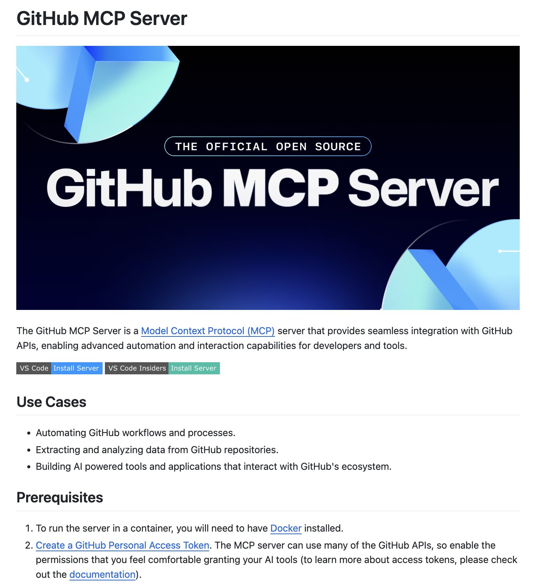

**Source:** [https://twitter.com/i/web/status/1908497370683506959](https://twitter.com/i/web/status/1908497370683506959)
**Original Post Date:** 2025-05-28 01:12:52

# GitHub Model Context Protocol (MCP) Server Integration: Architecture and Implementation

## Introduction
The GitHub Model Context Protocol (MCP) Server is a critical component in modern microservices architectures, enabling seamless automation and interaction with GitHub repositories through its RESTful API. This server facilitates advanced operations including workflow automation, data extraction for analysis, and AI-driven tool integration within the GitHub ecosystem.

## Technical Overview

The MCP Server implements a standardized protocol for handling GitHub API interactions, abstracting complex repository management tasks into manageable operations. It provides a robust interface for developers to automate repetitive processes while ensuring secure access through token-based authentication.

Key architectural components include: RESTful endpoints for workflow automation, data extraction modules for analytics, and AI integration interfaces for intelligent tool development.

- REST API Integration Layer
- Workflow Automation Engine
- Data Extraction Pipeline

## Implementation Prerequisites

Before deployment, ensure Docker is installed and available in your environment. Create a GitHub Personal Access Token with appropriate scopes for repository access.

The token must be configured with the following permissions: repo, workflow, admin:org, and read:user.

```bash
# Example Docker run command
sudo docker run -d -p 8080:8080 --name mcp-server github-mcp/server-image
# Configure token in environment variables
export GITHUB_TOKEN=your-personal-access-token
```

## Deployment Strategies

Deploy the MCP Server using Docker containers for optimal isolation and scalability. Integration with VS Code provides a streamlined development experience.

Consider implementing load balancing for production environments to handle multiple concurrent connections.

1. Install Docker environment
1. Pull MCP Server image
1. Configure token authentication
1. Deploy containerized instance

> **Note/Tip:** Always use environment variables for sensitive credentials like GitHub tokens.

> **Note/Tip:** Implement proper logging and monitoring using Docker's built-in mechanisms.

## Key Takeaways

- MCP Server enables seamless integration between GitHub repositories and microservices through standardized API endpoints
- Docker containerization provides deployment consistency across different environments
- VS Code integration streamlines development workflow for server configuration and testing

## Conclusion
Implementing the GitHub MCP Server is essential for modern microservices architectures requiring automated repository management. By leveraging Docker containers and proper security practices with personal access tokens, teams can efficiently manage complex workflows while maintaining robust security standards.

## External References

- [GitHub Personal Access Token Documentation](https://docs.github.com/en/authentication/keeping-your-account-and-data-secure/creating-a-personal-access-token)
- [Docker Official Documentation](https://docs.docker.com/get-started/)


## Media

**Image Description:** ### Description of the Image

The image is a screenshot of a webpage or documentation related to the **GitHub MCP Server**. The content is structured to provide an overview of the server, its use cases, prerequisites, and installation instructions. Below is a detailed breakdown:

---

#### **Header Section**
- **Title**: The main heading at the top reads **"GitHub MCP Server"** in bold, large font.
- **Background**: The background is predominantly dark blue with a gradient effect, featuring a stylized, abstract design with light blue and white geometric shapes. This design is likely symbolic of the GitHub logo or related technology.
- **Subtitle**: Below the title, there is a tagline that reads **"THE OFFICIAL OPEN SOURCE"**, enclosed in a light blue rectangular box. This emphasizes the open-source nature of the project.

---

#### **Main Content Section**
- **Introduction**: The introductory paragraph explains the purpose of the **GitHub MCP Server**:
  - It is described as a **Model Context Protocol (MCP)** server.
  - The server provides **seamless integration** with **GitHub APIs**.
  - It enables **advanced automation and interaction capabilities** for developers and tools.

- **Key Features**:
  - The server is designed to work with GitHub workflows and processes.
  - It supports automation of GitHub workflows and processes.
  - It facilitates data extraction and analysis from GitHub repositories.
  - It enables the development of AI-powered tools and applications that interact with GitHub.

---

#### **Use Cases**
- The section titled **"Use Cases"** lists specific applications of the GitHub MCP Server:
  1. **Automating GitHub workflows and processes**.
  2. **Extracting and analyzing data from GitHub repositories**.
  3. **Building AI-powered tools and applications that interact with GitHub**.

---

#### **Prerequisites**
- The section titled **"Prerequisites"** outlines the requirements to set up and run the GitHub MCP Server:
  1. **Docker Installation**: To run the server in a container, **Docker** must be installed.
  2. **GitHub Personal Access Token**: A **GitHub Personal Access Token** is required. This token grants the necessary permissions for the MCP server to interact with GitHub APIs.

---

#### **Installation Instructions**
- The image includes buttons for installation:
  - **"VS Code Install Server"**: A button for installing the server using Visual Studio Code.
  - **"VS Code Insiders Install Server"**: Another button for installing the server using the Insiders version of Visual Studio Code.

---

#### **Design and Layout**
- **Color Scheme**: The design uses a dark theme with a dark blue background and white/light blue text, creating a modern and professional look.
- **Typography**: The text is well-structured with clear headings, bullet points, and links for additional information.
- **Links**: There are hyperlinks for:
  - **Docker**: To guide users to install Docker.
  - **GitHub Personal Access Token Documentation**: To help users create and manage access tokens.

---

### Key Technical Details
1. **GitHub MCP Server**:
   - A server based on the **Model Context Protocol (MCP)**.
   - Integrates with **GitHub APIs** for automation and interaction.
   - Supports advanced functionalities like data extraction, analysis, and AI-powered tools.

2. **Integration with GitHub**:
   - Requires a **GitHub Personal Access Token** to authenticate and authorize API interactions.
   - Enables seamless communication with GitHub repositories and workflows.

3. **Containerization**:
   - The server can be run in a container, requiring **Docker** to be installed.

4. **Development Tools**:
   - Installation options are provided for **Visual Studio Code** and **VS Code Insiders**.

---

### Summary
The image provides a comprehensive overview of the **GitHub MCP Server**, highlighting its purpose, use cases, prerequisites, and installation process. It is designed to appeal to developers and technical users who want to leverage GitHub APIs for advanced automation and AI-driven applications. The emphasis on open-source, integration, and ease of use is evident throughout the content.
