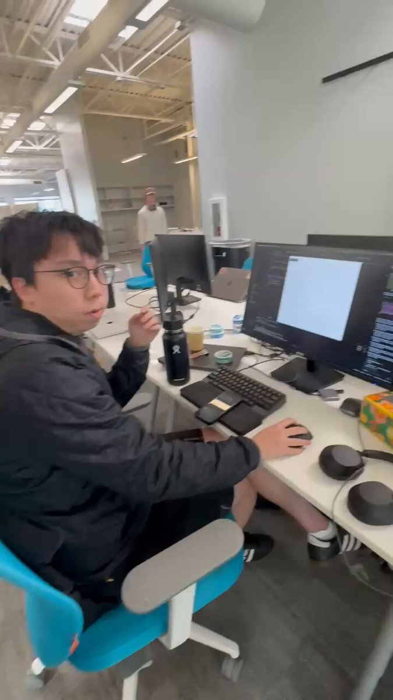

**Source:** [https://twitter.com/i/web/status/1907963792778211568](https://twitter.com/i/web/status/1907963792778211568)
**Original Post Date:** 2025-05-27 23:44:17

# Microservices Architecture: Comprehensive Technical Overview

## Fundamental Concepts

## Technical Architecture Components

## Communication Patterns

## Data Management in Microservices

## Deployment and Orchestration

## Monitoring and Observability

## Security Considerations

## Media

**Video Description:** Video Content Analysis - media_seg0_item0.mp4:

The video appears to capture a professional or technical work environment, likely an office or a collaborative workspace. Here's a comprehensive description based on the provided frames:

### **Setting and Environment**
1. **Office Space**: The video is set in a modern, open-plan office with high ceilings, exposed beams, and industrial-style lighting. The space is well-lit, with natural light complemented by overhead lighting.
2. **Furniture and Layout**: The office features a mix of blue and white chairs, desks, and workstations. There are visible elements like whiteboards, shelves, and potted plants, contributing to a clean and organized workspace.
3. **Technology**: The desks are equipped with computers, monitors, keyboards, and other peripherals. The presence of multiple screens and coding-related content suggests a tech-focused or software development environment.

### **Main Subject**
1. **Person in Focus**: The primary subject is a person seated at a desk, engaged in work. They are wearing a black jacket, glasses, and appear to be focused on their computer screen.
2. **Body Language and Actions**:
   - In the first frame, the individual is gesturing with their hands, possibly explaining or discussing something, indicating a collaborative or explanatory moment.
   - In the second frame, the person is more focused, with their hand resting on their chin, suggesting deep thought or concentration.
   - In the third frame, the focus shifts to the computer screen, showing detailed coding or programming work.

### **Technical Content**
1. **Computer Screen**: The third frame provides a close-up of the computer screen, displaying code or a development environment. The content includes:
   - **Code Editor**: The screen shows a text editor with lines of code, likely written in a programming language such as Python or JavaScript.
   - **Error Messages**: There are visible error messages or logs, indicating debugging or troubleshooting activities.
   - **Comments and Documentation**: The code includes comments, suggesting an emphasis on clarity and maintainability.
2. **Workspace Setup**: The desk setup includes a monitor, keyboard, mouse, and various peripherals like USB drives and adapters, indicating a typical developer’s workspace.

### **Overall Narrative**
The video seems to depict a day in the life of a software developer or a technical professional working in a collaborative office environment. The sequence of frames suggests a workflow that involves:
1. **Collaboration**: The initial frame shows the individual gesturing, possibly explaining a concept or code to a colleague.
2. **Deep Focus**: The second frame captures a moment of intense concentration, likely analyzing or solving a problem.
3. **Technical Work**: The third frame provides a detailed view of the coding environment, highlighting the technical nature of the work being performed.

### **Key Themes**
- **Professional Environment**: The video emphasizes a modern, tech-savvy workspace with a focus on collaboration and productivity.
- **Problem-Solving**: The presence of error messages and the individual’s focused demeanor suggest a focus on debugging and resolving technical issues.
- **Technical Skills**: The coding environment and the individual’s engagement with the screen highlight the technical expertise required in software development.

### **Conclusion**
The video provides a cohesive look at a professional working in a tech-oriented role, capturing both the collaborative and individual aspects of their work. It showcases the dynamic nature of problem-solving in a technical field, with a clear emphasis on coding, debugging, and communication within a modern office setting.

Key Frames Analysis:
Frame 1: ### Description of Frame 1:

#### **Foreground:**
- A person is seated in a bright blue office chair with a gray seat cushion. The chair has a modern design with white legs.
- The individual is wearing a black quilted jacket and black shorts, along with black sneakers.
- They are sitting at a white desk with various items on it.
- The person is gesturing with their hands, with one hand raised and the other slightly extended, suggesting they are speaking or explaining something.

#### **Desk and Workspace:**
- The desk is white and has multiple items on it:
  - A black water bottle is placed near the center of the desk.
  - A black computer monitor is positioned on the desk, along with a keyboard and a mouse.
  - There are other small items, including a yellow cup, a green container, and some other office supplies.
  - A laptop is partially visible on the desk, with its lid open.

#### **Background:**
- The setting appears to be a modern, open-plan office space with high ceilings and exposed white beams.
- The office has a clean and bright aesthetic, with white walls and ample lighting from overhead fixtures.
- There are several office chairs and desks visible in the background, indicating a collaborative workspace.
- Some shelves and storage units are visible in the background, along with a few potted plants, adding a touch of greenery to the space.
- The office has a mix of blue and white chairs, contributing to a vibrant and professional atmosphere.

#### **Additional Details:**
- The overall environment is well-lit, with natural light possibly coming from windows outside the frame.
- The person appears to be engaged in a conversation or presentation, given their hand gestures and posture.

This frame captures a professional and dynamic office environment, with the individual actively interacting in what seems to be a work-related context.
Frame 2: In frame 2 of the video, the following details are visible:

1. **Setting**: The scene is set in an open office environment with a modern, industrial design. The ceiling has exposed beams and fluorescent lighting, contributing to a bright and airy atmosphere.

2. **Foreground**:
   - A person is seated on a teal office chair with a white base. The chair has a cushioned seat and backrest.
   - The individual is wearing a dark jacket and appears to be focused on a computer screen in front of them.
   - The person is sitting at a white desk with various items on it:
     - A black water bottle is placed on the desk.
     - A few small containers or cups are visible, including a yellow one and a green one.
     - A smartphone is placed on the desk, along with a black wallet or case.
     - A dual-monitor setup is present, with one monitor displaying code or text.

3. **Background**:
   - The office is spacious and open, with multiple desks and workstations visible.
   - Other individuals are seated at desks in the background, working on their computers.
   - The office has a mix of blue and white chairs, and some desks are organized with plants and personal items.
   - Whiteboards are visible in the background, indicating a collaborative workspace.
   - Shelving units and storage areas are present, contributing to the organized layout of the office.

4. **Lighting and Atmosphere**:
   - The lighting is bright, with a combination of natural light from windows and artificial lighting from the ceiling.
   - The overall atmosphere is professional and focused, typical of a tech or creative office environment.

This frame captures a typical moment in a modern, collaborative office space where individuals are engaged in work on their computers.
Frame 3: ### Description of Frame 3:

#### **Visible Content:**
1. **Monitor Display:**
   - The monitor shows a coding or development environment, likely an Integrated Development Environment (IDE) or a code editor.
   - The left side of the screen displays a file explorer or project directory structure, indicating that the user is working on a project.
   - The central part of the screen shows a blank or mostly empty text editor window, with some text or code visible at the top left corner.
   - The right side of the screen contains a terminal or console output, displaying text that appears to be logs, error messages, or command outputs. The text includes phrases like:
     - "cannot load error"
     - "Access-Control-Allow-Origin"
     - "Finalize"
     - "Let's make sure the code"
     - "Access-Control-Allow-Origin"
     - "Access-Control-Allow-Methods"
   - The terminal output suggests that the user is debugging or testing code, possibly related to web development or API interactions.

2. **Hardware Setup:**
   - The monitor is a large, widescreen display with a black bezel. The brand "KTC" is visible on the bottom bezel.
   - Below the monitor, there is a desk with various peripherals:
     - A black keyboard is partially visible on the left side of the desk.
     - A black computer mouse is placed on the desk to the right of the monitor.
     - Several USB devices and cables are connected to the monitor or desk setup, including:
       - A USB drive.
       - A small external hard drive or SSD.
       - A USB-C adapter or hub.
     - These devices are neatly arranged near the monitor's base.

3. **Background:**
   - The background includes a white wall on the left side and a wooden panel on the right side. The wooden panel has a rustic, horizontal plank design.
   - A black sliding barn door track is mounted on the wall above the wooden panel, suggesting a modern or industrial design aesthetic.

4. **Lighting:**
   - The room is well-lit, likely with natural light coming from an unseen window, as the overall scene is bright and clear.

#### **Summary:**
The frame depicts a workspace setup where someone is engaged in coding or software development. The monitor shows a code editor with a blank or minimal text area and a terminal on the right displaying logs or error messages. The desk includes essential peripherals like a keyboard, mouse, and USB devices, and the background features a modern, industrial-style design with a wooden panel and sliding barn door track. The overall environment suggests a focused and organized work area.
Frame 4: ### Description of Frame 4:

#### **Foreground:**
- **Monitor Display:**
  - The monitor shows a graphical interface with a network or graph visualization. The graph consists of numerous nodes connected by lines, forming a network-like structure.
  - The nodes are colored in two distinct shades:
    - **Purple nodes:** These are more densely clustered in the center of the graph.
    - **Orange nodes:** These are more sparsely distributed around the periphery of the graph.
  - The nodes are interconnected with lines, indicating relationships or connections between them.

- **Code Editor:**
  - On the right side of the monitor, there is a code editor open with visible text. The code appears to be written in a programming language, possibly Python or JavaScript, based on the syntax and structure.
  - The code includes comments and functions, suggesting it is related to data processing, network analysis, or visualization.

#### **Desk and Peripherals:**
- Below the monitor, the desk is visible with several items:
  - A **USB drive** or external storage device is placed on the desk.
  - A **small black device** (possibly a USB hub or another peripheral) is also visible.
  - Cables are connected to the monitor and other devices, indicating an active setup.

#### **Background:**
- **Wall and Decor:**
  - The wall in the background is white, and there is a large wooden pallet-style structure mounted on it. The pallets are arranged in a vertical pattern, adding a rustic or industrial aesthetic to the room.
  - The pallets are made of wood with visible grain and knots, giving them a natural, textured appearance.

- **Additional Elements:**
  - To the left of the monitor, part of another desk or workspace is visible, with some items or equipment partially in view.
  - The room appears to be well-lit, likely with natural light coming from an unseen window or artificial lighting.

#### **Overall Context:**
- The scene suggests a workspace or office environment, likely used for data analysis, software development, or network visualization tasks. The combination of the graph visualization and the code editor indicates that the user is working on a project involving network analysis, data processing, or similar technical activities.

This frame provides a clear view of a technical workspace with a focus on data visualization and coding. The graph on the screen and the code editor suggest an active project involving network or data analysis.
Frame 5: In frame 5 of the video, the following details are visible:

### **Foreground:**
- A large computer monitor is prominently displayed in the foreground, showing a split-screen setup.
  - **Left side of the screen:** A settings or configuration window is open, with a section titled "Authentication Options." It includes options like "Authentication," "Authorization," and "Caching." There are checkboxes and text fields visible.
  - **Right side of the screen:** A code editor is open, displaying lines of code in a syntax-highlighted format. The code appears to be related to programming, possibly involving JavaScript or a similar language, with visible elements like `console.log`, `fetch`, and other functions.
  - The bottom of the screen shows a terminal or console output with text, indicating some form of debugging or execution output.

### **Midground:**
- A person is seated at the desk, partially visible behind the monitor. They appear to be focused on the screen, likely working on the code or configuration displayed.
- The desk surface is white and clean, with a few items visible:
  - A black keyboard and mouse are placed on the desk.
  - A small container of what appears to be lip balm or a similar item is on the left side of the desk.
  - A black external device (possibly a hard drive or USB hub) is connected to the monitor.
  - A colorful box with a pattern of orange and yellow circles is partially visible on the right side of the desk.

### **Background:**
- The room has a modern, minimalist design with white walls.
- A section of the wall features a wooden panel with a rustic, industrial look, mounted on black metal brackets.
- The ceiling is visible, with a curved or arched design, adding to the modern aesthetic.
- In the far background, there are additional desks and office furniture, suggesting this is a shared workspace or office environment.

### **Lighting:**
- The room is well-lit, likely with natural light coming from windows outside the frame, complemented by indoor lighting.

### **Overall Context:**
The scene depicts a professional or collaborative workspace where someone is engaged in coding or software development. The focus is on the computer screen, highlighting the technical work being performed. The environment suggests a tech-oriented or creative office setting.

**Image Description:** The image depicts a person sitting at a desk in what appears to be an office or workspace environment. Below is a detailed description of the main subject and the surrounding elements:

### **Main Subject:**
1. **Person:**
   - The individual is seated on a blue and gray office chair, facing a computer setup.
   - They are wearing glasses and a dark jacket, suggesting a casual or semi-casual work environment.
   - Their posture indicates they are engaged in work, with one hand on the mouse and the other gesturing or holding something small, possibly a snack or a pen.
   - The person appears to be looking slightly off-camera, possibly interacting with someone or something outside the frame.

2. **Desk Setup:**
   - The desk is white and appears to be part of a modern office setup.
   - **Monitors:** There are two computer monitors:
     - The primary monitor on the right displays a coding or development interface, with a visible text editor and some code or terminal output.
     - The secondary monitor on the left is turned off or displaying a blank screen.
   - **Keyboard and Mouse:** A black keyboard and mouse are placed on the desk, indicating the person is actively working on the computer.
   - **Headset:** A pair of black over-ear headphones is placed on the desk, suggesting the individual might be involved in tasks requiring audio communication, such as meetings or calls.

3. **Desk Items:**
   - **Water Bottle:** A black water bottle with a logo is placed on the desk, indicating the person is staying hydrated.
   - **Snacks and Beverages:** There are some snacks and a yellow beverage (possibly a drink or juice) on the desk, suggesting the person is taking a break or multitasking.
   - **Miscellaneous Items:** There are other small items on the desk, including a wallet, a phone, and some sticky notes, indicating a typical workspace setup.

### **Background:**
1. **Office Environment:**
   - The background shows an open-plan office space with high ceilings and exposed structural elements, such as beams and ductwork.
   - The lighting is bright, with overhead fluorescent lights illuminating the space.
   - There are white walls and some shelving units in the background, contributing to a clean and organized workspace.
   - Another person is visible in the background, standing near a shelving unit, wearing a light-colored hoodie and a cap. This suggests a collaborative or shared office environment.

2. **Additional Details:**
   - The floor is made of polished concrete, which is common in modern office spaces.
   - The overall aesthetic is minimalistic and functional, typical of tech or creative workspaces.

### **Technical Details:**
- **Computer Setup:** The primary monitor shows a coding interface, indicating the person might be a developer or working on technical tasks. The visible text editor and terminal suggest they are working with code.
- **Workspace Ergonomics:** The chair is ergonomic, with a supportive backrest and armrests, which is important for long hours of work.
- **Headset:** The presence of the headset suggests the individual might be involved in tasks requiring audio communication, such as video calls, meetings, or customer support.

### **Overall Impression:**
The image portrays a typical scene in a modern office, where the individual is engaged in technical work, possibly coding or development, while maintaining a casual and comfortable workspace. The presence of snacks, beverages, and personal items adds a human touch, indicating a relaxed yet productive environment. The open-plan office layout and bright lighting contribute to a collaborative and professional atmosphere.
