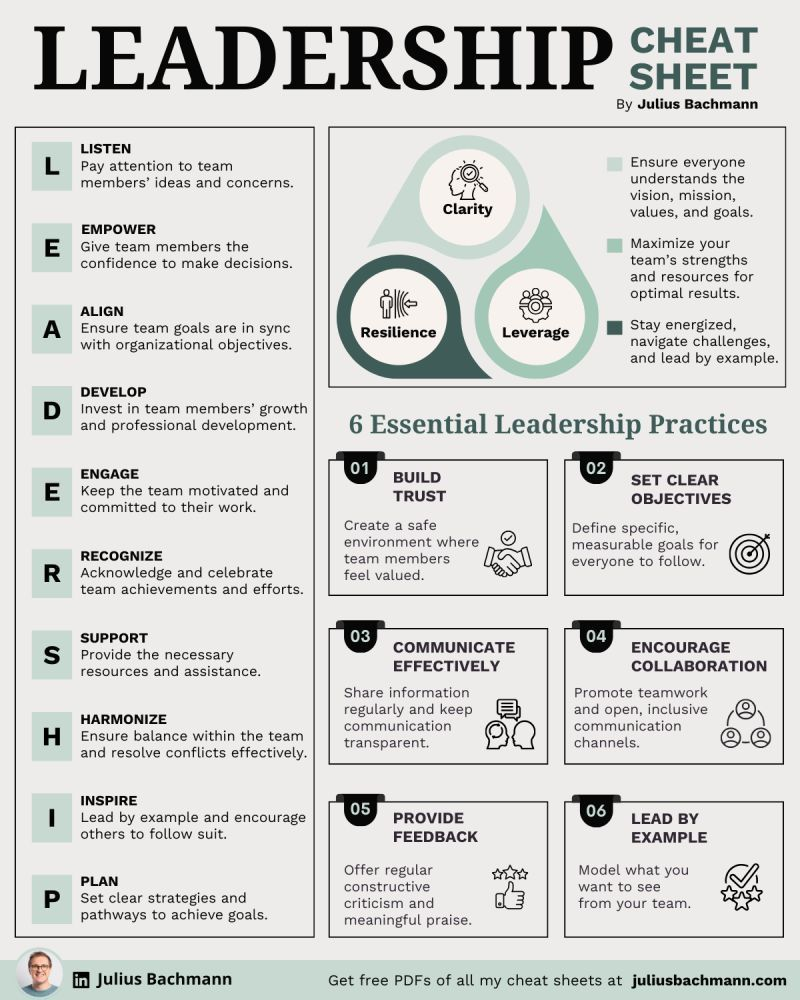

**Source:** [https://twitter.com/i/web/status/1879529475911635019](https://twitter.com/i/web/status/1879529475911635019)
**Original Post Date:** 2025-05-28 05:10:40

# Microservices Architecture: Principles and Best Practices

## Introduction
Microservices architecture has become a cornerstone of modern software development, offering scalability, flexibility, and resilience. This article explores essential principles, architectural patterns, and implementation strategies for building robust microservice-based systems. We'll examine the core concepts that differentiate microservices from monolithic architectures and provide practical guidance on designing, implementing, and maintaining distributed systems.

## Core Principles of Microservices Architecture

Microservices architecture is built upon several fundamental principles that drive its effectiveness. These include service independence, loose coupling, and decentralized data management. Each microservice should be designed to perform a specific business function independently.

The principle of 'bounded contexts' from Domain-Driven Design (DDD) is essential in microservices architecture. It ensures each service has clear boundaries and responsibilities that align with business domains.

1. Each service should be independently deployable
1. Services communicate through lightweight protocols like REST or gRPC
1. Decentralized data management with database per service pattern

> **Note/Tip:** Avoid the temptation to create too fine-grained services; this can lead to excessive network overhead and coordination complexity.

## Design Patterns for Microservices

Implementing effective microservices requires adherence to established design patterns. The Circuit Breaker pattern, inspired by Hystrix, helps manage failure scenarios when dependent services are unavailable.

The API Gateway pattern serves as a single entry point for clients, providing load balancing, authentication, and request routing capabilities.

_Example of Spring Cloud Gateway configuration for routing requests to different microservices_

```yaml
spring:
  cloud:
    gateway:
      routes:
      - id: auth_route
        uri: lb://auth-service
        predicates:
        - Path=/api/auth/**
        filters:
        - name: TokenRelayFilter
          order: 1
```

- Circuit Breaker Pattern
- API Gateway Pattern
- Saga Pattern for distributed transactions
- Event Sourcing and CQRS

## Challenges and Solutions in Microservices

Microservices introduce new challenges such as service discovery, inter-service communication, and distributed monitoring. These require sophisticated solutions like Consul or Eureka for service discovery.

Distributed tracing becomes essential for debugging and performance analysis across services. Tools like Jaeger provide end-to-end visibility.

_Example of a distributed tracing span in JSON format_

```json
{
  "traceId": "9b352d8-1ad4f-476c-ba01-59e8cb90c7da",
  "spans": [
    {
      "id": "4bf92c6b0ac71cd1",
      "name": "auth-service.auth.user",
      "timestamp": 1563416373821000,
      "duration": 125
    }
  ]
}
```

1. Complexity in testing and deployment
1. Data consistency challenges across service boundaries
1. Network latency and reliability issues

## DevOps and CI/CD for Microservices

Microservices require robust DevOps practices to manage continuous delivery. Containerization with Docker, orchestration with Kubernetes, and automated testing pipelines are essential components.

Implementing feature toggles and canary deployments allows safe rollouts of new service versions without downtime.

_Kubernetes deployment configuration for a microservice with canary rollout support_

```yaml
apiVersion: apps/v1
kind: Deployment
metadata:
  name: auth-service
spec:
  replicas: 3
  strategy:
    type: RollingUpdate
    rollingUpdate:
      maxSurge: 1
      maxUnavailable: 0
```

## Key Takeaways

- Microservices should be aligned with business domains rather than technical concerns
- Implement robust monitoring and observability from the start of your microservices journey
- Use event-driven architecture to decouple services while maintaining loose coupling
- Adopt a DevOps culture and automated CI/CD pipelines for sustainable microservice management

## Conclusion
Microservices architecture offers significant benefits in terms of scalability, maintainability, and innovation velocity. However, success requires careful attention to architectural principles, design patterns, and operational practices. By following the guidance provided in this article, teams can effectively build and manage complex distributed systems while avoiding common pitfalls.

## External References

- [Martin Fowler's Microservices Overview](https://martinfowler.com/microservices/)
- [Netflix Architecture Center of Excellence Blog](http://techblog.netflix.com/search/label/Microservices)
- [O'Reilly: Building Microservices by Sam Newman](https://www.oreilly.com/library/view/building-microservices/9781491950357/)


## Media

**Image Description:** ### Description of the Image

The image is a detailed infographic titled **"Leadership Cheat Sheet"** by Julius Bachmann. It is designed to provide a comprehensive guide to effective leadership practices, divided into two main sections: **LEADERSHIP PRINCIPLES** and **ESSENTIAL LEADERSHIP PRACTICES**. The layout is clean, organized, and visually appealing, with a mix of text, icons, and color-coded sections to enhance readability and comprehension.

---

### **Main Sections**

#### **1. Leadership Principles**
This section is presented in a vertical list on the left side of the infographic. Each principle is represented by a letter, forming the acronym **LEADERSHIP**. Each principle is accompanied by a brief explanation and a light green background for emphasis.

- **L - Listen**
  - **Explanation**: Pay attention to team members' ideas and concerns.
  - **Icon**: A light green box with the letter "L."

- **E - Empower**
  - **Explanation**: Give team members the confidence to make decisions.
  - **Icon**: A light green box with the letter "E."

- **A - Align**
  - **Explanation**: Ensure team goals are in sync with organizational objectives.
  - **Icon**: A light green box with the letter "A."

- **D - Develop**
  - **Explanation**: Invest in team members' growth and professional development.
  - **Icon**: A light green box with the letter "D."

- **E - Engage**
  - **Explanation**: Keep the team motivated and committed to their work.
  - **Icon**: A light green box with the letter "E."

- **R - Recognize**
  - **Explanation**: Acknowledge and celebrate team members' achievements and efforts.
  - **Icon**: A light green box with the letter "R."

- **S - Support**
  - **Explanation**: Provide the necessary resources and assistance.
  - **Icon**: A light green box with the letter "S."

- **H - Harmonize**
  - **Explanation**: Ensure balance within the team and resolve conflicts effectively.
  - **Icon**: A light green box with the letter "H."

- **I - Inspire**
  - **Explanation**: Lead by example and encourage others to follow suit.
  - **Icon**: A light green box with the letter "I."

- **P - Plan**
  - **Explanation**: Set clear strategies and pathways to achieve goals.
  - **Icon**: A light green box with the letter "P."

---

#### **2. Essential Leadership Practices**
This section is presented on the right side of the infographic and is divided into six key practices, each with a numbered heading and a brief explanation. Each practice is accompanied by an icon and a light green or dark green background for emphasis.

- **01. Build Trust**
  - **Explanation**: Create a safe environment where team members feel valued.
  - **Icon**: A handshake symbol.
  - **Color**: Light green.

- **02. Set Clear Objectives**
  - **Explanation**: Define specific, measurable goals for everyone to follow.
  - **Icon**: A target symbol.
  - **Color**: Light green.

- **03. Communicate Effectively**
  - **Explanation**: Share information regularly and keep communication transparent.
  - **Icon**: Speech bubble symbols.
  - **Color**: Light green.

- **04. Encourage Collaboration**
  - **Explanation**: Promote teamwork and open, inclusive communication channels.
  - **Icon**: Two people connecting.
  - **Color**: Light green.

- **05. Provide Feedback**
  - **Explanation**: Offer regular constructive criticism and meaningful praise.
  - **Icon**: Thumbs-up and thumbs-down symbols.
  - **Color**: Dark green.

- **06. Lead by Example**
  - **Explanation**: Model the behavior you want to see from your team.
  - **Icon**: A checkmark symbol.
  - **Color**: Dark green.

---

### **Central Visual Element**
In the middle of the infographic, there is a triangular diagram with three interconnected circles, each representing a key leadership attribute:

1. **Clarity**
   - **Explanation**: Ensure everyone understands the vision, mission, values, and goals.
   - **Icon**: A magnifying glass over a human head.

2. **Resilience**
   - **Explanation**: Stay energized, navigate challenges, and lead by example.
   - **Icon**: A human figure with a shield.

3. **Leverage**
   - **Explanation**: Maximize the team's strengths and resources for optimal results.
   - **Icon**: A gear symbol.

Each circle is color-coded (light green, dark green, and light green, respectively) and connected to emphasize their interdependence.

---

### **Footer**
At the bottom of the infographic, there is a call-to-action section:

- **Author Information**: The infographic is credited to **Julius Bachmann**, with a small circular profile picture of the author on the left.
- **Website Link**: A link to the author's website, **juliusbachmann.com**, is provided.
- **PDF Offer**: A prompt to get free PDFs of all cheat sheets is included, directing users to the author's website.

---

### **Design Elements**
- **Color Scheme**: The infographic uses a clean, professional color palette with shades of green, black, and white.
- **Icons**: Simple, clear icons are used to represent each principle and practice, enhancing visual appeal and understanding.
- **Typography**: The text is well-organized, with clear headings, subheadings, and bullet points for easy readability.
- **Layout**: The layout is symmetrical and balanced, with the principles on the left and practices on the right, converging in the central triangular diagram.

---

### **Overall Purpose**
The infographic serves as a concise and visually engaging guide for leaders, providing actionable principles and practices to enhance leadership effectiveness. It is designed to be easily digestible and practical for both new and experienced leaders.
