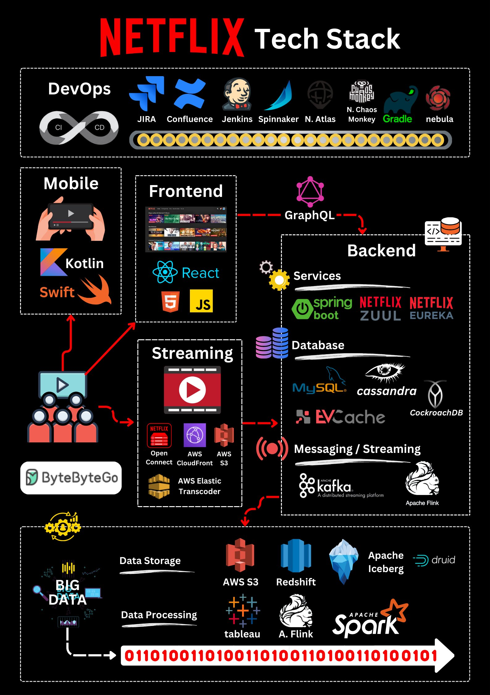

**Source:** [https://twitter.com/i/web/status/1871786708125323441](https://twitter.com/i/web/status/1871786708125323441)
**Original Post Date:** 2025-05-27 17:49:38

# Netflix Microservices Architecture: Technology Stack and Best Practices

## Introduction
Netflix's global streaming platform exemplifies modern distributed systems design. This knowledge base item explores their technology stack across DevOps, mobile development, frontend/backend services, and data management. Understanding Netflix's architectural choices provides valuable insights for building scalable cloud-native applications with high resilience and performance.

## DevOps Infrastructure

Netflix employs a robust DevOps pipeline leveraging Jenkins and Spinnaker for continuous delivery, enabling rapid deployment of features while maintaining system stability.

The Chaos Engineering practice is central to their approach, using tools like N. Atlas and Monkey to proactively identify and address system weaknesses.

- Jenkins: CI/CD orchestration
- Spinnaker: Multi-cloud deployment
- N. Chaos: Resilience testing

> **Note/Tip:** Chaos Engineering should be integrated early in the development lifecycle

## Backend Architecture

The backend leverages Netflix OSS (Eureka, Zuul) for service discovery and API gateway functionality, enabling microservices to communicate efficiently.

Data storage combines MySQL for structured data with Cassandra and CockroachDB for distributed NoSQL needs.

_Example of service discovery using Netflix Eureka_

```java
public class ServiceDiscovery {
  @Autowired
  private EurekaClient eurekaClient;
  
  public String getServiceUrl(String serviceName) {
    InstanceInfo instance = eurekaClient.getNextServerFromEureka(serviceName, false);
    return instance.getHomePageUrl();
  }
}
```

1. Zuul API Gateway configuration
1. Service registration with Eureka
1. GraphQL implementation patterns

## Data Processing and Analytics

Apache Spark handles large-scale data processing, while Apache Flink provides real-time analytics capabilities.

Druid and Redshift form the core of Netflix's analytics infrastructure, enabling complex query execution at scale.

- Apache Spark for batch processing
- Flink for stream processing
- Druid for real-time analytics

## Cloud Infrastructure

AWS serves as the primary cloud provider, with S3 handling storage needs and CloudFront managing global content delivery.

Open Connect extends Netflix's reach by delivering content directly to ISPs for optimal streaming performance.

1. S3 for media file storage
1. CloudFront for CDN distribution
1. Elastic Transcoder for video conversion

## Key Takeaways

- Implementing chaos engineering principles is crucial for building resilient systems
- Service discovery and API gateway patterns are essential in microservices architectures
- Balancing structured and unstructured data storage requires careful consideration of use cases
- Cloud-native applications must leverage hybrid cloud strategies for optimal performance

## Conclusion
Netflix's architecture demonstrates how combining cloud infrastructure, resilient design principles, and modern development practices can scale to support millions of users globally. Engineers can apply these patterns to build robust, scalable systems.

## External References

- [Netflix Technology Blog](https://netflixtechblog.com/)
- [AWS Services Documentation](https://aws.amazon.com/documentation/)


## Media

**Image Description:** The image is a detailed infographic that illustrates the **technology stack** used by Netflix. It provides an overview of the various tools, frameworks, and services that power Netflix's infrastructure, from development and operations to data processing and streaming. Below is a detailed breakdown of the image, organized by sections:

---

### **1. DevOps**
- **CI/CD Pipeline**: 
  - **Jenkins**: A popular open-source automation server used for continuous integration and continuous delivery.
  - **Spinnaker**: A multi-cloud continuous delivery platform for releasing software changes with high velocity and confidence.
  - **JIRA**: An issue tracking and project management tool used for managing tasks and workflows.
  - **Confluence**: A collaboration tool for creating and sharing knowledge within the team.
  - **N. Atlas**: A Netflix-specific tool for monitoring and managing infrastructure.
  - **N. Chaos**: A tool for chaos engineering, used to test the resilience of systems.
  - **Monkey**: A tool for simulating failures in the system to test fault tolerance.
  - **Gradle**: A build automation tool used for managing dependencies and building projects.
  - **Nebula**: A set of Gradle plugins developed by Netflix for building and deploying applications.

---

### **2. Mobile**
- **Languages and Frameworks**:
  - **Kotlin**: A modern, statically-typed programming language for Android app development.
  - **Swift**: A programming language for iOS app development.
- **User Interface**:
  - The image shows hands holding a mobile device, indicating the focus on mobile app development and user experience.

---

### **3. Frontend**
- **Technologies**:
  - **React**: A JavaScript library for building user interfaces, particularly popular for creating interactive web applications.
  - **HTML5**: The latest version of HTML, used for structuring web content.
  - **JavaScript**: The primary scripting language for web development.
- **User Interface**:
  - The image shows a screenshot of the Netflix web interface, highlighting the frontend's role in delivering the user experience.

---

### **4. Backend**
- **Services**:
  - **GraphQL**: A query language for APIs, allowing clients to request only the data they need.
  - **Spring Boot**: A Java-based framework for building microservices and web applications.
  - **Netflix OSS (Open Source Software)**:
    - **Zuul**: A gateway service that provides dynamic routing, monitoring, and security.
    - **Eureka**: A service registry for discovering and managing microservices.
- **Database**:
  - **MySQL**: A relational database management system.
  - **Cassandra**: A distributed NoSQL database for handling large amounts of data with high availability.
  - **CockroachDB**: A distributed SQL database designed for scalability and fault tolerance.
- **Caching**:
  - **EVCache**: A distributed caching system used for improving performance by storing frequently accessed data.
- **Services**:
  - **AWS Services**:
    - **AWS S3**: A cloud-based object storage service for storing large amounts of data.
    - **AWS CloudFront**: A content delivery network (CDN) for distributing content globally.
    - **AWS Elastic Transcoder**: A service for converting media files into formats suitable for streaming.

---

### **5. Streaming**
- **Streaming Services**:
  - **Netflix Streaming**: The core streaming platform used for delivering video content.
  - **AWS Services**:
    - **AWS S3**: Used for storing video files.
    - **AWS CloudFront**: Used for caching and delivering content globally.
    - **AWS Elastic Transcoder**: Used for converting video files into different formats for streaming.
- **Messaging and Streaming**:
  - **Kafka**: A distributed streaming platform used for handling real-time data streams.
  - **Apache Flink**: A distributed stream and batch processing framework for real-time data analytics.

---

### **6. Data Storage**
- **Databases and Storage**:
  - **AWS S3**: Used for storing large amounts of data, including video files and other media.
  - **Redshift**: A fully managed, petabyte-scale data warehouse service for running complex analytical queries.
  - **Apache Iceberg**: An open-source table format for large analytic datasets, providing features like time travel and schema evolution.
  - **Druid**: A fast, distributed data store for real-time analytics and time-series data.

---

### **7. Data Processing**
- **Tools and Frameworks**:
  - **Apache Spark**: A unified analytics engine for large-scale data processing and machine learning.
  - **Apache Flink**: Used for real-time and batch data processing.
  - **Tableau**: A business intelligence and data visualization tool for analyzing and presenting data.

---

### **8. Infrastructure and Networking**
- **AWS Services**:
  - **AWS S3**: Used for object storage.
  - **AWS CloudFront**: Used for content delivery and caching.
  - **AWS Elastic Transcoder**: Used for video transcoding.
- **Open Connect**: A service that allows Netflix to deliver content directly to internet service providers (ISPs) for faster and more reliable streaming.

---

### **9. Binary Data Representation**
- At the bottom of the image, there is a binary string (`0101001001001101010100110100110100100101`), which represents the fundamental data format used in computing. This emphasizes the foundation of all the technologies shown in the image.

---

### **Overall Structure**
The image is organized into a hierarchical structure, starting from the **DevOps** tools at the top, moving through **Mobile** and **Frontend** layers, then into the **Backend** and **Streaming** services, and finally into **Data Storage** and **Data Processing** at the bottom. Each section is interconnected, highlighting the flow of data and the dependencies between different components.

---

### **Key Takeaways**
- **Netflix** uses a highly distributed and scalable architecture.
- The stack is heavily reliant on **AWS services** for cloud infrastructure.
- **Microservices** and **resilience engineering** are core principles, as evidenced by tools like **Zuul**, **Eureka**, and **N. Chaos**.
- **Data processing** and **analytics** are critical, with tools like **Apache Spark**, **Flink**, and **Druid** being integral to the stack.
- The **mobile** and **frontend** layers emphasize user experience, with modern technologies like **Kotlin**, **Swift**, and **React**.

This image provides a comprehensive view of the technical ecosystem that powers Netflix's global streaming platform.
