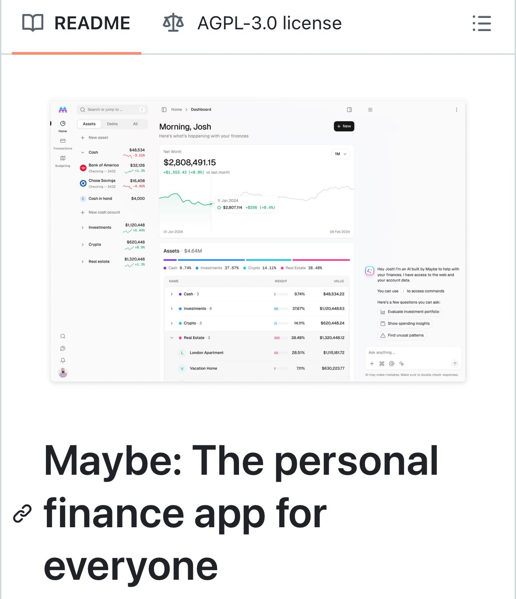

**Source:** [https://twitter.com/i/web/status/1946502110813593676](https://twitter.com/i/web/status/1946502110813593676)
**Original Post Date:** 2025-07-20 09:11:53

# Netflix's Microservices Architecture: Best Practices and Key Insights

## Introduction
Netflix is a pioneer in adopting microservices architecture to achieve scalability, flexibility, and resilience. This knowledge base item delves into the best practices and key insights from Netflix's experience with microservices. We will explore how Netflix decomposes its services, manages inter-service communication, handles data management, and implements monitoring and observability.

## Service Decomposition

Netflix follows a domain-driven design approach to decompose its services. Each service is responsible for a specific business capability or domain. This decomposition allows teams to work independently on different parts of the application without affecting each other.

The key to successful service decomposition is to ensure that services are loosely coupled and highly cohesive. Netflix uses context boundaries to define the scope of each service, ensuring that changes within one service do not impact others.

- Identify business capabilities or domains.
- Define context boundaries for each service.
- Ensure services are loosely coupled and highly cohesive.
- Use domain-driven design principles to guide decomposition.

> **Note/Tip:** Avoid creating services that are too fine-grained, as this can lead to excessive overhead in communication and management.

> **Note/Tip:** Regularly review service boundaries as business needs evolve.

## Inter-Service Communication

Netflix primarily uses RESTful APIs for inter-service communication. However, it also employs other protocols like gRPC and GraphQL in specific scenarios where they offer advantages over REST.

To ensure reliability and fault tolerance, Netflix implements retries with exponential backoff, circuit breakers, and timeouts. These mechanisms help to handle transient failures gracefully and prevent cascading failures across services.

- Use RESTful APIs for most inter-service communication.
- Consider gRPC or GraphQL for specific use cases where they provide benefits.
- Implement retries with exponential backoff to handle transient failures.
- Use circuit breakers to prevent cascading failures.
- Set appropriate timeouts to avoid long waits for responses.

> **Note/Tip:** Monitor API performance and latency to identify potential bottlenecks.

> **Note/Tip:** Document APIs thoroughly to facilitate integration with other services.

## Data Management

Netflix uses a polyglot persistence approach, selecting the most appropriate database for each service based on its requirements. This allows for optimal performance and scalability.

To ensure data consistency across services, Netflix employs event sourcing and CQRS (Command Query Responsibility Segregation). These patterns help to manage complex business logic and maintain a single source of truth.

- Adopt a polyglot persistence strategy.
- Choose the right database for each service based on its needs.
- Use event sourcing to maintain a single source of truth.
- Implement CQRS to manage complex business logic.

> **Note/Tip:** Regularly review and optimize database schemas as requirements change.

> **Note/Tip:** Consider using read replicas for read-heavy workloads.

## Monitoring and Observability

Netflix has built a comprehensive monitoring and observability platform to ensure the reliability and performance of its services. This platform includes tools like Atlas for metrics, Hystrix for circuit breaking, and Chaos Monkey for chaos engineering.

To gain deep insights into service behavior, Netflix uses distributed tracing with tools like Zipkin. This helps to identify latency issues and diagnose problems across multiple services.

- Implement a comprehensive monitoring platform using tools like Atlas for metrics.
- Use circuit breakers like Hystrix to prevent cascading failures.
- Leverage chaos engineering with tools like Chaos Monkey to test resilience.
- Adopt distributed tracing with Zipkin to gain insights into service behavior.

> **Note/Tip:** Set up alerts for key metrics to quickly detect and respond to issues.

> **Note/Tip:** Regularly review monitoring dashboards to identify trends and potential problems.

## Key Takeaways

- Netflix decomposes services based on business capabilities using domain-driven design principles.
- Inter-service communication is primarily done via RESTful APIs with additional protocols like gRPC and GraphQL where beneficial.
- Data management employs a polyglot persistence approach, selecting the right database for each service's needs.
- Monitoring and observability are critical components of Netflix's microservices architecture, using tools like Atlas, Hystrix, and Zipkin.

## Conclusion
Netflix's microservices architecture best practices offer valuable insights into achieving scalability, flexibility, and resilience. By following these principles—service decomposition based on domain-driven design, reliable inter-service communication with retries and circuit breakers, polyglot persistence for data management, and comprehensive monitoring and observability—organizations can build robust and scalable microservices architectures.

## External References

- [Netflix Tech Blog: Netflix's Microservices Architecture](https://netflixtechblog.com/netflixs-microservices-architecture)
- [Domain-Driven Design: Tackling Complexity in the Heart of Software](https://www.amazon.com/Domain-Driven-Design-Tackling-Complexity-Software/dp/032112520X)

## Media

**Image Description:** The image appears to be a screenshot of a financial dashboard interface, likely from a personal finance management application or tool. The dashboard is titled **"Maybe: The personal finance app for everyone"**, suggesting that the tool is designed to be user-friendly and accessible for managing personal finances. Below is a detailed breakdown of the image:

### **Main Subject: Financial Dashboard**
The dashboard is designed to provide a comprehensive overview of a user's financial situation, including assets, debts, net worth, and investment performance. The interface is clean, organized, and visually appealing, with clear sections and data visualizations.

#### **Header**
- **Title:** The dashboard greets the user with a personalized message: **"Morning, Josh"**, indicating that the tool is user-specific and likely integrates with a user account.
- **Net Worth:** The net worth is prominently displayed as **$2,808,491.15**, with a positive change of **+$1,553.43 (+0.9%)** compared to the previous month.
- **Date Range:** The net worth is tracked over a period, with a graph showing changes from **01 Jan 2024** to **06 Feb 2024**.

#### **Assets Section**
The assets are broken down into several categories, each with a corresponding value and percentage of the total assets:
1. **Cash:** 
   - Value: **$48,534.22**
   - Percentage: **9.74%**
   - Subcategories:
     - Bank of America Checking: **$32,126**
     - Chase Savings: **$16,408**
     - Cash in hand: **$4,000**
2. **Investments:** 
   - Value: **$1,120,448.63**
   - Percentage: **37.67%**
3. **Crypto:** 
   - Value: **$620,448.24**
   - Percentage: **14.11%**
4. **Real Estate:** 
   - Value: **$1,320,448.12**
   - Percentage: **38.48%**
   - Subcategories:
     - London Apartment: **$1,115,181.72**
     - Vacation Home: **$630,223.77**

#### **Net Worth Graph**
- A line graph shows the net worth over time, with data points marked for specific dates:
  - **01 Jan 2024:** Net worth of **$2,807,114**
  - **06 Feb 2024:** Net worth of **$2,808,491.15**
- The graph indicates a slight upward trend in net worth.

#### **Assets Breakdown**
- A pie chart visually represents the distribution of assets:
  - **Cash:** 9.74%
  - **Investments:** 37.67%
  - **Crypto:** 14.11%
  - **Real Estate:** 38.48%

#### **Additional Features**
- **Search Bar:** Located at the top, allowing users to search or jump to specific sections.
- **Navigation Menu:** On the left side, there are options for navigating to different sections such as **Home**, **Assets**, **Debts**, **Transactions**, **Budgeting**, **Investments**, **Crypto**, and **Real Estate**.
- **New Asset Button:** A button labeled **"+ New asset"** is visible, suggesting users can add new financial entries.
- **AI Assistant:** A chatbot or AI assistant is present in the bottom-right corner, labeled **"Hey Josh! I'm an AI built by Maybe to help with your finances."** This indicates the tool includes AI-driven features for financial advice or assistance.

### **Technical Details**
1. **License Information:**
   - The top of the image includes a reference to an **AGPL-3.0 license**, indicating that the software is open-source and governed by the Affero General Public License version 3.0.
2. **README File:**
   - The top left corner mentions a **README** file, suggesting that this is part of a software repository or project documentation.
3. **Design and Layout:**
   - The dashboard uses a clean, modern design with a white background and blue accents.
   - Data is presented in a structured format, with clear labels, percentages, and monetary values.
   - The use of graphs and pie charts enhances data visualization, making it easier for users to understand their financial situation at a glance.

### **Overall Impression**
The dashboard is designed to provide a holistic view of a user's financial health, with detailed breakdowns of assets, net worth, and performance over time. The inclusion of an AI assistant and open-source licensing suggests that the tool is both innovative and community-driven, aiming to be accessible and customizable for a wide audience. The emphasis on personalization (e.g., "Morning, Josh") and the clean, user-friendly interface indicate a focus on usability and user experience.
