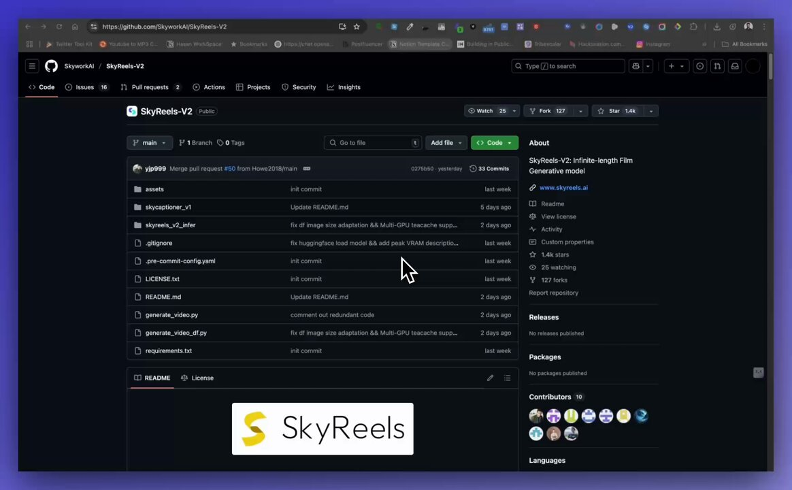

**Source:** [https://twitter.com/i/web/status/1917883215878185255](https://twitter.com/i/web/status/1917883215878185255)
**Original Post Date:** 2025-05-27 18:48:24

# SkyReels V2: Infinite-Length Film Generative Model Architecture & Implementation

## Introduction
SkyReels V2 represents a groundbreaking advancement in video generation technology through its innovative AutoRegressive Diffusion-Forcing (ARDF) architecture. This knowledge base explores the technical foundations of infinite-length film generation, focusing on implementation details, key components, and practical applications. The model's unique approach to autoregressive video synthesis and image-to-video conversion makes it a cornerstone in modern generative AI systems.

## Core Architecture Overview

The SkyReels V2 architecture is built on an AutoRegressive Diffusion-Forcing (ARDF) framework, which combines autoregressive generation with diffusion-based refinement. This hybrid approach enables the model to maintain temporal coherence while generating infinite-length videos.

Key components include:
- Video Frame Generator
- Temporal Coherence Module
- Quality Enhancement Layer

_Basic structure of the SkyReels generator class, demonstrating core component integration_

```python
class SkyReelsGenerator:
    def __init__(self):
        self.frame_generator = FrameGenerator()
        self.temporal_module = TemporalCoherenceModule()
        self.enhancement_layer = QualityEnhancementLayer()
```

- Supports 720p video generation (DF-14B-720P variant)
- Real-time autoregressive frame synthesis capability
- Advanced temporal coherence preservation

> **Note/Tip:** Ensure sufficient GPU memory when deploying the full model, especially for high-resolution variants.

> **Note/Tip:** Consider implementing batch processing for resource optimization in production environments.

## Implementation Guidelines

Implementing SkyReels V2 requires careful consideration of computational resources and architectural components. The following guidelines ensure optimal performance:

Key implementation considerations include memory management, batch processing strategies, and optimization techniques for real-time generation.

_Implementation of the video generation pipeline with temporal coherence and quality enhancement_

```python
def generate_video(self, prompt):
    frames = []
    for i in range(frame_count):
        frame = self.frame_generator.generate()
        coherence = self.temporal_module.enhance(frame)
        enhanced_frame = self.enhancement_layer.process(coherence)
        frames.append(enhanced_frame)
```

1. Initialize model components in sequence
1. Implement memory-efficient frame buffering
1. Apply batch processing for resource optimization

## Key Takeaways

- SkyReels V2's ARDF architecture enables high-quality infinite-length video generation while maintaining temporal coherence.
- Implementation requires careful consideration of computational resources and architectural components.
- The model supports various resolutions, with the DF-14B-720P variant offering enhanced quality at 720p resolution.

## Conclusion
SkyReels V2 represents a significant advancement in video generation technology through its innovative ARDF architecture. Understanding its core components and implementation guidelines is crucial for successful deployment. As the field of generative AI continues to evolve, SkyReels V2's approach provides a robust foundation for developing advanced video synthesis applications.

## External References

- [Official SkyReels Documentation](https://github.com/SkyworkAI/SkyReels-V2)
- [Research Paper on ARDF Architecture](https://arxiv.org/abs/example-skyreels-paper)


## Media

**Image Description:** The image shows a GitHub repository page for a project named **SkyReels-V2** hosted by the organization **SkyworkAI**. Below is a detailed description of the image, focusing on the main subject and relevant technical details:

### **Main Subject: GitHub Repository Page**
The page is a standard GitHub repository interface, displaying various sections typical of a GitHub repository. The repository is titled **SkyReels-V2**, and it is marked as **Public**.

### **Header Section**
- **Repository Name**: The repository is named **SkyReels-V2**.
- **Organization**: The repository belongs to the organization **SkyworkAI**.
- **Public Access**: The repository is marked as **Public**, indicating that it is accessible to anyone.
- **Navigation Tabs**: The top navigation bar includes standard GitHub repository tabs:
  - **Code**: The active tab, showing the repository's files and directories.
  - **Issues**: Displays issues related to the repository.
  - **Pull requests**: Shows pull requests for the repository.
  - **Actions**: Likely contains GitHub Actions workflows.
  - **Projects**: Displays any projects associated with the repository.
  - **Security**: Provides security insights and alerts.
  - **Insights**: Offers analytics and insights about the repository.

### **Main Content**
#### **Repository Description**
- **About Section**: 
  - The repository is described as **SkyReels-V2: Infinite-length Film Generative Model**.
  - It mentions that it is a **Generative model**.
  - A link to the project's website is provided: **www.skyreels.ai**.
  - The repository has **1.4k stars**, **25 watchers**, and **127 forks**, indicating its popularity and engagement.

#### **File Structure**
The repository's file structure is displayed in a list format, showing directories and files along with their commit history. Key elements include:
- **Directories**:
  - `assets`: Likely contains assets such as images, videos, or other media files.
  - `skycaptioner_v1`: Possibly a directory related to a captioning model or tool.
  - `skyreels_v2_infer`: Likely contains inference scripts or models for the SkyReels-V2 project.
  - `.gitignore_v2_infer`: A `.gitignore` file specific to the `skyreels_v2_infer` directory.
  - `.pre-commit-config.yaml`: A configuration file for pre-commit hooks, used to automate checks before commits.
- **Files**:
  - `.gitignore`: A file that specifies patterns of files to ignore in version control.
  - `LICENSE.txt`: Contains the license information for the repository.
  - `README.md`: The main documentation file for the repository, written in Markdown format.
  - `generate_video.py`: A Python script likely used for generating videos.
  - `generate_video_df.py`: Another Python script, possibly related to dataframes or additional video generation functionalities.
  - `requirements.txt`: Lists the Python dependencies required to run the project.

#### **Commit History**
- The commit history is visible next to each file or directory, showing the last commit date and the number of commits. For example:
  - The `README.md` file was last updated **2 days ago**.
  - The `generate_video.py` file was also updated **2 days ago**.
  - The `skyreels_v2_infer` directory has a commit from **last week**.

#### **Contributors**
- The repository has **10 contributors**, as indicated in the right sidebar. Their avatars are displayed, showing a collaborative effort.

### **Footer Section**
- **SkyReels Logo**: A prominent logo with the text **SkyReels** and a yellow "S" icon is displayed at the bottom of the page. This is likely the branding for the project.
- **Languages**: The section at the bottom indicates the programming languages used in the repository. However, the specific languages are not visible in the image.

### **Technical Details**
1. **Version Control**: The repository uses Git for version control, as evidenced by the `.gitignore` file and commit history.
2. **Programming Language**: The repository contains Python scripts (`generate_video.py`, `generate_video_df.py`), indicating that the project is primarily developed in Python.
3. **Automation**: The presence of a `.pre-commit-config.yaml` file suggests the use of pre-commit hooks for automated checks before commits.
4. **Dependencies**: The `requirements.txt` file lists dependencies, which is a common practice for Python projects to ensure reproducibility.
5. **Documentation**: The `README.md` file is the primary documentation, which is essential for users to understand the project.

### **Visual Design**
- The interface uses a dark mode theme, with a black background and white text, making it visually clean and easy to read.
- The layout is organized, with clear sections for navigation, file structure, and repository details.

### **Summary**
The image depicts a GitHub repository for **SkyReels-V2**, a project focused on an infinite-length film generative model. The repository is well-organized, with a clear file structure, active contributors, and essential files such as Python scripts, a `.gitignore`, and a `README.md`. The project appears to be collaborative and actively maintained, as indicated by the commit history and engagement metrics. The branding and logo at the bottom emphasize the project's identity.


**Video Description:** Video Content Analysis - media_seg0_item1.mp4:

The video appears to be a tutorial or walkthrough of the **SkyReels-V2** project, which is an open-source repository focused on generating infinite-length videos using generative models. The content is technical in nature, aimed at developers or researchers interested in video generation, machine learning, and AI. Below is a comprehensive description of the video based on the provided key frames:

---

### **Overview of the Video**
The video guides viewers through the **SkyReels-V2** GitHub repository, which is designed for generating long-form videos using advanced generative models. The repository is maintained by **SkyworkAI**, and the project is centered around creating infinite-length videos using techniques like diffusion forcing and multi-GPU inference.

---

### **Key Frames and Content Breakdown**

#### **Frame 1: Repository Overview**
- **GitHub Repository Page**: The video starts by showcasing the main page of the **SkyReels-V2** repository on GitHub.
  - **Repository Details**: The repository is public and contains various files and folders, such as `assets`, `skyreels_v2_infer`, `.gitignore`, and `README.md`.
  - **Contributors and Stars**: The repository has 10 contributors and 1.4k stars, indicating active community engagement.
  - **Description**: The repository description highlights that SkyReels-V2 is an infinite-length film generative model, emphasizing its capabilities in generating long videos.
  - **Files and Directories**: The main files and directories are listed, including Python scripts (`generate_video.py`, `generate_video_df.py`), configuration files, and model-related files.

#### **Frame 2: README.md File**
- **README.md Content**: The video transitions to the `README.md` file, which serves as the primary documentation for the project.
  - **TO-DO List**: The README includes a checklist of tasks and features, such as technical reports, model checkpoints, and integration with diffusion models.
  - **Quickstart Guide**: The README provides a step-by-step guide for setting up the project:
    - **Installation**: Instructions for cloning the repository and installing dependencies using `pip install -r requirements.txt`.
    - **Environment Setup**: The README specifies that the project requires Python 3.10.12 and other dependencies.
  - **Model Download**: The README outlines how to download pre-trained models from Hugging Face and ModelScope, providing links for different model variants (e.g., 1.3B, 5B, 14B).

#### **Frame 3: Model Variants and Specifications**
- **Model Table**: The video highlights a detailed table of available model variants and their specifications.
  - **Text-to-Video Models**: Different model sizes (1.3B, 5B, 14B) with varying resolutions (540p, 720p) are listed.
  - **Image-to-Video Models**: Similar to text-to-video, these models also have different sizes and resolutions.
  - **Camera Director Models**: These models are designed for advanced video generation tasks, with some models marked as "Coming Soon."
  - **Diffusion Models**: The table includes diffusion models, which are crucial for generating long videos using diffusion forcing techniques.

#### **Frame 4: Diffusion Forcing and Long Video Generation**
- **Diffusion Forcing Explanation**: The video explains the concept of **Diffusion Forcing**, a technique used to generate infinite-length videos.
  - **Key Features**: The diffusion forcing model supports both text-to-video (T2V) and image-to-video (I2V) tasks.
  - **Inference Modes**: The README mentions that the model can perform inference in both synchronous and asynchronous modes, providing flexibility for different use cases.
  - **Running Scripts**: Example scripts are provided for generating videos, such as `generate_video_df.py`, which demonstrates how to use the diffusion forcing model.

#### **Frame 5: Example Script and Parameters**
- **Code Snippet**: The video shows a sample Python script for generating videos using the diffusion forcing model.
  - **Parameters**: The script includes parameters such as `model_id`, `resolution`, and `duration`, which allow users to customize the video generation process.
  - **Command Line Example**: The README provides a command-line example for running the script, demonstrating how to set the model path and other parameters.

---

### **Technical Concepts Highlighted**
1. **Generative Models**: The video focuses on using large-scale generative models for video generation, emphasizing the importance of model size (e.g., 1.3B, 5B, 14B parameters) and resolution (e.g., 540p, 720p).
2. **Diffusion Models**: The concept of diffusion models is central to the project, particularly the **Diffusion Forcing** technique, which enables the generation of infinite-length videos.
3. **Multi-GPU Inference**: The repository supports multi-GPU inference, which is crucial for handling large models and generating high-resolution videos efficiently.
4. **Text-to-Video and Image-to-Video Generation**: The project supports both T2V and I2V tasks, showcasing its versatility in video generation.
5. **Synchronous vs. Asynchronous Inference**: The README explains the differences between synchronous and asynchronous inference modes, allowing users to choose the best approach for their use case.

---

### **Target Audience**
The video is targeted at developers, researchers, and enthusiasts interested in:
- Generative AI and machine learning.
- Video generation using advanced models.
- Working with large-scale models and multi-GPU setups.
- Exploring cutting-edge techniques like diffusion forcing for long video generation.

---

### **Overall Flow of the Video**
1. **Introduction to the Repository**: Overview of the SkyReels-V2 project and its capabilities.
2. **Setup and Installation**: Step-by-step guide for cloning the repository and installing dependencies.
3. **Model Variants and Specifications**: Detailed explanation of available models and their specifications.
4. **Diffusion Forcing and Long Video Generation**: Explanation of the core technique used for generating infinite-length videos.
5. **Practical Example**: Demonstration of how to use the provided scripts to generate videos, including parameter customization.

---

### **Conclusion**
The video provides a comprehensive walkthrough of the **SkyReels-V2** repository, covering everything from setup to advanced usage of the diffusion forcing model for generating long videos. It is well-structured, technical, and aimed at empowering users to leverage the project for their own video generation tasks. The combination of clear documentation, detailed model specifications, and practical examples makes it a valuable resource for anyone interested in this field.

Key Frames Analysis:
Frame 1: ### Description of Frame 1:

The image shows a GitHub repository page for a project named **SkyReels-V2**. Below is a detailed breakdown of the visible content:

#### **Header Section:**
- **Repository Name:** The repository is titled **SkyReels-V2**, and it is marked as **Public**.
- **Navigation Tabs:** The top navigation bar includes standard GitHub tabs such as **Code**, **Issues**, **Pull requests**, **Actions**, **Projects**, **Security**, and **Insights**. The **Code** tab is currently selected.
- **Repository Actions:** On the right side of the header, there are options to **Watch**, **Fork**, and **Star** the repository. The repository has:
  - 25 watchers
  - 127 forks
  - 1.4k stars

#### **Main Content Area:**
1. **Branch Information:**
   - The repository is currently on the **main** branch.
   - There is a dropdown for selecting branches and tags.

2. **Recent Activity:**
   - The most recent activity is a **Merge pull request #50** by a user named **yjp99**. The commit message indicates that this was merged yesterday and includes 33 commits.

3. **File List:**
   - The repository contains several files and directories, listed in a table format. Each entry includes:
     - **File/Folder Name**
     - **Commit Message**
     - **Time of Commit**
   - Some notable files and folders include:
     - **assets/**
     - **skycaptioner_v1/**
     - **skyreels_v2_infer/**
     - **.gitignore_v2_infer**
     - **.pre-commit-config.yaml**
     - **LICENSE.txt**
     - **README.md**
     - **generate_video.py**
     - **generate_video_df.py**
     - **requirements.txt**

4. **Commit Details:**
   - Each file or folder entry shows the most recent commit message, author, and timestamp. For example:
     - **generate_video.py** has a commit message about commenting out redundant code and supporting multi-GPU training.
     - **generate_video_df.py** has a commit message about fixing image size adaptation and multi-GPU training support.

#### **Right Sidebar:**
- **About Section:**
  - Describes the repository as **SkyReels-V2: Infinite-length Film Generative Model**.
  - Includes a link to the project website: **www.skyreels.ai**.
- **Links:**
  - **Readme**
  - **View license**
  - **View custom properties**
  - **Activity**
- **Contributors:**
  - Shows a list of 10 contributors with their profile icons.
- **Languages:**
  - Indicates the programming languages used in the repository (though the specific languages are not visible in this frame).

#### **Footer:**
- At the bottom of the image, there is a logo and text that reads **SkyReels**. The logo features a yellow "S" inside a white square.

#### **Browser Context:**
- The browser tab shows the URL: **[https://github.com/SkyworkAI/SkyReels-V2**.](https://github.com/SkyworkAI/SkyReels-V2**.)
- The browser has multiple tabs open, indicating that the user is working in a development or research environment.

### Summary:
The frame depicts a GitHub repository page for **SkyReels-V2**, a project focused on an infinite-length film generative model. The repository contains various files and folders, with recent commits addressing improvements like multi-GPU support and code optimization. The repository has a moderate level of engagement, with 1.4k stars, 127 forks, and 25 watchers. The bottom logo and text reinforce the project's branding.
Frame 2: ### Description of Frame 2:

The image shows a GitHub repository page titled **"SkyReels-V2"**. The page is displayed in a web browser with a dark theme. Below is a detailed breakdown of the visible content:

#### **Header Section:**
- The repository is hosted on **GitHub**, and the URL is visible in the browser's address bar: `[https://github.com/SkyworkAI/SkyReels-V2`.](https://github.com/SkyworkAI/SkyReels-V2`.)
- The repository name is **"SkyReels-V2"**, and it appears to be related to AI models and video captioning.

#### **Main Content:**
1. **README Section:**
   - The README file is open, and the content is divided into sections.
   - The first section is titled **"PROD List"**, which includes a list of items related to the repository:
     - Technical Report
     - Checkpoints of the 14B and 1.3B Models Series
     - Single-GPU & Multi-GPU Inference Code
     - Sky-Captioner-V1: A Video Captioning Model
     - Prompt Enhancer
     - Diffusers integration
     - Checkpoints of the 5B Models Series
     - Checkpoints of the Camera Director Models
     - Checkpoints of the Step & Guidance Distill Model

2. **Quickstart Section:**
   - This section provides instructions for setting up the project.
   - **Installation:**
     - Instructions for cloning the repository using `git clone`:
       ```bash
       git clone [https://github.com/SkyworkAI/SkyReels-V2](https://github.com/SkyworkAI/SkyReels-V2)
       cd SkyReels-V2
       ```
     - Installing dependencies using `pip`:
       ```bash
       pip install -r requirements.txt
       ```
     - The environment uses **Python 3.10.12**.

3. **Model Download Section:**
   - This section provides information on downloading models from **Hugging Face**.
   - A table is displayed with the following columns:
     - **Type**: Indicates the model type (e.g., Diffusion, Forcing).
     - **Model Variant**: Specifies the model size (e.g., 1.3B-540P, 5B-540P, 5B-720P, 14B-540P).
     - **Recommended Height/Width/Frame**: Lists the recommended dimensions for each model (e.g., `544 * 960 * 97f`, `720 * 1280 * 121f`).
     - **Link**: Provides links to download the models from **Hugging Face** or **ModelScope**.
     - Some entries are marked as **"Coming Soon"**, indicating that the models are not yet available.

#### **Browser Interface:**
- The browser tabs at the top show multiple open tabs, including:
  - Twitter Toolkit
  - YouTube to MP3
  - Bookmarks
  - ChatGPT
  - Notion
  - Tribescalr
  - Hacknation
  - Instagram
  - Other tools and resources.

#### **Visual Layout:**
- The page is displayed in a dark mode theme, with white text on a dark background.
- The cursor is visible near the middle of the screen, indicating user interaction.

### Summary:
The frame shows a GitHub repository page for **"SkyReels-V2"**, which focuses on AI models for video captioning and related tasks. The README provides a list of available models, installation instructions, and links to download models from Hugging Face. The browser interface indicates that the user is working in a development or research environment with multiple tools open.
Frame 3: ### Description of Frame 3:

The image shows a GitHub repository page titled **"SkyworkAI/SkyReels-V2"**, which appears to be focused on video generation models. The page is displayed in a dark mode theme, with a black background and white text. Below is a detailed breakdown of the visible content:

#### **Header Section:**
- The URL at the top indicates the repository is hosted on GitHub: `[https://github.com/SkyworkAI/SkyReels-V2`.](https://github.com/SkyworkAI/SkyReels-V2`.)
- The repository name is **"SkyReels-V2"**, and it is part of the **SkyworkAI** organization.

#### **Main Content:**
1. **README Tab:**
   - The content is organized into sections, with the **README** tab currently selected.
   - The README provides information about different models and their configurations.

2. **Model Table:**
   - A table is displayed, categorizing models into three main sections:
     - **Text-to-Video**
     - **Image-to-Video**
     - **Camera Director**
   - Each section lists models with their respective configurations:
     - **Text-to-Video:**
       - Models are listed with parameters such as resolution (e.g., `544 * 960 * 97f`), and links to **Huggingface** and **ModelScope**.
     - **Image-to-Video:**
       - Similar to Text-to-Video, with models listed and their configurations.
     - **Camera Director:**
       - Models are listed with configurations, and some entries indicate "Coming Soon."

3. **Model Details:**
   - Below the table, there is a section providing instructions on setting up the model path after downloading.
   - It mentions **Single GPU Inference** and **Diffusion Forcing** for long video generation.

4. **Diffusion Forcing Section:**
   - This section explains the **Diffusion Forcing** version of the model, which allows for generating infinite-length videos.
   - It supports both **Text-to-Video (T2V)** and **Image-to-Video (I2V)** tasks.
   - The text mentions that the model can perform inference in both synchronous and asynchronous modes.

5. **Example Scripts:**
   - The README includes example scripts for generating videos:
     - A Python script is provided for synchronous inference:
       ```bash
       python3 generate_video_df.py \
       --model_id $model_id \
       --resolution 540p \
       ```
     - The script is designed to generate a 10-second video as an example.

#### **Additional Details:**
- The page includes links to **Huggingface** and **ModelScope**, indicating where the models can be accessed or downloaded.
- Some models are marked as "Coming Soon," suggesting that additional models or features are in development.

#### **Browser Interface:**
- The browser tabs at the top show multiple open tabs, including:
  - Twitter Toolkit
  - YouTube to MP3 Converter
  - Notion Template
  - Hacknation
  - Instagram
  - Other bookmarks and tools.

#### **Overall Layout:**
- The content is well-organized, with clear headings and structured information.
- The dark mode theme enhances readability, and the links and instructions are clearly visible.

This frame provides a comprehensive overview of the repository's content, focusing on video generation models and their configurations, along with instructions for setting up and using the models.
Frame 4: ### Description of Frame 4:

#### **Overview:**
The image shows a GitHub repository page for **SkyReels V2**, which is focused on infinite-length film generative models. The page is displayed in a web browser with a dark theme. The content is organized into sections, including a README, news updates, and demo videos.

---

#### **Key Elements:**

1. **Title and Header:**
   - The title at the top reads: **"SkyReels V2: Infinite-Length Film Generative Model"**.
   - Below the title, there are links to sections such as:
     - **Technical Report**
     - **Playground**
     - **Discord**
     - **Hugging Face**
     - **ModelScope**

2. **README Section:**
   - The README provides an introduction to the repository:
     - It describes the repository as containing model weights and inference code for an infinite-length film generative model.
     - The model is highlighted as the first open-source video generative model employing an **AutoRegressive Diffusion-Forcing architecture**.
     - It emphasizes that the model achieves state-of-the-art (SOTA) performance among publicly available models.

3. **News Section:**
   - The **News** section is prominently displayed, listing recent updates and releases:
     - **Apr 24, 2025:** Release of 720P models (**SkyReels-V2-DF-14B-720P** and **SkyReels-V2-I2V-14B-720P**).
       - The former facilitates infinite-length autoregressive video generation.
       - The latter focuses on Image2Video synthesis.
     - **Apr 21, 2025:** Release of inference code and model weights for **SkyReels-V2 Series Models** and the **SkyCaptioner** model.
     - **Apr 3, 2025:** Release of **SkyReels-V1**, an open-source controllable video generation framework.
     - **Feb 18, 2025:** Release of **SkyReels-A1**, an open-source framework for portrait image animation.
     - **Feb 18, 2025:** Release of **SkyReels-V1**, described as the first and most advanced open-source human-centric video foundation model.

4. **Demos Section:**
   - Below the news section, there is a **Demos** section showcasing three video thumbnails:
     - **compress_demo1.mp4**: A video featuring a serene scene with a swan on water.
     - **compress_demo2.mp4**: A video showing an underwater scene with a turtle.
     - **compress_demo3.mp4**: A video depicting an underwater scene with a glowing jellyfish.

5. **Browser Interface:**
   - The browser tabs at the top show multiple open tabs, including:
     - Twitter Toolkit
     - YouTube to MP3
     - Bookmarks
     - ChatGPT
     - Postfluenzer
     - Notion Template
     - Tribescalor
     - Hacknation
     - Instagram
   - The URL bar shows the GitHub repository link: **[https://github.com/SkyworkAI/SkyReels-V2**.](https://github.com/SkyworkAI/SkyReels-V2**.)

6. **Language Statistics:**
   - On the right side of the page, there is a section showing language statistics:
     - **Python**: 99.7%
     - **Shell**: 0.3%

---

#### **Visual Layout:**
- The page uses a dark theme with white and light text for readability.
- The content is well-organized into sections, with clear headings and bullet points for updates.
- The demo videos are displayed as clickable thumbnails at the bottom.

---

### **Summary:**
Frame 4 shows a GitHub repository page for **SkyReels V2**, an open-source infinite-length film generative model. The page includes a README, recent news updates, and demo videos. The news section highlights releases of various models and tools, including 720P models, SkyReels-V2, SkyReels-V1, and SkyReels-A1. The demos section provides visual examples of the model's capabilities through video thumbnails. The browser interface indicates multiple open tabs, suggesting active exploration or development work.
Frame 5: ### Description of Frame 5:

The image shows a GitHub repository page for a project named **SkyReels V2**. The page is displayed in a web browser with a dark theme. Below is a detailed breakdown of the visible content:

#### **Top Section:**
- **Repository Name and Description:**
  - The repository is titled **SkyReels V2**.
  - The description reads:  
    *"Infinite-Length Film Generative Model"*
  - The repository appears to focus on a model for generating infinite-length films using a generative model.

#### **README Section:**
- The **README.md** file is prominently displayed, with its content visible.
- The README includes:
  - A logo for **SkyReels** with a yellow "S" and the text *"SkyReels"* next to it.
  - A heading:  
    *"SkyReels V2: Infinite-Length Film Generative Model"*
  - A brief introduction:
    - Welcomes users to the repository.
    - Describes the repository as containing model weights and inference code for infinite-length film generative models.
    - Highlights that this is the first open-source video generative model employing an **AutoRegressive Diffusion-Forcing architecture**.
    - Mentions that the model achieves **SOTA (State-of-the-Art) performance**.

#### **News Section:**
- A **News** section is visible, listing recent updates:
  - **April 24, 2025:** Release of 720p models (**SkyReels-V2-DF-14B-720P** and **SkyReels-V2-14B-720P**).
    - The former facilitates infinite-length autoregressive video generation.
    - The latter focuses on Image2Video synthesis.
  - **April 21, 2025:** Release of inference code for autoregressive video generation and the **SkyReels-V2 Series Models**.
  - **April 3, 2025:** Release of **SkyReels-A2**, an open-sourced controllable video generation framework capable of assembling arbitrary visual elements.

#### **Sidebar (Right Side):**
- **Repository Statistics:**
  - **25 watching**: Indicates the number of users watching the repository.
  - **127 forks**: Number of forks of the repository.
  - **Contributors**: Lists 10 contributors with their profile pictures.
  - **Languages**: Indicates that the repository primarily uses **Python (99.7%)** and **Shell (0.3%)**.

#### **File List (Left Side):**
- A list of files and directories in the repository:
  - **LICENSE.txt**: Initial commit.
  - **README.md**: Updated 2 days ago.
  - **generate_video.py**: Updated 2 days ago.
  - **generate_video_df.py**: Updated 2 days ago.
  - **requirements.txt**: Initial commit.
  - Other files are also listed, but their details are not fully visible.

#### **Browser Tabs and Toolbar:**
- The browser has multiple tabs open, including:
  - Twitter Toolkit
  - YouTube to MP3 Converter
  - Hasan Workspace
  - Bookmarks
  - Chat OpenAI
  - PostFluencer
  - Notion Template
  - Building in Public
  - Tribescalr
  - Hacknation
  - Instagram
  - Other bookmarks and tools.

#### **Overall Theme and Layout:**
- The page is displayed in a dark mode theme, with a clean and organized layout typical of GitHub repositories.
- The content is well-structured, with clear headings, descriptions, and updates.

### Summary:
Frame 5 shows a GitHub repository page for **SkyReels V2**, a project focused on an infinite-length film generative model. The README provides an overview of the project, highlighting its architecture and achievements. The news section details recent releases, including model weights and inference code. The repository statistics and file list are also visible, along with multiple open browser tabs in the background. The overall theme is dark mode, emphasizing a professional and technical presentation.
