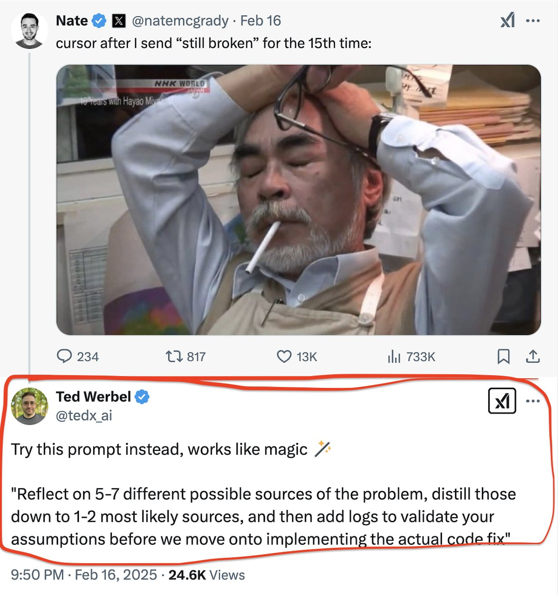

**Source:** [https://twitter.com/i/web/status/1891632470207979646](https://twitter.com/i/web/status/1891632470207979646)
**Original Post Date:** 2025-05-27 23:37:29

# Systematic Debugging Approaches for Microservice Troubleshooting

## Introduction
Debugging distributed systems presents unique challenges, especially when multiple services interact. This article explores a methodical approach to troubleshooting based on proven practices from production environments.

## Structured Problem Isolation Process

Begin by identifying all possible failure points across the service boundary:

- Database connectivity and query performance issues

- Network latency between services

- Configuration mismatches between deployment environments

- Third-party API dependencies

```yaml
# Service Health Check Template
services:
  authentication-service:
    health_endpoint: /health
    dependency_checks:
      - name: database_connectivity
        endpoint: /db/status
      - name: auth_provider
        endpoint: /auth/heartbeat
```

1. Document the expected behavior of each service component
1. Create a dependency map showing all internal and external dependencies
1. Define clear success metrics for each interaction point

> **Note/Tip:** Always maintain detailed logs with proper correlation IDs across services

> **Note/Tip:** Implement circuit breakers to prevent cascading failures during debugging

> **Note/Tip:** Use service mesh features like Istio or Linkerd for advanced observability

## Incremental Validation Through Logging

Systematically validate assumptions by adding targeted logging at each suspected failure point. Example: When investigating a database timeout issue, first log query execution times before checking connection pool settings.

```java
// Incremental Logging Pattern
public class ServiceHealthMonitor {
    private static final Logger logger = LoggerFactory.getLogger(ServiceHealthMonitor.class);
    
    public void logServiceState(String component) {
        logger.info("Checking component: {}", component);
        // Add specific validation logic here
    }
}
```

## Key Takeaways

- Prioritize structured problem isolation over rapid code fixes
- Implement incremental validation through targeted logging at each suspected failure point
- Maintain comprehensive dependency maps to guide systematic troubleshooting

## Conclusion
Effective debugging in microservices requires a methodical approach. By following these structured steps and maintaining proper documentation, teams can reduce resolution time and improve overall system reliability.

## External References

- [AWS Well-Architected Framework - Operations Excellence](https://aws.amazon.com/architecture/well-architected/framework/operations/)
- [Service Mesh Patterns for Observability](https://istio.io/latest/docs/concepts/traffic-management/)


## Media

**Image Description:** The image is a screenshot of a social media post, likely from a platform like Twitter or X, featuring a conversation between two users. Below is a detailed description:

### **Main Components of the Image:**

#### **Top Section:**
1. **User Profile:**
   - The post is made by a user named **Nate**, whose Twitter/X handle is **@natemcgrady**.
   - The profile picture shows a man with short hair and a beard, smiling.
   - The post was made on **February 16**.

2. **Post Content:**
   - The text in the post reads:
     ```
     cursor after after I send “still still broken” for the 15th time:
     ```
   - This suggests frustration or exasperation, likely related to a technical issue that has not been resolved despite repeated attempts to report it.

3. **Image in the Post:**
   - The image shows a man with a serious or exasperated expression. He is wearing glasses, a light-colored shirt, and a beige vest. 
   - He has his hands raised to his head, appearing stressed or overwhelmed. 
   - He is smoking a cigarette, which adds to the sense of frustration or exhaustion.
   - The background includes stacks of papers or folders, suggesting a work environment, possibly an office or a busy setting.

#### **Bottom Section:**
1. **Reply by Ted Werbel:**
   - The reply is from a user named **Ted Werbel**, whose Twitter/X handle is **@tedx_ai**.
   - The profile picture shows a man with short hair and a beard, smiling.
   - The reply was made on **February 16, 2025**, at **9:50 PM**.

2. **Reply Content:**
   - The text in the reply reads:
     ```
     Try this prompt instead, works like magic ✨
     ```
   - Below this, there is a detailed prompt:
     ```
     "Reflect on 5-7 different possible possible sources of the problem, distill those down to 1-2 most likely sources, and then add logs to validate your assumptions before we move onto implementing the actual code fix."
     ```
   - The prompt is formatted with repeated words for emphasis, such as "possible possible," "distill those," and "move move onto implementing implementing." This repetition adds a humorous or exaggerated tone.

3. **Engagement Metrics:**
   - The original post by Nate has:
     - **234 comments**
     - **817 retweets**
     - **13K likes**
     - **733K views**
   - The reply by Ted Werbel has:
     - **24.6K views**

### **Technical Details:**
1. **Platform:**
   - The post appears to be from Twitter or X, given the layout, icons, and engagement metrics.
   - The presence of the "X" logo in the top-right corner confirms this.

2. **Timestamp:**
   - The original post is dated **February 16**.
   - The reply is dated **February 16, 2025**, at **9:50 PM**.

3. **Engagement:**
   - Both the post and the reply have significant engagement, indicating that the content resonated with the audience.

4. **Visual Elements:**
   - The image in Nate's post is a photograph of a stressed individual, which visually conveys the frustration described in the text.
   - The reply by Ted Werbel includes a humorous and exaggerated prompt, which adds a lighthearted tone to the conversation.

### **Overall Context:**
The image captures a relatable moment of technical frustration, where a user repeatedly reports a problem that remains unresolved. The reply offers a humorous and detailed prompt, suggesting a structured approach to troubleshooting, which adds a comedic element to the conversation. The high engagement metrics suggest that the content struck a chord with many users, likely due to its relatability and humor.
