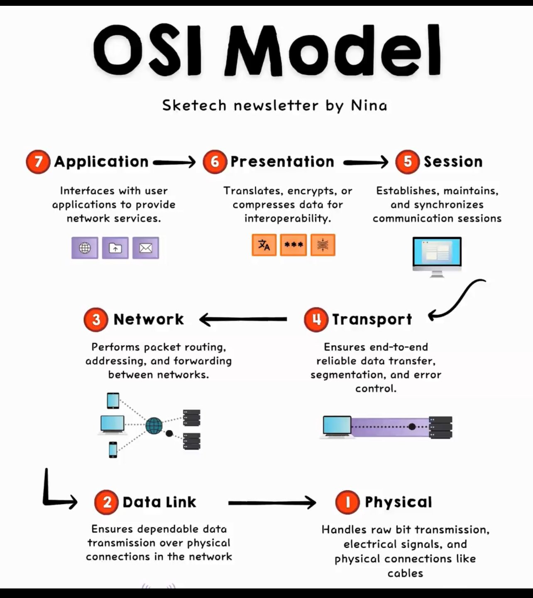

**Source:** [https://twitter.com/i/web/status/1868587787689361694](https://twitter.com/i/web/status/1868587787689361694)
**Original Post Date:** 2025-05-28 01:41:21

# OSI Model: A Comprehensive Overview of Network Communication Layers

## Introduction
The OSI (Open Systems Interconnection) Model provides a foundational framework for understanding data communication across networks. As a hierarchical structure divided into seven distinct layers, it standardizes how different systems communicate while maintaining clear separation of concerns between hardware and software components.

## Physical Layer

The Physical layer is responsible for transmitting raw bits over physical media. It defines electrical, mechanical, and procedural interfaces ensuring reliable transmission.

This layer deals with hardware specifications like cables, connectors, voltage levels, and signal timing.

- Handles bit-level data transmission
- Defines physical media characteristics
- Manages electrical signals

## Data Link Layer

This layer ensures reliable transfer of frames between devices on the same network. It handles error detection, flow control, and MAC addressing.

The Data Link layer introduces frame formatting, manages collision detection (in half-duplex networks), and provides local delivery.

- Implements error checking through CRC
- Manages media access control
- Performs flow control

## Network Layer

The Network layer handles logical addressing, routing packets between different networks. It determines optimal paths and manages packet forwarding.

This layer is responsible for IP address management, subnetting, and routing protocols.

- Implements logical addressing (IP)
- Performs routing decisions
- Handles network congestion

## Transport Layer

This layer ensures end-to-end reliable data transfer through segmentation, reassembly, and flow control.

Common protocols like TCP (connection-oriented) and UDP (connectionless) operate at this layer.

- Manages error recovery
- Implements congestion control
- Handles multiplexing

## Session Layer

The Session layer establishes, maintains, and terminates communication sessions between applications.

It provides mechanisms for synchronization, dialog management, and recovery from connection failures.

- Manages session establishment
- Handles checkpointing
- Provides dialog control

## Presentation Layer

This layer translates and formats data between systems, handling encryption, compression, and data conversion.

It ensures that data transmitted from one system can be understood by another.

- Manages data translation
- Handles encryption/decryption
- Performs data compression

## Application Layer

The Application layer interfaces with end-user applications, providing services like file transfer, email, and web browsing.

It is the closest to the end user and provides network services directly accessible by software.

- Provides common application services
- Implements user authentication
- Handles resource sharing

## Key Takeaways

- Each layer has distinct responsibilities and interfaces with adjacent layers only.
- Understanding the OSI model is crucial for network troubleshooting, protocol design, and system integration.
- The model allows different vendors to develop products that can interoperate at various layers.

## Conclusion
The OSI Model provides a structured approach to understanding complex network communications. By separating concerns into distinct layers, it simplifies the design, implementation, and maintenance of networking technologies.

## External References

- [OSI Model - ITU-T](https://www.itu.int/rec/T-REC-X.200)
- [OSPF Protocol Specification](https://tools.ietf.org/html/rfc5340)

## Media

**Image Description:** The image is a detailed illustration of the **OSI (Open Systems Interconnection) Model**, which is a conceptual framework that describes how data is transmitted between two endpoints in a network. The model is divided into **seven layers**, each with specific functions and responsibilities. The image provides a visual representation of these layers, along with brief descriptions of their roles. Below is a detailed breakdown:

---

### **Main Subject: OSI Model**
The OSI Model is depicted as a vertical stack of seven layers, with each layer numbered and labeled. The layers are interconnected, showing the flow of data from the topmost layer (Application) to the bottommost layer (Physical), and vice versa. The image also includes icons and brief descriptions for each layer.

---

### **Layer-by-Layer Breakdown:**

#### **1. Physical Layer (Layer 1)**
- **Description:** Handles the transmission of raw bits over a physical medium.
- **Responsibilities:** 
  - Ensures the physical transmission of data over the network.
  - Manages electrical, mechanical, and procedural interfaces.
- **Icons:** Represent physical connections like cables, wires, and network hardware.
- **Key Terms:** Bits, signals, electrical signals, cables.

#### **2. Data Link Layer (Layer 2)**
- **Description:** Ensures reliable transfer of data frames between nodes on the same network.
- **Responsibilities:**
  - Provides error-free transfer of data over the physical layer.
  - Handles framing, error detection, and flow control.
  - Manages MAC (Media Access Control) addresses.
- **Icons:** Represent devices like switches, hubs, and network interfaces.
- **Key Terms:** Frames, MAC addresses, error detection, flow control.

#### **3. Network Layer (Layer 3)**
- **Description:** Manages the routing of data packets between different networks.
- **Responsibilities:**
  - Handles logical addressing (e.g., IP addresses).
  - Performs packet routing and forwarding.
  - Ensures efficient data delivery across networks.
- **Icons:** Represent routers and network topologies.
- **Key Terms:** Packets, IP addresses, routing, forwarding.

#### **4. Transport Layer (Layer 4)**
- **Description:** Ensures reliable, end-to-end data transfer between applications.
- **Responsibilities:**
  - Provides end-to-end communication.
  - Handles segmentation, reassembly, and error recovery.
  - Manages flow control and congestion control.
- **Icons:** Represent data flow and connection establishment.
- **Key Terms:** Segmentation, reassembly, TCP/UDP, reliability.

#### **5. Session Layer (Layer 5)**
- **Description:** Manages the establishment, maintenance, and termination of sessions between applications.
- **Responsibilities:**
  - Establishes, manages, and terminates sessions between applications.
  - Synchronizes data exchange and manages session checkpoints.
- **Icons:** Represent session establishment and synchronization.
- **Key Terms:** Sessions, synchronization, checkpoints.

#### **6. Presentation Layer (Layer 6)**
- **Description:** Translates and formats data for the application layer.
- **Responsibilities:**
  - Translates, encrypts, or compresses data for interoperability.
  - Ensures data is in a format that the application layer can understand.
- **Icons:** Represent data transformation (e.g., text, encryption, compression).
- **Key Terms:** Translation, encryption, compression, data formatting.

#### **7. Application Layer (Layer 7)**
- **Description:** Provides interfaces for applications to access network services.
- **Responsibilities:**
  - Interfaces with user applications.
  - Provides network services like file transfer, email, and web browsing.
- **Icons:** Represent common applications (e.g., web browsers, email clients, file transfer protocols).
- **Key Terms:** User applications, network services, file transfer, email.

---

### **Visual Elements:**
1. **Layer Numbers and Labels:** Each layer is numbered (1–7) and labeled with its name (e.g., Physical, Data Link, etc.).
2. **Arrows:** Arrows indicate the direction of data flow between layers, showing how data moves from the application layer down to the physical layer and back up.
3. **Icons:** Each layer has associated icons that visually represent its function:
   - **Physical Layer:** Cables, network hardware.
   - **Data Link Layer:** Network interfaces, switches.
   - **Network Layer:** Routers, IP addresses.
   - **Transport Layer:** Data flow, connection establishment.
   - **Session Layer:** Session management.
   - **Presentation Layer:** Data transformation (e.g., text, encryption).
   - **Application Layer:** Common applications (e.g., web browser, email client).
4. **Text Descriptions:** Brief explanations of each layer's responsibilities are provided next to the corresponding layer.

---

### **Additional Notes:**
- The image is titled **"OSI Model"** at the top, with a subtitle indicating it is a sketch newsletter by "Nina."
- The layout is clean and organized, with a clear flow from top to bottom, emphasizing the hierarchical nature of the OSI Model.
- The use of arrows and icons helps to visually convey the concept of data flow and the role of each layer in the communication process.

---

### **Overall Purpose:**
The image serves as an educational tool to explain the OSI Model in a visually intuitive manner, making it easier for learners to understand the functions and interactions of each layer in network communication.
