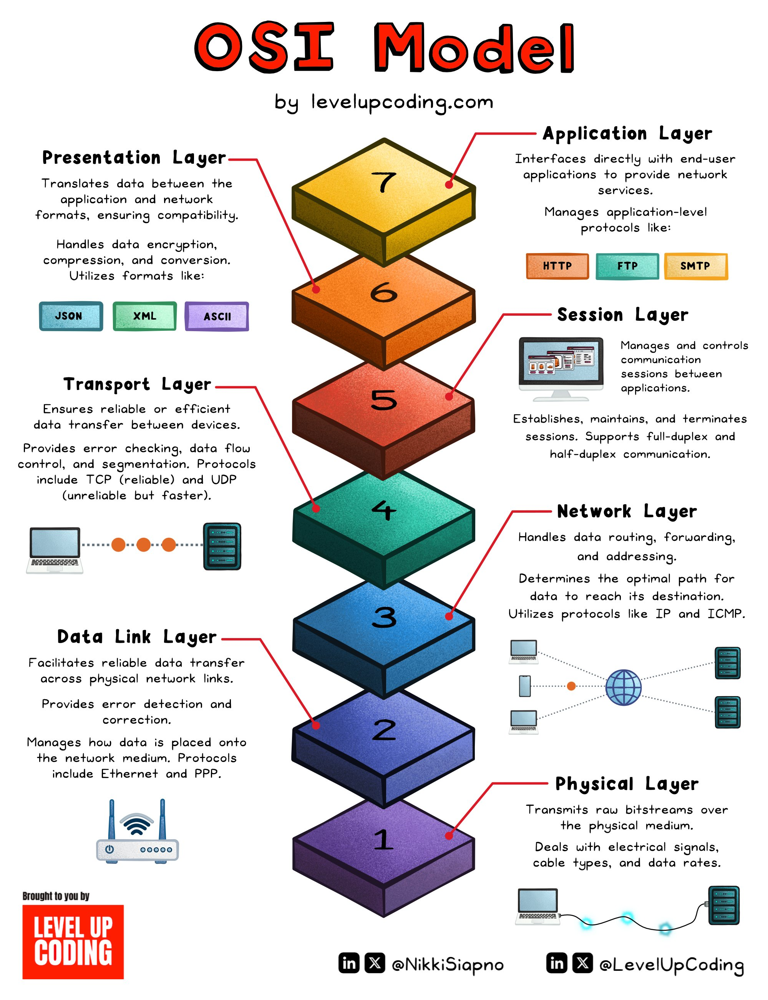

**Source:** [https://twitter.com/i/web/status/1921822976170655926](https://twitter.com/i/web/status/1921822976170655926)
**Original Post Date:** 2025-05-27 21:18:40

# OSI Model: Understanding Network Communication Layers for Software Architecture

## Introduction
The Open Systems Interconnection (OSI) model is a fundamental framework for understanding how data moves through networks. This knowledge base explains each of the seven layers' responsibilities and protocols, essential for software engineers designing scalable network architectures.

## Physical Layer

Handles raw bit transmission over physical media (cables, wireless). Manages electrical signals, data rates, and connectivity.

Protocols like Ethernet and PPP ensure reliable signal transmission and cable management.

- Manages electrical signals and data rates
- Handles physical medium specifications
- Establishes connection parameters

## Data Link Layer

Ensures reliable point-to-point delivery between devices on the same network. Handles error detection and correction.

Key protocols include Ethernet, PPP, and wireless standards like IEEE 802.11 (Wi-Fi).

- Provides error detection/correction mechanisms
- Manages frame sequencing
- Controls access to physical medium

## Network Layer

Responsible for logical addressing and routing. Determines optimal paths between hosts across networks.

IP protocol provides packet delivery while ICMP handles error messages.

- Manages IP address allocation
- Handles packet routing decisions
- Supports network segmentation

## Transport Layer

Ensures reliable data delivery between hosts. Provides flow control and error recovery.

TCP offers guaranteed delivery with connection management, while UDP prioritizes speed over reliability.

- Manages end-to-end connections
- Provides congestion control
- Handles data segmentation

## Session Layer

Establishes, manages, and terminates communication sessions between applications.

Supports different communication modes including full-duplex and half-duplex.

- Manages session establishment/termination
- Handles session synchronization
- Provides dialog control

## Presentation Layer

Translates data between application and network formats. Handles encryption, compression, and format conversion.

Ensures compatibility across different systems using standards like JSON and XML.

- Manages data encryption/decryption
- Handles data compression
- Supports format translation

## Application Layer

Interfaces directly with end-user applications. Provides high-level network services.

Protocols like HTTP, FTP, and SMTP enable application-specific communication.

- Supports web browsing (HTTP)
- Enables file transfer (FTP)
- Manages email delivery (SMTP)

## Key Takeaways

- Understanding OSI layers helps in designing robust network architectures
- Different protocols operate at different layers for specialized functions
- Layer interactions enable end-to-end data communication

## Conclusion
The OSI model provides a structured approach to understanding network communication. By comprehending each layer's role and responsibilities, software engineers can design more efficient and reliable networked systems.

## External References

- [International Organization for Standardization (ISO) - OSI Model](https://www.iso.org/standard/64325.html)
- [Level Up Coding OSI Model Infographic](https://levelupcoding.com/os-model-infographic/)

## Media

**Image Description:** ### Description of the Image

The image is a detailed infographic that explains the **OSI (Open Systems Interconnection) Model**, a conceptual framework used to understand and standardize network communication. The model is divided into **seven layers**, each with specific responsibilities and functions. The infographic is visually organized with a pyramid-like structure, where each layer is represented by a colored block. The layers are numbered from 1 (bottom) to 7 (top), with the topmost layer being the **Application Layer** and the bottommost layer being the **Physical Layer**. Below is a detailed breakdown of each layer:

---

### **1. Physical Layer (Layer 1)**
- **Color**: Purple
- **Responsibilities**:
  - Deals with the physical transmission of raw bitstreams over the network.
  - Handles the electrical, mechanical, and procedural aspects of data transmission.
  - Involves the physical medium (e.g., cables, fiber optics, wireless signals).
  - Manages electrical signals, data rates, and types of cables.
- **Protocols**: Ethernet, PPP (Point-to-Point Protocol).

---

### **2. Data Link Layer (Layer 2)**
- **Color**: Dark Blue
- **Responsibilities**:
  - Facilitates reliable data transfer across physical network links.
  - Provides error detection and correction.
  - Manages how data is placed onto the network medium.
  - Ensures data is transmitted without errors.
- **Protocols**: Ethernet, PPP, IEEE 802.11 (Wi-Fi), IEEE 802.3 (Ethernet).

---

### **3. Network Layer (Layer 3)**
- **Color**: Light Blue
- **Responsibilities**:
  - Handles data routing, forwarding, and addressing.
  - Determines the optimal path for data to reach its destination.
  - Manages network addressing (e.g., IP addresses).
- **Protocols**: IP (Internet Protocol), ICMP (Internet Control Message Protocol), IGMP (Internet Group Management Protocol).

---

### **4. Transport Layer (Layer 4)**
- **Color**: Teal
- **Responsibilities**:
  - Ensures reliable or efficient data transfer between devices.
  - Provides error checking, data flow control, and segmentation.
  - Manages data transfer between hosts.
- **Protocols**: TCP (Transmission Control Protocol), UDP (User Datagram Protocol).
  - **TCP**: Reliable, connection-oriented protocol.
  - **UDP**: Unreliable, connectionless protocol (faster but less reliable).

---

### **5. Session Layer (Layer 5)**
- **Color**: Red
- **Responsibilities**:
  - Manages and controls communication sessions between applications.
  - Establishes, maintains, and terminates sessions.
  - Supports full-duplex and half-duplex communication.
- **Protocols**: NetBIOS, SQL, RPC (Remote Procedure Call).

---

### **6. Presentation Layer (Layer 6)**
- **Color**: Orange
- **Responsibilities**:
  - Translates data between the application and network formats.
  - Ensures compatibility between different systems.
  - Handles data encryption, compression, and conversion.
- **Formats**: JSON, XML, ASCII.
- **Protocols**: SSL/TLS (for encryption).

---

### **7. Application Layer (Layer 7)**
- **Color**: Gold
- **Responsibilities**:
  - Interfaces directly with end-user applications.
  - Provides network services to applications.
  - Manages application-level protocols.
- **Protocols**: HTTP (Hypertext Transfer Protocol), FTP (File Transfer Protocol), SMTP (Simple Mail Transfer Protocol), DNS (Domain Name System).

---

### **Visual Elements**
- **Pyramid Structure**: The layers are stacked in a pyramid shape, with the Physical Layer at the bottom and the Application Layer at the top, emphasizing the hierarchical nature of the model.
- **Color Coding**: Each layer is represented by a distinct color, making it visually easy to differentiate between them.
- **Icons and Illustrations**:
  - Physical Layer: Wi-Fi and Ethernet icons.
  - Data Link Layer: Network interface cards and cables.
  - Network Layer: Routers and IP addressing icons.
  - Transport Layer: TCP and UDP protocol icons.
  - Session Layer: Session management icons.
  - Presentation Layer: JSON, XML, and ASCII format icons.
  - Application Layer: HTTP, FTP, and SMTP protocol icons.
- **Text Descriptions**: Each layer has a detailed description of its responsibilities and associated protocols.

---

### **Additional Information**
- **Source**: The infographic is credited to **levelupcoding.com**.
- **Social Media Handles**: The image includes social media handles for **@NikkiSiapno** and **@LevelUpCoding**.
- **Branding**: The infographic is branded with the **Level Up Coding** logo.

---

### **Overall Purpose**
The infographic serves as an educational tool to explain the OSI Model in a clear and visually appealing manner. It breaks down the complex concept of network communication into manageable, understandable layers, highlighting the role of each layer in the transmission of data from the physical medium to the end-user application.
