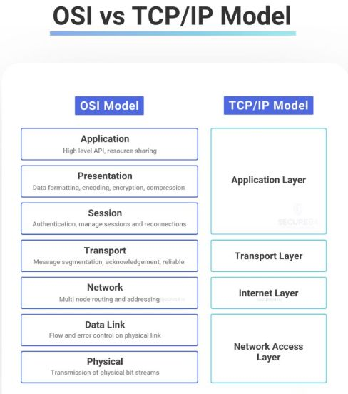

**Source:** [https://twitter.com/i/web/status/1868264760254349383](https://twitter.com/i/web/status/1868264760254349383)
**Original Post Date:** 2025-05-27 22:29:03

# OSI vs. TCP/IP Model: Layer Comparison and Technical Analysis

## Introduction
The OSI and TCP/IP models are foundational frameworks that define how data flows through computer networks. Understanding these models is crucial for software engineers designing distributed systems or troubleshooting network issues. This analysis provides a detailed comparison of both models, highlighting their structural differences and functional relationships.

## OSI Model Architecture

The OSI model consists of seven distinct layers: Application, Presentation, Session, Transport, Network, Data Link, and Physical. Each layer has specific responsibilities and interfaces with adjacent layers through precise service definitions.

Layer decomposition in the OSI model allows for detailed troubleshooting by isolating issues to specific communication functions, such as encryption (Presentation Layer) or session management (Session Layer).

- Application layer handles user-facing protocols like HTTP and FTP
- Transport layer ensures reliable data delivery with TCP/UDP
- Network layer performs routing decisions via IP addressing
- Physical layer defines electrical and mechanical specifications

> **Note/Tip:** When designing network services, consider OSI model's detailed layering for better protocol separation and modularity.

## TCP/IP Model Simplification

The TCP/IP model consolidates OSI's seven layers into four: Application, Transport, Internet (Network), and Network Access. This simplification reflects modern internet needs while maintaining essential functionality.

By merging multiple OSI layers, TCP/IP offers a more streamlined approach to network stack implementation.

```bash
# Example of layer mapping in modern networking
ping -c 1 google.com # Network Access (ICMP)
curl http://example.com # Transport & Application
tcpdump -i eth0 port 80 # Network & Transport
```

## Technical Comparisons

While OSI provides detailed abstraction, TCP/IP offers practical implementation advantages. For instance, the Presentation and Session layers from OSI are absorbed into Application layer functions in TCP/IP.

This consolidation simplifies stack development but may reduce flexibility in specialized network designs.

1. OSI's seven-layer model enables more granular protocol separation
1. TCP/IP's four layers simplify implementation and debugging
1. Most modern protocols map to TCP/IP but understand OSI for deeper troubleshooting

## Conclusion
While the OSI model remains valuable for educational purposes and detailed analysis, TCP/IP's streamlined structure dominates modern networking implementations. Engineers should be familiar with both frameworks to effectively design, implement, and troubleshoot networked systems.

## External References

- [OSI Model Definition](https://www.iso.org/isoiec-7498-2.html)
- [TCP/IP Architecture Guide](https://tools.ietf.org/html/rfc1122)


## Media

**Image Description:** The image is a comparative diagram illustrating the **OSI (Open Systems Interconnection) Model** and the **TCP/IP (Transmission Control Protocol/Internet Protocol) Model**, two fundamental networking models used in computer networking. The diagram highlights the layers of each model and their corresponding functions. Below is a detailed description:

### **Main Subject:**
The main subject of the image is the comparison between the **OSI Model** and the **TCP/IP Model**. Both models are hierarchical frameworks that define how data is transmitted over a network, but they differ in their structure and the number of layers.

### **Structure of the Diagram:**
The diagram is divided into two columns:
1. **Left Column:** Represents the **OSI Model**.
2. **Right Column:** Represents the **TCP/IP Model**.

Each column lists the layers of the respective model, with brief descriptions of their functions.

---

### **OSI Model (Left Column):**
The OSI Model is a seven-layer framework that defines how data is transmitted over a network. The layers are listed from top to bottom, with each layer building upon the one below it. Here are the layers and their descriptions:

1. **Application Layer:**
   - **Description:** High-level APIs, resource sharing.
   - **Function:** Provides services to the application software, such as file transfer, email, and web browsing.

2. **Presentation Layer:**
   - **Description:** Data formatting, encoding, encryption, compression.
   - **Function:** Ensures that data is in a format that can be understood by the receiving application. Handles tasks like data encryption, compression, and formatting.

3. **Session Layer:**
   - **Description:** Authentication, manage sessions and reconnections.
   - **Function:** Establishes, manages, and terminates sessions between applications. It also handles authentication and reconnection management.

4. **Transport Layer:**
   - **Description:** Message segmentation, acknowledgment, reliable.
   - **Function:** Ensures reliable data transmission by handling tasks like segmentation, reassembly, error checking, and flow control.

5. **Network Layer:**
   - **Description:** Multi-node routing and addressing.
   - **Function:** Handles routing and addressing, determining the best path for data to travel across the network.

6. **Data Link Layer:**
   - **Description:** Flow and error control on physical link.
   - **Function:** Ensures reliable transmission of data over the physical network by handling tasks like error detection and correction, and flow control.

7. **Physical Layer:**
   - **Description:** Transmission of physical bit streams.
   - **Function:** Deals with the physical transmission of data over the network, including the electrical, mechanical, and procedural aspects of data transmission.

---

### **TCP/IP Model (Right Column):**
The TCP/IP Model is a four-layer framework that is more widely used in modern networking, particularly in the Internet. The layers are listed from top to bottom, with each layer building upon the one below it. Here are the layers and their descriptions:

1. **Application Layer:**
   - **Description:** Same as the Application Layer in the OSI Model.
   - **Function:** Provides services to the application software, such as file transfer, email, and web browsing.

2. **Transport Layer:**
   - **Description:** Same as the Transport Layer in the OSI Model.
   - **Function:** Ensures reliable data transmission by handling tasks like segmentation, reassembly, error checking, and flow control.

3. **Internet Layer:**
   - **Description:** Same as the Network Layer in the OSI Model.
   - **Function:** Handles routing and addressing, determining the best path for data to travel across the network.

4. **Network Access Layer:**
   - **Description:** Combines the Data Link Layer and Physical Layer of the OSI Model.
   - **Function:** Handles the physical transmission of data over the network, including tasks like error detection and correction, flow control, and the physical aspects of data transmission.

---

### **Comparison Highlights:**
- The **OSI Model** has **seven layers**, while the **TCP/IP Model** has **four layers**.
- The **TCP/IP Model** combines the functions of multiple OSI layers into fewer layers:
  - The **Network Access Layer** in TCP/IP combines the **Data Link Layer** and **Physical Layer** of the OSI Model.
  - The **Internet Layer** in TCP/IP corresponds to the **Network Layer** of the OSI Model.
  - The **Transport Layer** and **Application Layer** in both models are similar.

### **Visual Design:**
- The diagram uses a clean, structured layout with blue boxes for each layer.
- The layers are aligned vertically for easy comparison.
- The text is concise and descriptive, providing a brief overview of each layer's function.

### **Relevant Technical Details:**
- **OSI Model Layers:** Application, Presentation, Session, Transport, Network, Data Link, Physical.
- **TCP/IP Model Layers:** Application, Transport, Internet, Network Access.
- **Key Differences:** The OSI Model is more detailed with seven layers, while the TCP/IP Model is more streamlined with four layers, combining some functions of the OSI Model into fewer layers.

This diagram effectively illustrates the similarities and differences between the two models, making it easier to understand their respective roles in network communication.
