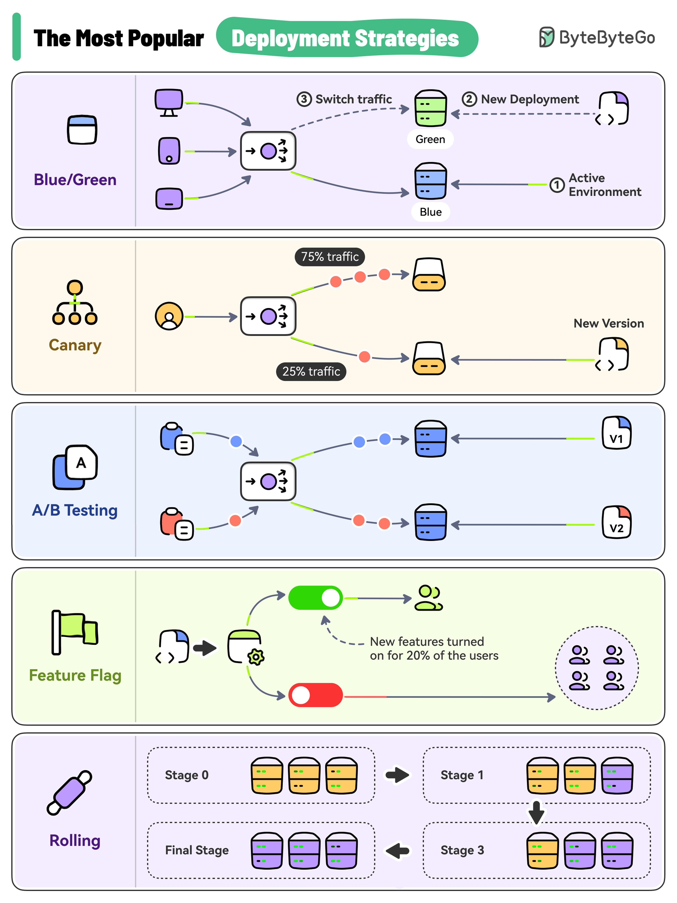

**Source:** [https://twitter.com/i/web/status/1869249994521452949](https://twitter.com/i/web/status/1869249994521452949)
**Original Post Date:** 2025-07-23 06:27:21

# Production Release Patterns: A Comprehensive Guide to Deployment Strategies

## Introduction
In modern software development, deploying new versions of applications efficiently and safely is crucial. This guide explores five popular deployment strategies: Blue/Green Deployment, Canary Deployment, A/B Testing, Feature Flag Deployment, and Rolling Deployment. Each strategy has unique benefits and use cases, making them essential tools for managing production releases effectively.

## Blue/Green Deployment

Blue/Green Deployment is a strategy where two identical production environments are maintained: one active (Blue) and one inactive (Green). When a new version of the application is ready, it is deployed to the Green environment. Once tested and verified, traffic is switched from Blue to Green.

This approach ensures zero downtime during deployment and allows for easy rollback if issues arise in the Green environment. Both environments are identical in terms of infrastructure and configuration, which minimizes risks associated with changes.

- Zero downtime during the switch.
- Easy rollback if issues arise in the Green environment.
- Both environments are identical in terms of infrastructure and configuration.

## Canary Deployment

Canary Deployment involves deploying a new version of an application to a subset of users while the majority continues to use the old version. This strategy minimizes risk by exposing only a portion of users to the new version.

Traffic is split between the old and new versions, allowing for gradual rollout and monitoring of performance and user impact. If issues are detected, the deployment can be rolled back easily.

- Minimizes risk by exposing only a portion of users to the new version.
- Allows for gradual rollout and monitoring of performance and user impact.
- Easy rollback if issues are detected.

## A/B Testing

A/B Testing is a deployment strategy where two versions of an application (V1 and V2) are tested simultaneously. Traffic is split between the two versions, allowing for direct comparison based on predefined metrics.

This approach helps determine which version performs better, making it useful for testing new features or UI changes. The results can inform future development decisions.

- Allows for direct comparison of two versions.
- Helps in determining which version performs better based on predefined metrics.
- Useful for testing new features or UI changes.

## Feature Flag Deployment

Feature Flag Deployment involves implementing a new feature but toggling it off by default. The feature is then turned on for a subset of users, allowing for controlled testing and monitoring.

This strategy enables gradual rollout of new features without deploying new code. It also allows for easy toggling of features on or off without redeploying the application.

- Enables gradual rollout of new features without deploying new code.
- Allows for testing new features in a controlled manner.
- Easy to toggle features on or off without redeploying the application.
- Useful for A/B testing or feature experimentation.

## Rolling Deployment

Rolling Deployment involves updating servers in stages, with each stage involving a subset of servers or instances. This approach minimizes downtime by updating servers one at a time or in batches.

The deployment starts with the initial state where all servers are running the old version. As each stage is completed, more servers are updated to the new version until the entire environment is running the new version.

- Minimizes downtime by updating servers one at a time or in batches.
- Allows for gradual testing and monitoring of the new version.
- Easy rollback if issues are detected during any stage.

## Key Takeaways

- Blue/Green Deployment ensures zero downtime and easy rollback by maintaining two identical environments.
- Canary Deployment minimizes risk by exposing only a portion of users to the new version.
- A/B Testing allows for direct comparison of two versions based on predefined metrics.
- Feature Flag Deployment enables gradual rollout of new features without deploying new code.
- Rolling Deployment minimizes downtime by updating servers in stages.

## Conclusion
Understanding and implementing these deployment strategies can significantly improve the efficiency and safety of production releases. Each strategy has its unique benefits and use cases, making them essential tools for modern software development and DevOps practices.

## External References

- [ByteByteGo - The Most Popular Deployment Strategies](https://bytebytego.com)

## Media

**Image Description:** ### Image Description: Deployment Strategies

The image is a detailed infographic titled **"The Most Popular Deployment Strategies"** by **ByteByteGo**. It visually explains five popular deployment strategies used in software development and DevOps. Each strategy is illustrated with icons, flowcharts, and annotations to describe the process and key technical details. Below is a detailed breakdown of each section:

---

### **1. Blue/Green Deployment**

- **Icon**: A pair of blue and green squares.
- **Description**:
  - **Active Environment (Blue)**: The current production environment is active and handling all traffic.
  - **New Deployment (Green)**: A new version of the application is deployed to a separate environment (Green).
  - **Switch Traffic**: Once the new deployment is tested and verified, traffic is switched from the Blue environment to the Green environment.
  - **Key Features**:
    - Zero downtime during the switch.
    - Easy rollback if issues arise in the Green environment.
    - Both environments are identical in terms of infrastructure and configuration.

---

### **2. Canary Deployment**

- **Icon**: A yellow canary bird.
- **Description**:
  - **Active Environment (Blue)**: The current production environment is active.
  - **New Version**: A new version of the application is deployed to a separate environment.
  - **Traffic Split**: A small percentage of traffic (e.g., 25%) is routed to the new version, while the majority (e.g., 75%) continues to use the old version.
  - **Testing**: The new version is tested in a controlled manner with a subset of users.
  - **Key Features**:
    - Minimizes risk by exposing only a portion of users to the new version.
    - Allows for gradual rollout and monitoring of performance and user impact.
    - Easy rollback if issues are detected.

---

### **3. A/B Testing**

- **Icon**: Two versions labeled **V1** and **V2**.
- **Description**:
  - **Active Environment (V1)**: The current production environment is active.
  - **New Version (V2)**: A new version of the application is deployed.
  - **Traffic Split**: Traffic is split between the two versions (e.g., 50% to V1 and 50% to V2).
  - **Testing**: Both versions are tested simultaneously, and user behavior or performance metrics are compared.
  - **Key Features**:
    - Allows for direct comparison of two versions.
    - Helps in determining which version performs better based on predefined metrics.
    - Useful for testing new features or UI changes.

---

### **4. Feature Flag Deployment**

- **Icon**: A green flag.
- **Description**:
  - **Active Environment**: The current production environment is active.
  - **Feature Flag**: A new feature is implemented but is toggled off by default.
  - **Testing**: The feature is turned on for a subset of users (e.g., 20%).
  - **Key Features**:
    - Enables gradual rollout of new features without deploying new code.
    - Allows for testing new features in a controlled manner.
    - Easy to toggle features on or off without redeploying the application.
    - Useful for A/B testing or feature experimentation.

---

### **5. Rolling Deployment**

- **Icon**: A purple rolling pin.
- **Description**:
  - **Staged Rollout**: The deployment is done in stages, with each stage involving a subset of servers or instances.
  - **Stage 0**: The initial state where all servers are running the old version.
  - **Stage 1**: A portion of servers is updated to the new version.
  - **Stage 2**: More servers are updated, and the new version is tested.
  - **Stage 3**: All servers are updated to the new version.
  - **Final Stage**: The entire environment is running the new version.
  - **Key Features**:
    - Minimizes downtime by updating servers one at a time or in batches.
    - Allows for gradual testing and monitoring of the new version.
    - Easy rollback if issues are detected during any stage.

---

### **Overall Layout and Design**

- The infographic uses a clean, organized layout with distinct sections for each deployment strategy.
- Each section includes:
  - An icon representing the strategy.
  - A flowchart or diagram illustrating the process.
  - Annotations explaining key steps and features.
- The color coding (e.g., Blue/Green, Yellow Canary, V1/V2) helps differentiate between environments and versions.
- The design is visually appealing and easy to follow, making it suitable for both technical and non-technical audiences.

---

### **Conclusion**

The image provides a comprehensive overview of the most popular deployment strategies used in software development. Each strategy is explained with clear visuals and annotations, highlighting its key features, benefits, and use cases. This infographic serves as an excellent resource for understanding how to manage software deployments effectively.
