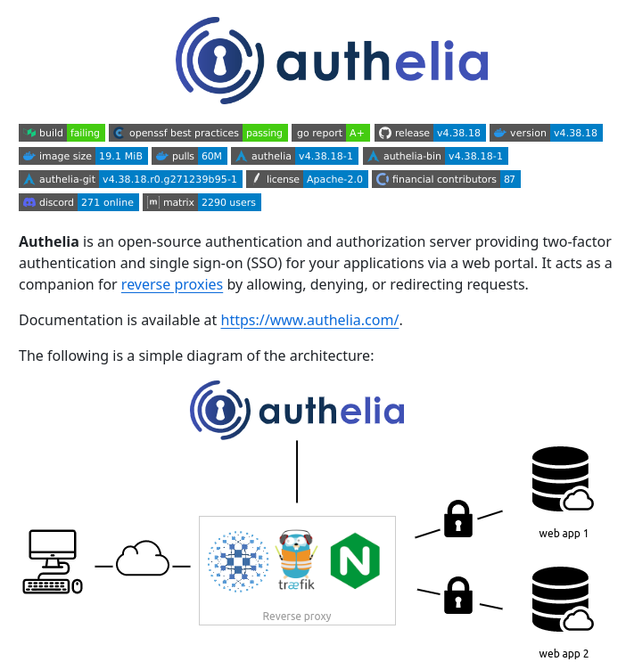

**Source:** [https://twitter.com/i/web/status/1878731182965248452](https://twitter.com/i/web/status/1878731182965248452)
**Original Post Date:** 2025-05-27 20:36:41

# Authelia: Open-Source Authentication & SSO Server Architecture

## Introduction
Authelia is a modern open-source authentication server designed to provide robust two-factor authentication (2FA) and single sign-on (SSO) capabilities. It operates as a companion to reverse proxies like Traefik or Nginx, securing multiple web applications through centralized authentication management. Authelia's architecture emphasizes security best practices while maintaining simplicity in deployment and maintenance.

## Architecture Overview

Authelia integrates with reverse proxies to intercept unauthenticated requests, routing them to its authentication portal. The server maintains user sessions and credentials in a database, supporting multiple authenticators including TOTP, LDAP, OAuth2, and YubiKey.

The system follows a client-server architecture where web applications are protected behind the reverse proxy. When an unauthorized request arrives, Authelia validates user credentials before allowing access to the requested resource.

- Centralized authentication portal
- Database-backed session management
- Reverse proxy integration support
- Multi-factor authentication capabilities

## Technical Specifications & Security

Built with Go, Authelia achieves an A+ Go Report score while maintaining a lightweight 19.1 MiB Docker image size. It adheres to OpenSSF Best Practices for security and offers comprehensive logging capabilities.

The system supports encrypted communication via TLS/SSL and provides fine-grained access control through role-based authorization.

```yaml
reverse_proxy:
  http:
    headers:
      x_forwarded_proto: https
authelia:
  internal_url: authelia.example.com
  redirect_to_dashboard: false
```

## Deployment & Configuration

Authelia can be deployed as a Docker container or directly from source. The configuration process involves setting up the reverse proxy, configuring authentication methods, and establishing database connections.

Version v4.38.18 includes improvements to OAuth2 integration and enhanced logging capabilities.

> **Note/Tip:** Always ensure TLS termination at the reverse proxy for maximum security

> **Note/Tip:** Regularly update to latest versions for security patches

## Key Takeaways

- Authelia provides enterprise-grade authentication without complex infrastructure requirements
- Integration with existing reverse proxies simplifies deployment in current architectures
- Comprehensive community support and documentation ensure successful implementation

## Conclusion
Authelia stands out as a robust, open-source solution for organizations requiring secure single sign-on capabilities. Its combination of ease-of-use, security features, and active community make it an excellent choice for teams looking to implement modern authentication practices.

## External References

- [Official Documentation](https://www.authelia.com/)
- [Docker Hub Repository](https://hub.docker.com/r/authelia/authelia)


## Media

**Image Description:** ### Description of the Image

The image is a detailed overview of **Authelia**, an open-source authentication and authorization server. The content is structured to provide information about Authelia's features, technical details, and its architecture. Below is a detailed breakdown:

---

#### **Header Section**
1. **Logo and Name**:
   - The logo of Authelia is prominently displayed at the top center. The logo consists of a stylized blue keyhole with a circular design around it, symbolizing security and authentication.
   - The name "Authelia" is written in a clean, modern font next to the logo.

2. **Status Indicators**:
   - Below the logo, there are several status indicators presented as colored badges. These provide quick insights into the project's health and status:
     - **Build**: Marked as "failing" (red badge).
     - **OpenSSF Best Practices**: Marked as "passing" (green badge).
     - **Go Report**: Marked as "A+" (green badge).
     - **Release**: Indicates the latest release version as `v4.38.18` (blue badge).
     - **Version**: Indicates the current version as `v4.38.18` (blue badge).
     - **Image Size**: Indicates the size of the Docker image as `19.1 MiB` (blue badge).
     - **Pulls**: Indicates the number of pulls as `60M` (blue badge).
     - **Authelia**: Links to the Authelia repository with version `v4.38.18-1` (blue badge).
     - **Authelia-bin**: Links to the Authelia binary repository with version `v4.38.18-1` (blue badge).
     - **Authelia-git**: Links to the Git repository with version `v4.38.18-r0.g271239b95-1` (blue badge).
     - **License**: Indicates the license as Apache-2.0 (blue badge).
     - **Financial Contributors**: Indicates the number of financial contributors as `87` (blue badge).
     - **Discord**: Indicates the number of online users on the Discord server as `271` (blue badge).
     - **Matrix**: Indicates the number of users on the Matrix server as `2290` (blue badge).

---

#### **Main Content Section**
1. **Introduction to Authelia**:
   - Authelia is described as an **open-source authentication and authorization server**.
   - It provides **two-factor authentication (2FA)** and **single sign-on (SSO)** for applications via a web portal.
   - Authelia acts as a companion for **reverse proxies**, allowing, denying, or redirecting requests.

2. **Documentation Link**:
   - The documentation is available at the URL: `[https://www.authelia.com/`.](https://www.authelia.com/`.)

3. **Architecture Diagram**:
   - A simple diagram illustrates the architecture of Authelia and its integration with other components.

---

#### **Architecture Diagram**
1. **Components**:
   - **Reverse Proxy**: Authelia is integrated with a reverse proxy (e.g., Traefik, Nginx). This is depicted in the center of the diagram.
   - **Authelia Server**: Authelia is shown as a central component that manages authentication and authorization.
   - **Web Applications**: Multiple web applications (e.g., "web app 1" and "web app 2") are secured by Authelia.
   - **Database**: Authelia interacts with a database (depicted as a cloud database icon) to store user credentials and session data.
   - **Users**: Users access the web applications through the reverse proxy, which routes requests to Authelia for authentication.

2. **Flow**:
   - Users interact with the web applications via a browser.
   - Requests are routed through a **reverse proxy** (e.g., Traefik or Nginx).
   - The reverse proxy redirects unauthenticated requests to Authelia for authentication.
   - Authelia verifies the user's credentials and manages sessions.
   - Once authenticated, the user is granted access to the web applications.

3. **Icons**:
   - **Computer**: Represents a client device (e.g., a user's computer).
   - **Cloud**: Represents the network or internet.
   - **Reverse Proxy**: Depicted with the Traefik logo and Nginx logo.
   - **Database**: Represented as a cloud database icon.
   - **Lock**: Symbolizes authentication and authorization.

---

#### **Technical Details**
1. **Versioning**:
   - The latest release version is `v4.38.18`.
   - The Git repository version is `v4.38.18-r0.g271239b95-1`.

2. **License**:
   - Authelia is licensed under the **Apache-2.0** license.

3. **Community Engagement**:
   - Authelia has a strong community presence, with:
     - `271` users on Discord.
     - `2290` users on Matrix.
     - `87` financial contributors.

4. **Security Practices**:
   - Authelia follows **OpenSSF Best Practices** and has a **Go Report** score of `A+`.

---

### Summary
The image provides a comprehensive overview of Authelia, an open-source authentication and authorization server. It highlights key features such as two-factor authentication, single sign-on, and integration with reverse proxies. The architecture diagram illustrates how Authelia fits into a typical web application setup, securing access to multiple web applications via a reverse proxy. The status indicators and community metrics emphasize the project's active development and community support.
