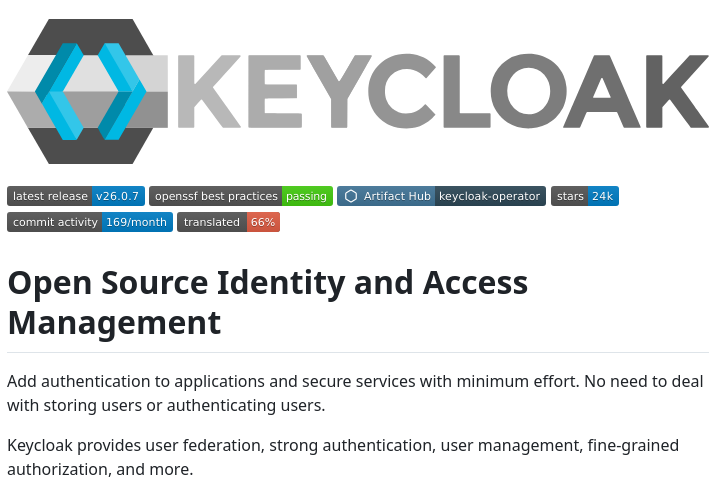

**Source:** [https://twitter.com/i/web/status/1875626285034082568](https://twitter.com/i/web/status/1875626285034082568)
**Original Post Date:** 2025-06-17 13:52:08

# Keycloak Single Sign-On Architecture: Implementation & Integration

## Introduction
Keycloak is a leading open-source identity and access management solution that simplifies the implementation of Single Sign-On (SSO) in modern applications. This architecture overview explores its core components, security features, integration capabilities, and community-driven development model. Through this knowledge base item, you'll understand how Keycloak addresses enterprise IAM requirements while maintaining scalability and compliance.

## Project Overview & Technical Foundation

Keycloak (v26.0.7) is a robust open-source platform that offers comprehensive identity management capabilities, including authentication, authorization, and user federation. The project follows OpenSSF best practices for security and has gained significant traction with 24k GitHub stars.

The architecture emphasizes minimal integration effort through its modular design, allowing seamless adoption into existing applications while maintaining high security standards.

- Open-source identity and access management solution
- Adherence to OpenSSF best practices for security
- 24k GitHub stars indicating community support

## Core Functional Architecture

Keycloak's architecture is built around several core components that work together to provide comprehensive IAM capabilities:

The platform supports multiple protocols including OAuth 2.0, OpenID Connect, and SAML 2.0, making it adaptable to various integration scenarios.

1. Authentication Service: Handles user authentication flows
1. Authorization System: Implements role-based access control (RBAC)
1. User Federation Layer: Integrates with external identity providers

## Kubernetes Integration & Scalability

Keycloak's Kubernetes operator simplifies deployment and management in containerized environments. The platform supports high availability configurations through clustering capabilities.

The Artifact Hub integration provides pre-configured Helm charts for streamlined deployments.

> **Note/Tip:** Use the Keycloak Operator to automate scaling and configuration management

> **Note/Tip:** Enable clustering for production workloads requiring high availability

## Key Takeaways

- Keycloak offers a comprehensive IAM solution with strong security foundations through OpenSSF compliance
- The architecture supports seamless integration with existing systems via user federation and multiple protocols
- Kubernetes operator and Artifact Hub integrations enable efficient cloud-native deployments

## Conclusion
Keycloak provides a robust, community-supported platform for implementing enterprise-grade SSO. Its modular architecture, security practices, and Kubernetes integration capabilities make it an ideal choice for organizations seeking to centralize their identity management infrastructure while maintaining flexibility and scalability.

## External References

- [Official Keycloak GitHub Repository](https://github.com/keycloak/keycloak)
- [OpenSSF Best Practices Documentation](https://bestpractices.coreinfrastructure.org/en/projects/1658)

## Media

**Image Description:** The image appears to be a screenshot of a GitHub repository page for an open-source project called **Keycloak**. Below is a detailed description of the image, focusing on the main subject and relevant technical details:

### **Main Subject: Keycloak**
Keycloak is an open-source identity and access management (IAM) solution. The repository page provides information about the project, its features, and its community engagement.

---

### **Header Section**
1. **Logo**:
   - The logo is prominently displayed on the left side of the header.
   - It features a stylized hexagonal shape with a blue arrow-like design inside, symbolizing movement or progress.
   - The text "KEYCLOAK" is written in a bold, sans-serif font next to the logo.

2. **Version Information**:
   - The latest release version is indicated as **v26.0.7**.
   - This is shown in a small rectangular badge labeled "latest release."

3. **Badges**:
   - Several badges are displayed below the logo, providing quick insights into the project's status and features:
     - **OpenSSF Best Practices**: A green badge indicating that the project follows OpenSSF (Open Source Security Foundation) best practices.
     - **Passing**: A green badge suggesting that the project's tests or checks are passing.
     - **Artifact Hub**: A badge linking to the Artifact Hub, where the project's artifacts (e.g., Helm charts, container images) can be found.
     - **Keycloak Operator**: A badge indicating the availability of an operator for managing Keycloak in Kubernetes environments.
     - **Stars**: A badge showing the project has **24k stars** on GitHub, indicating its popularity.

4. **Commit Activity**:
   - A badge shows **169 commits per month**, reflecting active development and maintenance.

5. **Translation Status**:
   - A badge indicates that the project is **66% translated**, suggesting ongoing localization efforts.

---

### **Title and Description**
1. **Title**:
   - The title is repeated multiple times in the image: **"Open Source Source Identity Identity Identity Management Management Management"**.
   - This repetition is likely a design choice or an error in the text formatting.

2. **Description**:
   - The description highlights Keycloak's purpose:
     - **Authentication**: Adds authentication capabilities to applications.
     - **Secure Services**: Secures services with minimal effort.
     - **User Management**: Handles user storage and authentication without requiring manual management.
   - The text emphasizes that Keycloak simplifies the process of managing user identities and access control.

---

### **Key Features**
The description mentions several key features of Keycloak:
1. **User Federation**: Integrates with various identity providers.
2. **Strong Authentication**: Supports advanced authentication methods.
3. **User Management**: Provides tools for managing user accounts.
4. **Fine-Grained Authorization**: Offers granular control over access permissions.
5. **Additional Features**: Implies that Keycloak offers more functionalities beyond those listed.

---

### **Technical Details**
1. **OpenSSF Best Practices**:
   - Indicates adherence to security best practices, which is crucial for an IAM solution.
2. **Artifact Hub**:
   - Suggests that Keycloak artifacts (e.g., Helm charts, container images) are available for easy deployment in Kubernetes environments.
3. **Keycloak Operator**:
   - Highlights the availability of a Kubernetes operator for managing Keycloak deployments, making it easier to configure and scale in cloud-native environments.

---

### **Community Engagement**
1. **Stars (24k)**:
   - Indicates a large and active community of users and contributors.
2. **Commit Activity (169/month)**:
   - Shows consistent development and maintenance, reflecting the project's maturity and support.

---

### **Design and Layout**
- The page uses a clean, modern design with a white background and black text.
- Badges are color-coded (e.g., green for passing tests, blue for links) to draw attention to key information.
- The repetition of the title in the description is noticeable and may be a design oversight.

---

### **Overall Impression**
The image effectively communicates Keycloak's purpose as an open-source IAM solution, emphasizing its features, community engagement, and adherence to security best practices. The use of badges and clear descriptions makes it easy for potential users to understand the project's status and capabilities. The repetition in the title, however, is a minor design issue that could be improved.
