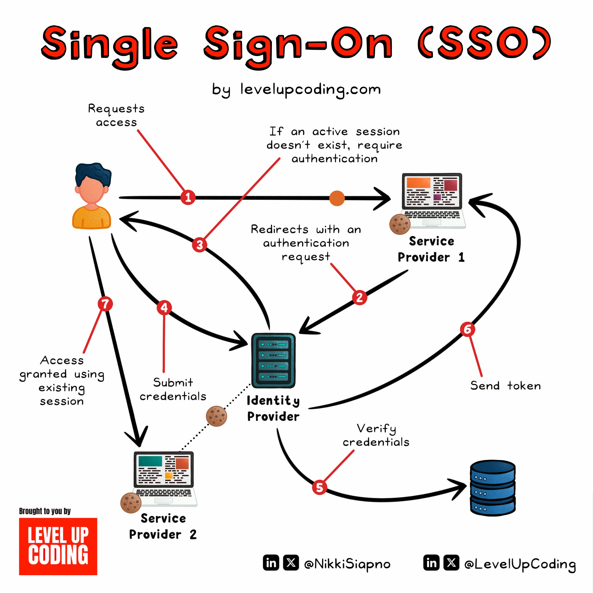

**Source:** [https://twitter.com/i/web/status/1917074989142183945](https://twitter.com/i/web/status/1917074989142183945)
**Original Post Date:** 2025-05-27 23:05:42

# Single Sign-On (SSO): Authentication Flow & Implementation Details

## Introduction
Single Sign-On (SSO) is a fundamental authentication pattern that revolutionizes user access management across multiple services. This knowledge base item explores the technical aspects of SSO, from core architectural components to implementation details, focusing on secure token-based authentication mechanisms and session management. Understanding this system is crucial for building scalable, secure applications that integrate with various third-party services.

## SSO Architecture Components

The SSO ecosystem consists of three primary components: User, Identity Provider (IdP), and Service Providers (SP). The IdP acts as a central authentication authority, storing user credentials and managing access tokens. Service providers trust the IdP's authentication decisions.

The process flow begins with the user initiating access to a service provider, which redirects to the IdP for authentication if no valid session exists.

- Identity Provider (IdP): Centralized authentication authority
- Service Providers (SPs): Applications requiring user access control
- Authentication Tokens: Secure credentials for cross-service access

> **Note/Tip:** Ensure mutual TLS between IdP and SPs to prevent man-in-the-middle attacks.

## Token-Based Authentication Flow

SSO relies heavily on token-based authentication. When a user authenticates with the IdP, it generates an access token that's sent back to the service provider.

The service provider validates this token and establishes a session cookie for subsequent requests without requiring re-authentication.

```javascript
const validateToken = (token) => {
  const decoded = jwt.verify(token, publicKey);
  return decoded && checkBlacklist(decoded.jti);
};

// Session management middleware
app.use((req, res, next) => {
  const token = req.cookies.auth_token;
  if (!validateToken(token)) {
    return redirectLogin(req);
  }
  next();
});
```

1. User initiates service request
1. Service provider checks for active session token
1. Redirect to IdP if no valid token exists
1. Token generation and validation process
1. Session establishment with cookies

## Implementation Considerations

When implementing SSO, critical factors include session management, security protocols (OAuth 2.0 or SAML), and token refresh mechanisms.

Organizations must carefully evaluate IdP options based on their specific requirements for scalability, compliance, and integration capabilities.

> **Note/Tip:** Implement automatic token rotation to mitigate compromise risks

> **Note/Tip:** Use secure cookie attributes (HttpOnly, Secure) for session management

## Key Takeaways

- SSO simplifies user experience while centralizing authentication logic
- Token-based architecture requires robust security practices and proper validation mechanisms
- Successful SSO implementation demands careful consideration of IdP selection and integration patterns

## Conclusion
Single Sign-On is a cornerstone of modern application architecture, offering improved security and convenience. By understanding the technical underpinnings of SSO flows and implementing best practices for token management and session control, developers can create secure and scalable authentication systems.

## External References

- [OAuth 2.0 Authorization Framework](https://tools.ietf.org/html/rfc6749)
- [SAML Technical Overview](http://docs.oasis-open.org/security/saml/v2.0/saml-tech-overview-2.0-os.pdf)


## Media

**Image Description:** The image is a flowchart illustrating the **Single Sign-On (SSO)** process, which is a method for users to access multiple services or applications using a single set of login credentials. The diagram is colorful and uses arrows, labels, and icons to depict the flow of actions and data between different components. Below is a detailed description of the image:

### **Main Subject: Single Sign-On (SSO) Process**
The main subject of the image is the **SSO process**, which allows a user to authenticate once and gain access to multiple services without needing to log in separately for each service. The flowchart outlines the steps involved in this process, highlighting the interaction between the user, service providers, and an identity provider.

### **Key Components in the Diagram**
1. **User**: Represented by a cartoon figure with blue hair and an orange shirt. The user initiates the process by requesting access to a service.
2. **Service Provider 1 and Service Provider 2**: These are the applications or services that the user wants to access. They are depicted as laptops with colorful screens.
3. **Identity Provider**: This is the central authority responsible for authenticating the user. It is represented by a server-like icon with multiple stacked boxes.
4. **Database**: Shown as a blue cylindrical icon, representing the storage of user credentials and authentication data.
5. **Cookies**: Represented by small brown icons, symbolizing session tokens or authentication tokens used to maintain the user's session.

### **Flow of the SSO Process**
The process is broken down into numbered steps, as follows:

#### **Step 1: User Requests Access**
- The user (cartoon figure) requests access to a service (Service Provider 1 or Service Provider 2).
- The service checks if the user has an active session.

#### **Step 2: Redirect to Identity Provider**
- If the user does not have an active session, the service redirects the user to the **Identity Provider** for authentication.
- This is depicted by an arrow pointing from the service provider to the identity provider.

#### **Step 3: Authentication at Identity Provider**
- The user submits their credentials (username and password) to the **Identity Provider**.
- The identity provider verifies the credentials against its database.

#### **Step 4: Verification of Credentials**
- The **Identity Provider** checks the submitted credentials against the stored data in its database.
- If the credentials are valid, the identity provider generates an authentication token.

#### **Step 5: Token Generation**
- The **Identity Provider** sends the authentication token back to the user.
- This token is used to establish a session and grant access to the requested service.

#### **Step 6: Token Sent to Service Provider**
- The user's browser sends the authentication token to the **Service Provider**.
- The service provider verifies the token to ensure the user is authenticated.

#### **Step 7: Access Granted**
- If the token is valid, the **Service Provider** grants the user access to the requested service.
- The user can now use the service without needing to log in again for other services that trust the same identity provider.

### **Additional Details**
- **Arrows and Numbers**: The flow is clearly marked with numbered arrows (1 to 7) to indicate the sequence of actions.
- **Icons**: 
  - The **Identity Provider** is represented by a server-like icon.
  - The **Database** is represented by a blue cylindrical icon.
  - **Cookies** are represented by small brown icons, symbolizing session tokens.
- **Text Labels**: Each step is accompanied by descriptive text labels, such as "Submit credentials," "Verify credentials," and "Access granted."

### **Technical Details**
1. **Authentication**: The process relies on the **Identity Provider** to authenticate the user's credentials.
2. **Token-Based Authentication**: An authentication token is generated and used to maintain the user's session across different services.
3. **Session Management**: The use of tokens and cookies ensures that the user remains authenticated across multiple services without needing to re-enter credentials.
4. **Trust Relationship**: The **Service Providers** trust the **Identity Provider** to authenticate users, which is a key aspect of the SSO mechanism.

### **Visual Design**
- The diagram uses a clean, colorful design with red arrows for the flow and black arrows for the main process steps.
- The use of icons (e.g., server, database, cookies) makes the diagram more intuitive and easier to understand.
- The title "Single Sign-On (SSO)" is prominently displayed at the top in bold red text.

### **Conclusion**
The image effectively illustrates the **Single Sign-On (SSO)** process, showing how a user can authenticate once and gain access to multiple services. The flowchart is well-structured, with clear steps and visual elements that make it easy to follow the sequence of actions involved in the SSO mechanism. The use of icons and numbered arrows enhances the clarity and educational value of the diagram.
