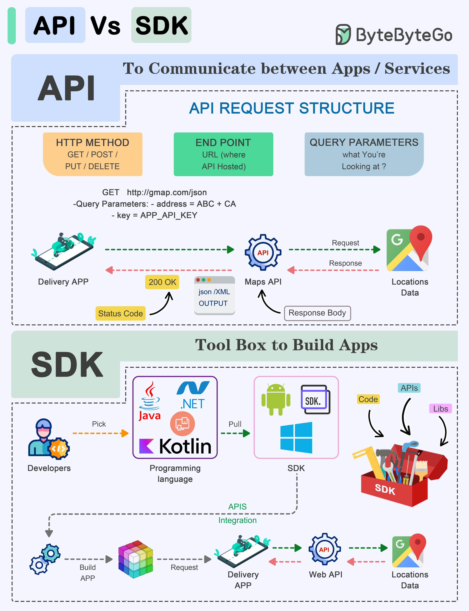

**Source:** [https://twitter.com/i/web/status/1868338990925160511](https://twitter.com/i/web/status/1868338990925160511)
**Original Post Date:** 2025-07-20 09:24:54

# API vs SDK: A Comprehensive Comparison for Software Engineers

## Introduction
In modern software engineering, APIs and SDKs are fundamental tools that facilitate communication between applications and services, as well as streamline the application development process. This knowledge base item provides a detailed comparison of these two concepts, focusing on their structures, purposes, and how they are used in practice.

## API Overview

An API (Application Programming Interface) is a set of protocols, routines, and tools for building software applications. It defines the methods and data formats that applications can use to communicate with each other.

APIs are primarily used for communication between different systems or services. They allow applications to send requests to external services and receive responses in a structured format, such as JSON or XML.

_This example shows a GET request to a maps API, where the endpoint is 'http://gmap.com/json' and query parameters include an address and an API key._

```http
GET http://gmap.com/json?address=ABC+CA&key=APP_API_KEY
```

- HTTP Method: Specifies the type of operation (e.g., GET, POST, PUT, DELETE).
- Endpoint: The URL that defines the resource being accessed.
- Query Parameters: Additional information passed to refine the request.

> **Note/Tip:** APIs are language-agnostic; they can be used with any programming language that supports HTTP requests.

> **Note/Tip:** Always handle API responses properly, checking for status codes and error messages.

## SDK Overview

An SDK (Software Development Kit) is a collection of tools, libraries, documentation, and code samples that facilitate the development of applications for specific platforms or services. SDKs provide developers with pre-built components to simplify the application development process.

SDKs are primarily used for building applications by providing reusable code snippets, libraries, and tools that can be integrated into a project.

- Programming Languages: SDKs are often language-specific (e.g., Java, Kotlin, .NET).
- Libraries (Libs): Pre-built code modules that developers can use.
- Code: SDKs provide reusable code snippets.
- APIs: SDKs often include APIs for interacting with specific services or platforms.

> **Note/Tip:** Using an SDK can significantly reduce development time by leveraging pre-built components and tools.

> **Note/Tip:** Ensure compatibility between the SDK version and your project's requirements to avoid conflicts.

## Comparison Between API and SDK

While APIs and SDKs are both essential in software development, they serve different purposes. APIs focus on enabling communication and data exchange between applications and services, whereas SDKs provide tools and libraries to simplify the application building process.

Both APIs and SDKs can work together; for example, an SDK might include APIs for interacting with external services.

- APIs are used for communication between applications and services.
- SDKs are used for building applications by providing tools, libraries, and code snippets.
- APIs are language-agnostic; SDKs are often language-specific.

## Conclusion
In summary, APIs and SDKs are crucial components in modern software engineering. APIs facilitate seamless communication between different systems, while SDKs provide the necessary tools and libraries to streamline application development. By understanding their distinct roles and how they can work together, developers can build more efficient and robust applications.

## External References

- [Official Google Maps API Documentation](https://developers.google.com/maps/documentation)
- [Android SDK Documentation](https://developer.android.com/docs)


## Media

**Image Description:** The image is an infographic comparing **APIs (Application Programming Interfaces)** and **SDKs (Software Development Kits)**. It provides a detailed breakdown of their structures, purposes, and how they are used in software development. Below is a detailed description of the image, focusing on the main subjects and technical details:

---

### **Title and Overview**
- The infographic is titled **"API vs SDK"**, indicating a comparison between the two concepts.
- The logo of **ByteByteByteGoGo** is present in the top-right corner, suggesting the creator or brand associated with the infographic.

---

### **API Section**
#### **Purpose**
- APIs are described as tools for **communication between applications and services**.
- The main focus is on how APIs facilitate data exchange and interaction between different systems.

#### **API Request Structure**
- The infographic breaks down the structure of an API request into three key components:
  1. **HTTP Method**: Specifies the type of operation to be performed (e.g., GET, POST, PUT, DELETE).
  2. **Endpoint**: The URL that defines the resource being accessed.
  3. **Query Parameters**: Additional information passed to the API to refine the request.

#### **Example API Request**
- A sample API request is shown:
  - **HTTP Method**: GET
  - **Endpoint**: `[http://gmap.com/json`](http://gmap.com/json`)
  - **Query Parameters**: 
    - `address=ABC+CA`
    - `key=APP_API_KEY`
  - This request is used to fetch data from a maps API.

#### **Request-Response Cycle**
- The infographic illustrates a **request-response cycle**:
  1. A **Delivery App** sends a request to a **Maps API**.
  2. The Maps API processes the request and sends a response back to the Delivery App.
  3. The response includes:
     - **Status Code**: `200 OK` (indicating a successful request).
     - **Response Body**: Data in JSON or XML format.

#### **Visual Representation**
- A mobile device (Delivery App) is shown sending a request to a server (Maps API).
- The response is depicted as returning data (e.g., location data) to the app.

---

### **SDK Section**
#### **Purpose**
- SDKs are described as **toolboxes for building applications**.
- They provide developers with pre-built tools, libraries, and code snippets to simplify the development process.

#### **Key Components**
- The infographic highlights the following elements of an SDK:
  1. **Programming Languages**: SDKs are often language-specific. Examples shown include:
     - **Java**
     - **Kotlin**
     - **.NET**
     - **Android SDK**
  2. **Libraries (Libs)**: Pre-built code modules that developers can use.
  3. **Code**: SDKs provide reusable code snippets.
  4. **APIs**: SDKs often include APIs for interacting with specific services or platforms.

#### **Developer Workflow**
- The infographic illustrates the workflow for developers using SDKs:
  1. **Pick**: Developers select the appropriate SDK based on their programming language or platform.
  2. **Pull**: Developers integrate the SDK into their project.
  3. **Build**: The SDK helps in building the application by providing tools and libraries.
  4. **Integration**: SDKs facilitate integration with APIs and other services.

#### **Visual Representation**
- A developer is shown interacting with various SDKs (e.g., Android SDK, Kotlin, .NET).
- The SDKs are depicted as tools in a toolbox, emphasizing their role in simplifying development.

---

### **Comparison Between API and SDK**
- **APIs** are used for **communication and data exchange** between applications and services.
- **SDKs** are used for **building applications** by providing tools, libraries, and code snippets.
- Both APIs and SDKs can work together; for example, an SDK might include APIs for interacting with external services.

---

### **Additional Details**
- **Color Coding**: Different elements are color-coded for clarity:
  - **API-related elements** are in shades of blue and green.
  - **SDK-related elements** are in shades of purple, pink, and red.
- **Icons and Logos**: Various icons (e.g., Android, Kotlin, .NET) are used to represent programming languages and platforms.
- **Flow Diagrams**: Arrows and dashed lines illustrate the flow of data and processes in both API and SDK workflows.

---

### **Conclusion**
The infographic effectively contrasts APIs and SDKs by highlighting their distinct purposes and functionalities. APIs are focused on enabling communication and data exchange, while SDKs are tools for building applications by providing reusable code and libraries. The visual elements and examples make the concepts easy to understand for developers and technical audiences.
