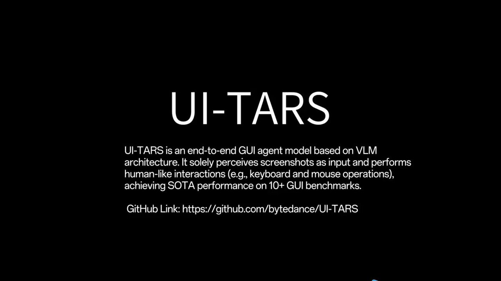

# bytedance_just_dropped_tars

**Tweet URL:** [/_akhaliq/status/1881929068746330432/video/1](/_akhaliq/status/1881929068746330432/video/1)

**Tweet Text:** ByteDance just dropped UI-TARS

Pioneering Automated GUI Interaction with Native Agents

**Image 1 Description:** The image presents information about UI-TARS, an end-to-end GUI agent model based on VLM architecture.

*   **Title**
    *   The title of the slide is "UI-TARS" in large white text.
*   **Description**
    *   Below the title, there is a brief description of what UI-TARS does: "UI-TARS is an end-to-end GUI agent model based on VLM architecture. It solely perceives screenshots as input and performs human-like interactions (e.g., keyboard and mouse operations), achieving SOTA performance on 10+ GUI benchmarks."
*   **Link**
    *   At the bottom of the slide, there is a link to GitHub: "https://github.com/bytedance/UI-TARS"

In summary, the image provides a clear and concise overview of UI-TARS, including its purpose, functionality, and availability on GitHub.

