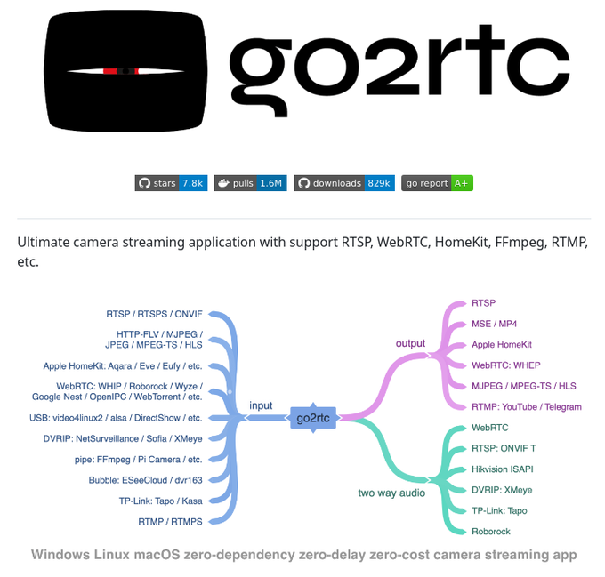

# camera_streaming_with_webrtc

**Tweet URL:** [https://x.com/tom_doerr/status/1880756388407673100](https://x.com/tom_doerr/status/1880756388407673100)

**Tweet Text:** Camera streaming app with WebRTC, RTSP, and more

**Image 1 Description:** The image presents a screenshot of the go2rtc website, which appears to be a streaming application. The title "go2rtc" is prominently displayed in large black text at the top of the page, accompanied by a logo featuring a black box with a red line running through it.

**Key Features:**

* **Title and Logo:** The title "go2rtc" is written in large black text at the top of the page, while the logo consists of a black box with a red line running through it.
* **Streaming Application:** The website appears to be a streaming application, as indicated by the presence of various input and output options.
* **Input Options:**
	+ RTSP
	+ RTMPS
	+ ONVIF
	+ HTTP-FLV
	+ MJPEG
	+ JPEG
	+ MPEG-TS
	+ HLS
* **Output Options:**
	+ RTSP
	+ MSE/MP4
	+ Apple HomeKit
	+ WebRTC: WHEP
	+ MJPEG/MPEG-TS/HLS
	+ RTMP: YouTube/Telegram
* **Color Scheme:** The website features a predominantly white background, with accents of blue, pink, and green used for the input and output options.

**Summary:**

In summary, the image depicts a screenshot of the go2rtc website, which appears to be a streaming application. The website offers various input and output options, including RTSP, RTMPS, ONVIF, HTTP-FLV, MJPEG, JPEG, MPEG-TS, HLS, RTSP, MSE/MP4, Apple HomeKit, WebRTC: WHEP, MJPEG/MPEG-TS/HLS, and RTMP: YouTube/Telegram. The website's color scheme is predominantly white, with accents of blue, pink, and green used for the input and output options.

