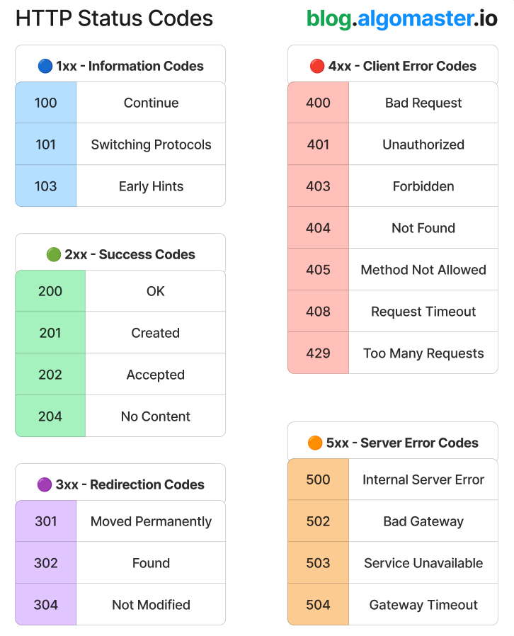

# common_http_status_codes

**Tweet URL:** [https://x.com/ashishps_1/status/1880835226298945706](https://x.com/ashishps_1/status/1880835226298945706)

**Tweet Text:** 21 Common HTTP Status Codes You Must Know:

 1𝐱𝐱 - 𝐈𝐧𝐟𝐨𝐫𝐦𝐚𝐭𝐢𝐨𝐧 𝐂𝐨𝐝𝐞𝐬
Indicates that the request has been received and is being processed. 

100 Continue - Request headers received; send the request body.
101 Switching Protocols - Server agrees to switch protocols.
103 Early Hints - Preloads resources to improve page load speed.

 2𝐱𝐱: 𝐒𝐮𝐜𝐜𝐞𝐬𝐬 𝐂𝐨𝐝𝐞𝐬
Indicates that the request is successfully processed.

200 OK - Request succeeded.
201 Created - Resource successfully created.
202 Accepted - Request accepted, processing pending.
204 No Content - Request successful, no content returned.

 3𝐱𝐱: 𝐑𝐞𝐝𝐢𝐫𝐞𝐜𝐭𝐢𝐨𝐧 𝐂𝐨𝐝𝐞𝐬
Indicates that further action is needed to complete the request.

301 Moved Permanently - Resource permanently relocated.
302 Found (Temporary Redirect) - Resource temporarily moved.
304 Not Modified - Cached version can be used.

 4𝐱𝐱: 𝐂𝐥𝐢𝐞𝐧𝐭 𝐄𝐫𝐫𝐨𝐫 𝐂𝐨𝐝𝐞𝐬
Indicates that something is wrong on the client side.

400 Bad Request - Invalid request syntax.
401 Unauthorized - Authentication required.
403 Forbidden - Access denied.
404 Not Found - Requested resource doesn’t exist.
405 Method Not Allowed - HTTP method is not supported.
408 Request Timeout - Request took too long.
429 Too Many Requests - Rate limit exceeded.

 5𝐱𝐱: 𝐒𝐞𝐫𝐯𝐞𝐫 𝐄𝐫𝐫𝐨𝐫 𝐂𝐨𝐝𝐞𝐬
Indicates that something went wrong on the server side.

500 Internal Server Error - Generic server failure.
502 Bad Gateway - Invalid upstream response.
503 Service Unavailable - Server overloaded or down.
504 Gateway Timeout - Upstream server timed out.

 Repost to help others in your network.

**Image 1 Description:** The infographic presents a comprehensive overview of HTTP status codes, categorized into six distinct sections: Informational, Successful, Redirection, Client Error, Server Errors, and Success.

*   **Informational**
    *   100 - Continue
        *   Indicates that the initial part of the request has been received and processed successfully.
    *   101 - Switching Protocols
        *   Specifies that the server will switch to a different protocol as indicated in the Upgrade header field.
*   **Successful**
    *   200 - OK
        *   The request was successful, and the requested resource is located at the given URI.
    *   201 - Created
        *   Indicates that the request has been fulfilled and resulted in a new resource being created.
    *   202 - Accepted
        *   Specifies that the server has accepted the request but has not yet processed it.
*   **Redirection**
    *   301 - Moved Permanently
        *   Indicates that the requested resource has been permanently moved to a different URI.
    *   302 - Found
        *   Specifies that the requested resource is temporarily available at a different URI.
    *   303 - See Other
        *   Indicates that the requested resource can be found at a different URI, using a GET method.
*   **Client Error**
    *   400 - Bad Request
        *   The server cannot or will not process the request due to invalid syntax.
    *   401 - Unauthorized
        *   Specifies that the client must authenticate itself in order to gain access to the requested resource.
    *   403 - Forbidden
        *   Indicates that the client is forbidden from accessing the requested resource.
*   **Server Errors**
    *   500 - Internal Server Error
        *   The server encountered an unexpected condition and was unable to complete the request.

In summary, this infographic provides a clear and concise visual representation of HTTP status codes, making it easier for users to quickly identify and understand the meaning behind each code.

