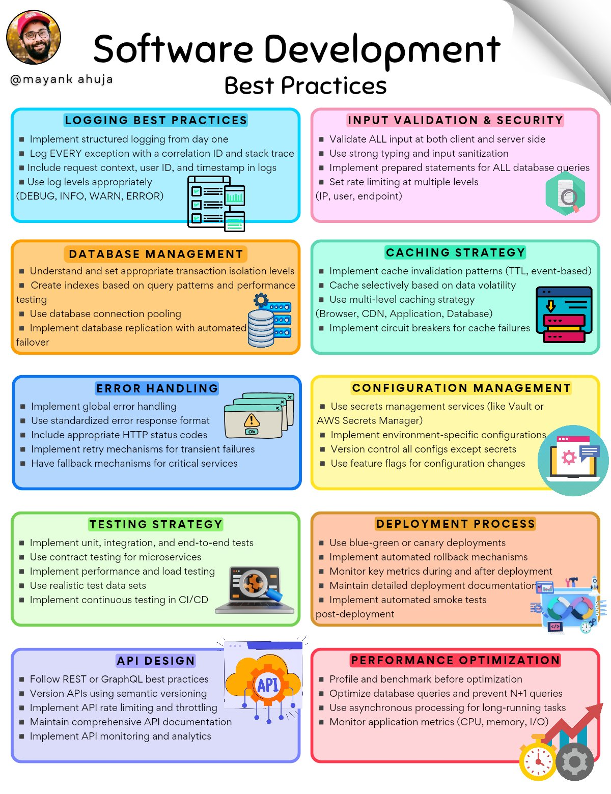

**Source:** [https://twitter.com/i/web/status/1888130153122758709](https://twitter.com/i/web/status/1888130153122758709)
**Original Post Date:** 2025-05-27 19:37:52

# Comprehensive Guide to Software Development Best Practices

## Introduction
Software development best practices form the backbone of reliable and maintainable applications. This guide presents ten critical areas that ensure system resilience, security, scalability, and optimal performance. From foundational logging strategies to advanced deployment techniques, these practices are essential for modern software engineering teams seeking to build high-quality solutions.

## Logging Best Practices

Structured logging is fundamental to debugging and monitoring. Implementing a consistent log format across your application enables efficient problem identification and resolution.

- Implement structured logging from day one
- Log every exception with correlation ID and stack trace
- Include request context, user ID, and timestamp in logs
- Use appropriate log levels (DEBUG, INFO, WARN, ERROR)

> **Note/Tip:** Correlation IDs are crucial for tracing requests across distributed systems

## Input Validation & Security

Security begins with robust input validation. Implementing defense-in-depth strategies at both client and server levels protects against common vulnerabilities.

- Validate all input at client and server sides
- Use strong typing and input sanitization
- Implement prepared statements for database queries
- Set rate limiting at IP, user, and endpoint levels

## Database Management

Proper database management is critical for application performance and availability. Understanding transaction isolation levels and index optimization forms the foundation of robust data handling.

- Understand transaction isolation levels
- Create indexes based on query patterns
- Use connection pooling
- Implement database replication with failover

## Caching Strategy

Effective caching reduces latency and server load. Implementing proper cache invalidation strategies ensures data consistency while maintaining performance benefits.

- Implement TTL or event-based cache invalidation
- Use multi-level caching based on data volatility
- Implement circuit breakers for cache failures

## Error Handling

Graceful error handling is essential for user experience and system stability. Implementing standardized responses ensures consistent behavior across your application.

- Implement global error handling
- Use standardized HTTP response codes
- Implement retry mechanisms for transient failures
- Have fallback mechanisms for critical services

## Configuration Management

Secure and efficient configuration management is crucial for deployment reliability. Using modern secrets management tools ensures sensitive data protection.

- Use secrets management services (e.g., Vault)
- Implement environment-specific configurations
- Use feature flags for controlled rollouts

## Testing Strategy

Comprehensive testing ensures software quality and reliability. Implementing various test types provides confidence in your application's behavior.

- Use contract, unit, integration, and end-to-end tests
- Implement performance testing for microservices
- Use realistic test data sets
- Implement continuous testing

## Deployment Process

Smooth deployments are critical for business continuity. Modern deployment strategies minimize downtime and enable quick rollbacks if needed.

- Use blue-green or canary deployments
- Implement automated rollback mechanisms
- Monitor key metrics during deployment
- Maintain detailed deployment documentation

## API Design

Well-designed APIs are essential for integration and scalability. Following REST or GraphQL principles ensures maintainable and scalable interfaces.

- Follow REST or GraphQL principles
- Version APIs using semantic versioning
- Implement rate limiting and throttling
- Maintain comprehensive documentation

## Performance Optimization

Optimization must be data-driven. Understanding bottlenecks through profiling leads to targeted improvements without unnecessary changes.

- Profile and benchmark before optimization
- Prevent N+1 queries in databases
- Use asynchronous processing for long tasks
- Monitor application metrics

## Key Takeaways

- Implement structured logging from day one with proper correlation IDs and context.
- Validate input at both client and server sides to prevent security vulnerabilities.
- Optimize database performance through indexing, connection pooling, and transaction management.
- Use caching strategically while implementing proper invalidation strategies.
- Design comprehensive testing pipelines with realistic data for reliable results.

## Conclusion
Adhering to these software development best practices ensures robust, secure, and scalable applications. Regular review and refinement of these practices as technology evolves is essential for maintaining high-quality software systems.

## External References

- [OWASP Security Guidelines](https://owasp.org/)
- [12-Factor App Methodology](https://12factor.net/)

## Media

**Image Description:** The image is a detailed infographic titled **"Software Development Best Practices"** by **@mayankahuja**. It is structured into 10 distinct sections, each focusing on a specific aspect of software development best practices. The sections are color-coded and include icons and bullet points to highlight key points. Below is a detailed breakdown of each section:

---

### **1. Logging Best Practices (Blue Background)**
- **Key Points:**
  - Implement structured logging from day one.
  - Log every exception with a correlation ID and stack trace.
  - Include request context, user ID, and timestamp in logs.
  - Use appropriate log levels (DEBUG, INFO, WARN, ERROR).
- **Icon:** A log file icon.
- **Purpose:** Ensures consistent and meaningful logging for debugging and monitoring.

---

### **2. Input Validation & Security (Pink Background)**
- **Key Points:**
  - Validate all input at both client and server sides.
  - Use strong typing and input sanitization.
  - Implement prepared statements for all database queries.
  - Set rate limiting at multiple levels (IP, user, endpoint).
- **Icon:** A security lock icon.
- **Purpose:** Ensures robust input validation and security against attacks like SQL injection and DDoS.

---

### **3. Database Management (Orange Background)**
- **Key Points:**
  - Understand and set appropriate transaction isolation levels.
  - Create indexes based on query patterns and performance testing.
  - Use database connection pooling.
  - Implement database replication with automated failover.
- **Icon:** A database server icon.
- **Purpose:** Optimizes database performance and ensures high availability.

---

### **4. Caching Strategy (Green Background)**
- **Key Points:**
  - Implement cache invalidation patterns (TTL, event-based).
  - Use multi-level caching based on data volatility.
  - Implement circuit breakers for cache failures.
- **Icon:** A cache icon.
- **Purpose:** Enhances performance by reducing database load and handling cache failures gracefully.

---

### **5. Error Handling (Blue Background)**
- **Key Points:**
  - Implement global error handling.
  - Use standardized HTTP response status codes.
  - Implement retry mechanisms for transient failures.
  - Have fallback mechanisms for critical services.
- **Icon:** An error warning icon.
- **Purpose:** Ensures robust error handling and graceful degradation.

---

### **6. Configuration Management (Yellow Background)**
- **Key Points:**
  - Use secrets management services (e.g., Vault, AWS Secrets Manager).
  - Implement environment-specific configurations.
  - Use feature flags for configuration changes.
- **Icon:** A settings gear icon.
- **Purpose:** Manages configurations securely and efficiently across environments.

---

### **7. Testing Strategy (Green Background)**
- **Key Points:**
  - Use contract, unit, integration, and end-to-end tests.
  - Implement performance testing for microservices.
  - Use realistic test data sets.
  - Implement continuous testing in CI/CD.
- **Icon:** A test automation icon.
- **Purpose:** Ensures comprehensive testing and quality assurance.

---

### **8. Deployment Process (Orange Background)**
- **Key Points:**
  - Use blue-green or canary deployments.
  - Implement automated rollback mechanisms.
  - Monitor key metrics during and after deployment.
  - Maintain detailed deployment documentation.
- **Icon:** A deployment pipeline icon.
- **Purpose:** Ensures smooth and reliable deployment processes.

---

### **9. API Design (Blue Background)**
- **Key Points:**
  - Follow REST or GraphQL principles.
  - Version APIs using semantic versioning.
  - Implement API rate limiting and throttling.
  - Maintain comprehensive API documentation.
- **Icon:** An API icon.
- **Purpose:** Ensures well-designed, scalable, and maintainable APIs.

---

### **10. Performance Optimization (Red Background)**
- **Key Points:**
  - Profile and benchmark before optimization.
  - Optimize database queries to prevent N+1 queries.
  - Use asynchronous processing for long-running tasks.
  - Monitor application metrics (CPU, memory, I/O).
- **Icon:** A performance monitoring icon.
- **Purpose:** Ensures optimal performance and resource utilization.

---

### **Overall Design and Layout:**
- The infographic is visually organized into a grid of 10 sections, each with a distinct color to differentiate topics.
- Each section includes:
  - A **title** in bold.
  - A **list of bullet points** highlighting key practices.
  - An **icon** representing the topic.
- The layout is clean and easy to follow, making it a useful reference for developers.

### **Purpose:**
The infographic serves as a comprehensive guide for software developers, covering best practices across various critical aspects of software development, from logging and security to deployment and performance optimization. It emphasizes practical, actionable advice for building robust, scalable, and maintainable software systems. 

---

This detailed breakdown ensures clarity and provides a thorough understanding of the image's content and purpose.
