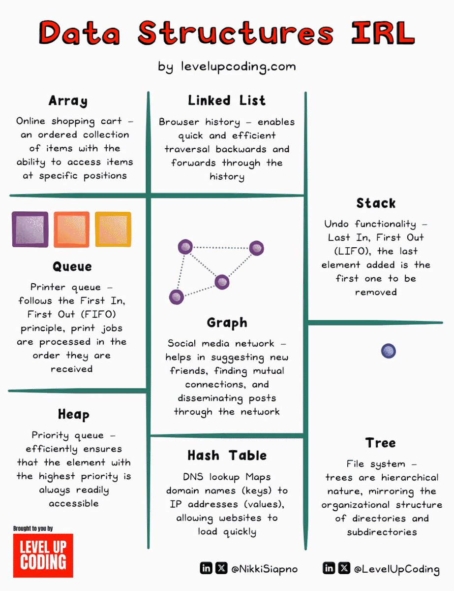

Data structures are the fundamental building blocks of software, enabling efficient organization and storage of information. They are not just theoretical concepts, but are widely used in various applications that we interact with daily. This article provides an overview of the top 8 data structures used in everyday software, along with real-world examples and use cases.

#### Detailed Technical Content
Data structures are essential components of software engineering, and understanding their usage is crucial for creating effective and efficient solutions. Here are some common data structures used in everyday software:

*   **List (Array)**: An ordered collection of items that allows access to elements at specific positions. Example: Online shopping cart, where items are added and removed in a specific order.
*   **Linked List**: A dynamic collection of items, where each element points to the next one, enabling efficient insertion and deletion of nodes. Example: Browser history, which allows quick navigation through previously visited pages.
*   **Hash Table**: A data structure that stores key-value pairs, allowing for fast lookups and efficient caching. Example: Web browsers use hash tables to cache frequently accessed resources.
*   **Stack**: A Last-In-First-Out (LIFO) data structure that follows the principle of adding and removing elements from the top. Example: Undo functionality in text editors, where the last action is reversed first.
*   **Queue**: A First-In-First-Out (FIFO) data structure that processes elements in the order they are received. Example: Printer queue, where print jobs are executed in the sequence they were submitted.
*   **Graph**: A non-linear data structure consisting of nodes and edges, used to represent relationships between objects. Example: Social media networks, which suggest new friends based on mutual connections.
*   **Matrix**: A two-dimensional array used to represent grids or tables, often employed in pathfinding algorithms. Example: Navigation systems use matrices to determine the shortest path between two points.
*   **Tree**: A hierarchical data structure composed of nodes, where each node has a value and zero or more child nodes. Example: File systems, which organize directories and subdirectories in a tree-like structure.
*   **Heap**: A specialized tree-based data structure that satisfies the heap property, used to implement priority queues. Example: Priority queues, which ensure that the element with the highest priority is always readily accessible.

#### Key Takeaways and Best Practices
*   Understand the strengths and weaknesses of each data structure to choose the most suitable one for a given problem.
*   Consider factors like scalability, performance, and ease of implementation when selecting a data structure.
*   Familiarize yourself with common use cases and examples of each data structure to improve your problem-solving skills.

#### References
*   [Kickresume](https://www.kickresume.com/en/ai-resume-writer/?utm_source=linkedin_twitter&utm_medium=linkedin_twitter&utm_campaign=levelupcoding_feb_march_2025_generalai&utm_id=levelupcoding_feb_march_2025_generalai): A platform offering AI-powered resume writing and industry-specific templates.
*   [Levelupcoding](https://lucode.co/kickresume-z7tt): A resource providing tutorials, examples, and best practices for software engineering and web development.

By grasping the concepts and applications of these fundamental data structures, software engineers can create more efficient, scalable, and effective solutions for everyday problems.
## Source

- Original Tweet: [https://twitter.com/i/web/status/1883730238712246422](https://twitter.com/i/web/status/1883730238712246422)
- Date: 2025-02-20 17:38:47

## Media

### Media 1

**Description:** This infographic, titled "Data Structures IRL" by levelupcoding.com, provides a comprehensive overview of various data structures commonly used in web development. The graphic is divided into nine sections, each featuring a distinct data structure accompanied by an explanatory text.

The top row includes the Array, Linked List, and Stack, which are all fundamental concepts in computer science. The middle section features Queue, Graph, and Heap, while the bottom row consists of Hash Table and Tree. Each data structure is represented with its own unique symbol and color scheme.

This infographic offers a concise introduction to key data structures and their applications in web development, making it an excellent resource for beginners.

*Last updated: 2025-02-20 17:38:47*