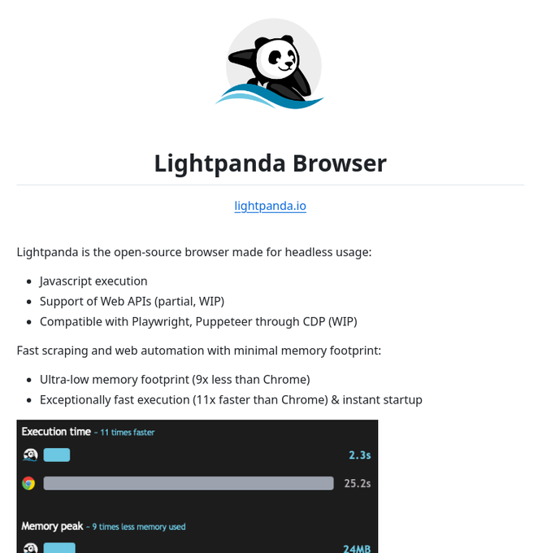

# headless_browser_scraping_automation

**Tweet URL:** [https://x.com/tom_doerr/status/1879816641417974036](https://x.com/tom_doerr/status/1879816641417974036)

**Tweet Text:** Headless browser for web scraping and automation

**Image 1 Description:** The image presents information about Lightpanda Browser, an open-source browser designed for headless usage.

* **Lightpanda Logo**
	+ A cartoon panda with its left arm raised is depicted in black and white.
	+ The logo features a blue wave at the bottom.
* **Browser Name and Tagline**
	+ "Lightpanda Browser" is written in bold black text.
	+ The tagline reads, "Lightpanda - Your Headless Web Companion."
* **Key Features**
	+ Javascript execution
	+ Support for Web APIs (partial)
	+ Compatible with Playwright and Puppeteer through CDP (WIP)
	+ Fast scraping and web automation with minimal memory footprint
* **Performance Statistics**
	+ Execution time: 11 times faster than Chrome
	+ Memory usage: 9 times less memory used compared to Chrome

In summary, the image effectively communicates the key features and benefits of Lightpanda Browser, making it an attractive option for developers seeking a fast and efficient headless browser solution.

