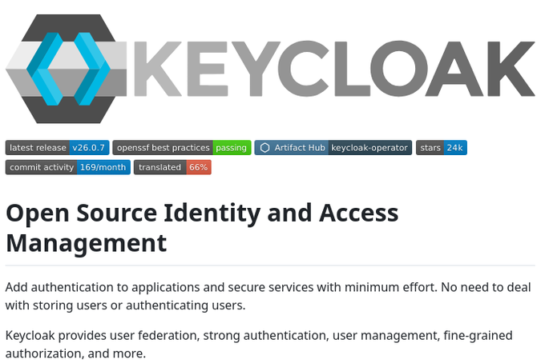

# keycloak_open_source_identity

**Tweet URL:** [https://x.com/tom_doerr/status/1875626285034082568](https://x.com/tom_doerr/status/1875626285034082568)

**Tweet Text:** Keycloak: Open-source Identity and Access Management solution for user federation, authentication, user management, and fine-grained authorization, supporting OpenID Connect, OAuth 2.0, and SAML

**Image 1 Description:** The image displays a screenshot of the Keycloak website, which is an open-source identity and access management solution.

* **Logo**
	+ The logo features a stylized letter "K" made up of three blue arrows pointing towards each other.
	+ It is placed in a gray hexagon with a white interior.
* **Title**
	+ The title "Open Source Identity and Access Management" is written in large black text below the logo.
* **Description**
	+ A brief description of Keycloak's features and benefits is provided, including adding authentication to applications and secure services with minimal effort, no storing users or authenticating users, and providing user federation, strong authentication, user management, fine-grained authorization, and more.
* **Navigation Menu**
	+ The navigation menu includes links to various pages on the website, such as "latest release", "v26.0.7", "openssf best practices", "passing", "Artifact Hub", "keycloak-operator", and "stars 24k".
* **Statistics**
	+ Statistics about Keycloak are displayed at the top of the page, including:
		- Latest release: v26.0.7
		- Openssf best practices passing status: passing
		- Artifact Hub keycloak-operator stars count: 24k

Overall, the image provides an overview of Keycloak's features and benefits, as well as some statistics about the project. The navigation menu allows users to access additional information on the website.

