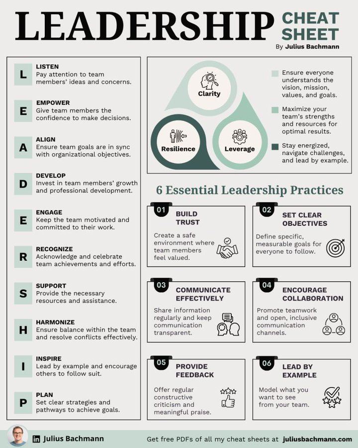

# leadership_cheat_sheet_tweet

**Tweet URL:** [https://x.com/gr0wthscale/status/1879529475911635019](https://x.com/gr0wthscale/status/1879529475911635019)

**Tweet Text:** Leadership Cheat Sheet

**Image 1 Description:** The image presents a comprehensive leadership cheat sheet, titled "LEADERSHIP CHEAT SHEET" in bold black text at the top. The author's name, "Julius Bachmann," is displayed in smaller green text to the right of the title.

**Main Content:**

* A flowchart on the left side outlines six essential leadership practices:
	+ LISTEN
	+ EMPOWER
	+ ALIGN
	+ DEVELOP
	+ ENGAGE
	+ RECOGNIZE
* A larger section in the middle features a graphic with three overlapping circles, representing Clarity, Resilience, and Leverage.
* Below this graphic are six essential leadership practices:
	+ BUILD TRUST
	+ SET CLEAR OBJECTIVES
	+ COMMUNICATE EFFECTIVELY
	+ ENCOURAGE COLLABORATION
	+ PROVIDE FEEDBACK
	+ LEAD BY EXAMPLE

**Additional Information:**

* At the bottom of the image, a small photo of Julius Bachmann is accompanied by his website, "juliusbachmann.com."
* A call-to-action invites viewers to download free PDFs of all cheat sheets from juliusbachmann.com.

Overall, this infographic provides a concise and informative guide to effective leadership practices, making it a valuable resource for individuals seeking to improve their leadership skills.

