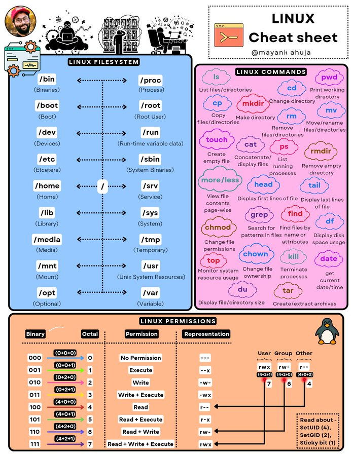

# linux_cheat_sheet_enjoy

**Tweet URL:** [https://x.com/techNmak/status/1881036704251080733](https://x.com/techNmak/status/1881036704251080733)

**Tweet Text:** My Linux Cheat Sheet. Enjoy!!!

**Image 1 Description:** The infographic presents a comprehensive Linux cheat sheet, providing an overview of key concepts in operating system management. The title "LINUX CHEAT SHEET" is prominently displayed at the top right corner.

**Key Concepts:**

* **File System Hierarchy:**
	+ /bin (Binaries)
	+ /boot (Boot loader)
	+ /dev (Devices)
	+ /etc (System configuration files)
	+ /home (User home directories)
	+ /lib (Libraries)
	+ /media (Removable media devices)
	+ /mnt (Mount point for removable media)
	+ /opt (Optional packages)
	+ /proc (Process information)
	+ /root (Root directory)
	+ /run (Runtime data)
	+ /srv (Service data)
	+ /sys (System configuration files)
	+ /tmp (Temporary files)
	+ /usr (User programs and data)
	+ /var (Variable data)

* **Linux Commands:**
	+ ls (List files and directories)
	+ cd (Change directory)
	+ pwd (Print working directory)
	+ mkdir (Make a new directory)
	+ rmdir (Remove an empty directory)
	+ rm (Remove a file or directory)
	+ cp (Copy a file or directory)
	+ mv (Move or rename a file or directory)
	+ touch (Create a new empty file)
	+ echo (Print output to the screen)

* **Linux Permissions:**
	+ Binary (0): No read, write, or execute permissions
	+ Octal (1): Read permission only
	+ Octal (2): Write permission only
	+ Octal (3): Execute permission only
	+ Octal (4): Read and execute permissions
	+ Octal (5): Read and write permissions
	+ Octal (6): Write and execute permissions
	+ Octal (7): Read, write, and execute permissions

* **Linux Commands:**
	+ chmod (Change file mode bits)
	+ chown (Change file ownership)
	+ chgrp (Change group ownership)
	+ umask (Set default file mode creation mask)

This cheat sheet provides a concise and informative overview of Linux concepts, making it an essential resource for anyone looking to learn more about the operating system.

