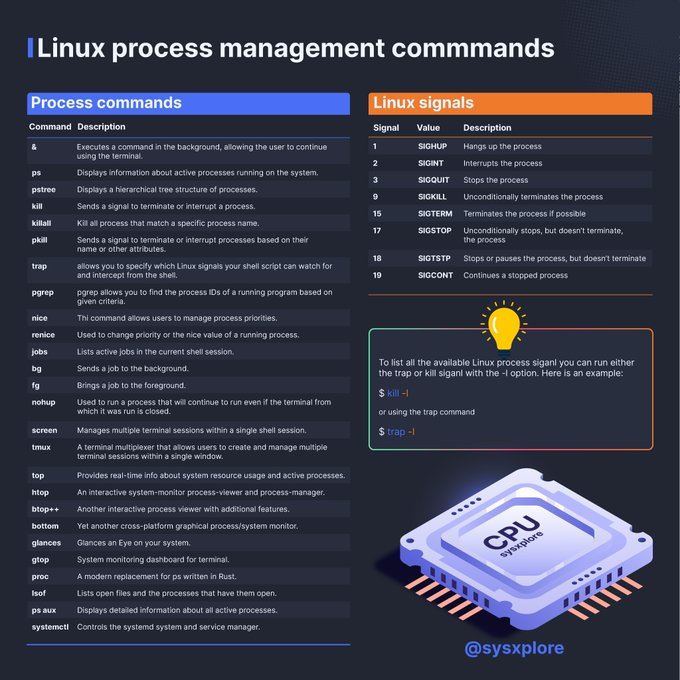

# linux_process_management_crash

**Tweet URL:** [https://x.com/sysxplore/status/1876960312282271771](https://x.com/sysxplore/status/1876960312282271771)

**Tweet Text:** Linux process management crash course

**Image 1 Description:** This infographic, titled "Linux process management commands," is presented by @sysxplore on the social media platform Twitter. The graphic is divided into two columns: "Process commands" and "Linux signals." The left column features 14 commands that can be used to manage processes, including ps (displays information about active processes running on a system), kill (terminates or interrupts a process), and renice (changes the priority of a running process). These commands are organized in alphabetical order.

The right column lists Linux signals, which are numbered from 1 to 19. Each signal is accompanied by a brief description that explains its purpose. For example, signal 3 signifies "SIGQUIT," which stops or pauses a process but does not terminate it. Signal 9 indicates "SIGKILL," which terminates the process immediately.

The infographic also includes an image of a microprocessor, featuring the text "CPU sysxplore" on its center square. The background is dark blue with a dotted pattern in light blue and orange hues at the top. This visual representation provides a clear understanding of Linux process management commands and signals, making it a valuable resource for those interested in learning more about this topic.

