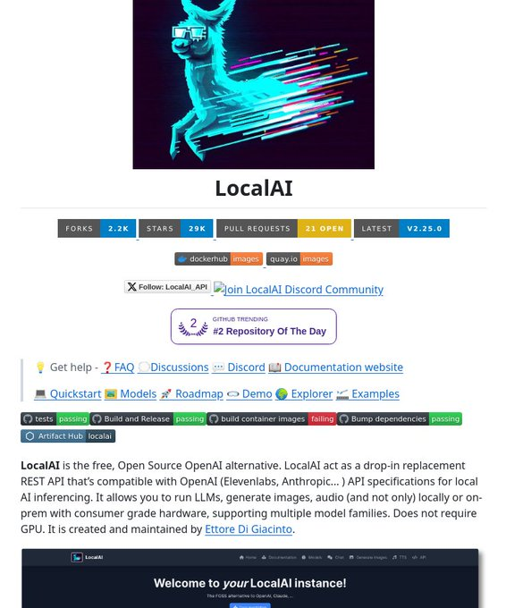

# local_alternative_openai_tweet

**Tweet URL:** [https://x.com/tom_doerr/status/1880878405341577660](https://x.com/tom_doerr/status/1880878405341577660)

**Tweet Text:** Local AI alternative to OpenAI

**Image 1 Description:** The image shows a screenshot of the LocalAI website, which appears to be a platform for machine learning and artificial intelligence. The page features a prominent banner with a blue llama wearing VR glasses, accompanied by various sections that provide information about the platform.

* **Banner**
	+ Features a blue llama wearing VR glasses
	+ Prominent display at the top of the page
* **Welcome Message**
	+ "Welcome to your LocalAI instance!" in white text on a dark gray background
	+ Located below the banner
* **Navigation Menu**
	+ Includes links to various sections, such as "Forks", "Stars", and "Pull Requests"
	+ Allows users to navigate through the website
* **Statistics**
	+ Displays statistics about the LocalAI community, including the number of forks, stars, and pull requests
	+ Provides an overview of the platform's activity

Overall, the image suggests that LocalAI is a collaborative platform for machine learning and artificial intelligence, with a strong focus on community engagement and development. The banner featuring a llama wearing VR glasses adds a touch of whimsy to the design, while the navigation menu and statistics provide users with easy access to information about the platform.

