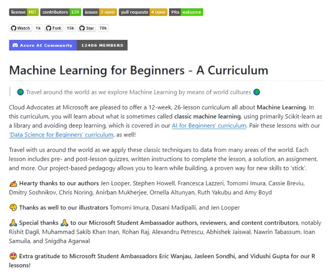

# machine_learning_beginners_great

**Tweet URL:** [https://x.com/Abhishekcur/status/1876663746166398993](https://x.com/Abhishekcur/status/1876663746166398993)

**Tweet Text:** Machine learning for Beginners - Great GitHub repo by Microsoft
- week-by-week
- topic-by-topic

**Image 1 Description:** The image shows a screenshot of a webpage for "Machine Learning for Beginners - A Curriculum" on GitHub. The page is divided into sections, each with its own title and content.

* **Title**
	+ Text: "Machine Learning for Beginners - A Curriculum"
	+ Color: Dark blue
	+ Font size: Large
* **Header**
	+ Text: "Azure AI Community"
	+ Color: Light blue
	+ Font size: Small
	+ URL: 12406 members
* **Body**
	+ Text: "Travel around the world as we explore Machine Learning by means of world cultures."
	+ Content: A brief introduction to the curriculum, including a 12-week, 26-lesson course on machine learning.
	+ Color: Black
	+ Font size: Medium
* **Footer**
	+ Text: "Thanks"
	+ Content: A list of contributors and acknowledgments.
	+ Color: Dark gray
	+ Font size: Small

Overall, the image presents a clear and concise overview of the Machine Learning for Beginners - A Curriculum project on GitHub. The use of dark blue and light blue colors creates visual contrast and makes the text easy to read. The font sizes are well-balanced, with larger headings and smaller body text.

