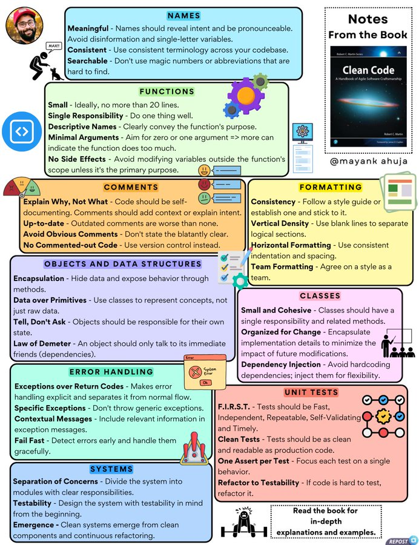

# notes_famous_book_clean

**Tweet URL:** [https://x.com/techNmak/status/1881919516696772864](https://x.com/techNmak/status/1881919516696772864)

**Tweet Text:** My Notes on the Famous Book 'Clean Code'. Enjoy!!

**Image 1 Description:** The image presents a comprehensive guide to coding principles, organized into 16 distinct sections with clear headings and concise descriptions. The layout is visually appealing, featuring a white background with black text and colorful boxes for each section.

**Main Points:**

* **Names**
	+ Meaningful names should reveal intent
	+ Avoid disinformation and single-letter variables
	+ Consistency in naming conventions
* **Functions**
	+ Small functions are preferred (ideally no more than 20 lines)
	+ Single responsibility per function
	+ Clear descriptive names for functions
* **Comments**
	+ Explain why, not what
	+ Avoid obvious comments
	+ Use version control instead of commenting code
* **Objects and Data Structures**
	+ Encapsulation: hide data and expose behavior through methods
	+ Data over primitives: use classes to represent concepts, not raw data
	+ Tell, don't ask: objects should be responsible for their own state
* **Error Handling**
	+ Exceptions over return codes: makes error handling explicit
	+ Specific exceptions: don't throw generic exceptions
	+ Contextual messages: include relevant information in exception messages
* **Systems**
	+ Separation of concerns: divide system into modules with clear responsibilities
	+ Testability: design systems with testability in mind from the beginning
	+ Emergence: clean systems emerge from well-designed components and continuous refactoring
* **Classes**
	+ Single responsibility per class
	+ Organized for change: encapsulate implementation details to minimize impact of future modifications
	+ Dependency injection: avoid hardcoding dependencies; inject them instead
* **Unit Tests**
	+ Fast, independent, repeatable, self-validating, and timely (F.I.R.S.T.)
	+ Clean tests: focus on a single aspect of the system
	+ One assert per test: focus each test on a specific behavior
* **Formatting**
	+ Consistency in formatting is key
	+ Use blank lines to separate logical sections
	+ Horizontal formatting: use indentation and spacing consistently

**Summary:**

The image provides a thorough guide to coding principles, covering topics such as naming conventions, function design, commenting code, error handling, systems design, class organization, unit testing, and formatting. By following these guidelines, developers can write more maintainable, readable, and efficient code.

