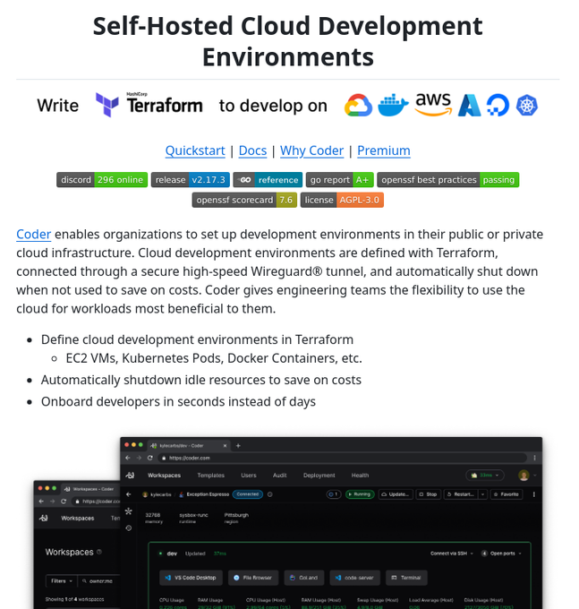

# open_source_platform_creating

**Tweet URL:** [https://x.com/tom_doerr/status/1875892457117757751](https://x.com/tom_doerr/status/1875892457117757751)

**Tweet Text:** Open-source platform for creating and managing cloud-based development environments using GitHub repositories and custom templates

**Image 1 Description:** The image presents a screenshot of a webpage focused on self-hosted cloud development environments, with a prominent title "Self-Hosted Cloud Development Environments" at the top.

**Visual Elements:**

* The page features a white background.
* A navigation bar is situated at the top, displaying links to various topics such as "Write," "Terraform," and "to develop on."
* Below the navigation bar, a section titled "Self-Hosted Cloud Development Environments" contains a brief description of the concept and its benefits.

**Content:**

* The page provides information about Terraform, a tool for managing infrastructure as code (IaC), including its features and advantages.
* A call-to-action is included, encouraging users to try Terraform with a link to sign up for an account.
* At the bottom of the page, a section titled "Self-Hosted Cloud Development Environments" offers additional resources and links to related topics.

**Key Takeaways:**

* The webpage aims to educate readers about self-hosted cloud development environments and their benefits.
* It provides information on Terraform and its features, as well as encouraging users to try it out with a sign-up link.

