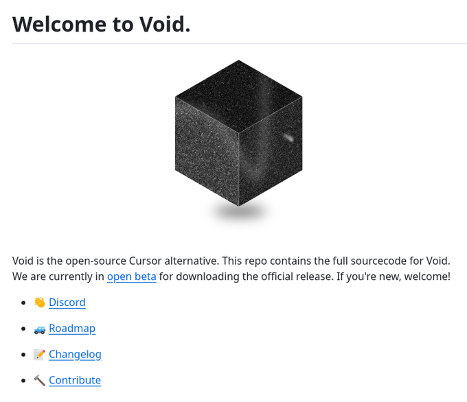

# open_source_text_editor

**Tweet URL:** [https://x.com/tom_doerr/status/1881612829234438609](https://x.com/tom_doerr/status/1881612829234438609)

**Tweet Text:** Open-source text editor with AI features

**Image 1 Description:** The image displays a screenshot of the Void website, which is an open-source alternative to the popular cursor software, CursorFX.

*   **Title**
    *   The title "Welcome to Void" is displayed in large black text at the top left of the page.
*   **Image**
    *   A 3D cube with a dark gray color and a textured surface is centered on the page.
*   **Description**
    *   Below the image, there is a brief description that reads: "Void is the open-source Cursor alternative. This repo contains the full source code for Void."
*   **Links**
    *   A list of links to various resources is provided below the description:
        *   Discord
        *   Roadmap
        *   Changelog
        *   Contribute

The image appears to be a landing page for the Void project, providing an introduction to the software and its features. The inclusion of links to external resources suggests that users can learn more about the project's development process and contribute to its growth. Overall, the image effectively communicates the purpose and goals of the Void project in a clear and concise manner.

