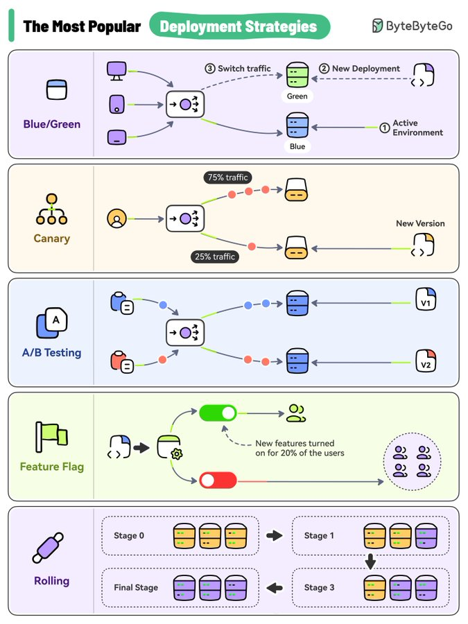

# production_release_patterns_tweet

**Tweet URL:** [https://x.com/sahnlam/status/1869249994521452949](https://x.com/sahnlam/status/1869249994521452949)

**Tweet Text:** Production Release Patterns

**Image 1 Description:** The image presents a comprehensive guide to deployment strategies, featuring five distinct sections that outline various approaches for deploying software or applications.

*   **Blue/Green Deployment**
    *   This section illustrates the Blue/Green deployment strategy, which involves routing traffic between two environments: a "blue" environment and a "green" environment.
    *   The blue environment represents the current production environment, while the green environment is the new version of the application or service.
    *   Traffic is routed to either the blue or green environment based on a load balancer or router.
    *   Once the deployment is complete, traffic is switched from the blue environment to the green environment.
*   **Canary Deployment**
    *   The canary deployment strategy involves rolling out new versions of an application or service to a small subset of users before releasing it to all users.
    *   This approach allows for testing and validation of the new version without affecting the entire user base.
    *   Traffic is routed to both the old and new versions, with the new version being served to a percentage of users (e.g., 25%).
*   **A/B Testing**
    *   A/B testing involves comparing two or more versions of an application or service to determine which one performs better.
    *   This approach allows for data-driven decision-making and optimization of user experience.
    *   Traffic is split between the different versions, with each version being served to a percentage of users (e.g., 50%).
*   **Feature Flag**
    *   The feature flag deployment strategy involves enabling or disabling specific features or functionality within an application or service.
    *   This approach allows for gradual rollout of new features and enables A/B testing.
    *   Traffic is routed to either the old version with all features enabled or the new version with some features disabled (e.g., 20%).
*   **Rolling Update**
    *   The rolling update deployment strategy involves updating individual instances of an application or service while keeping others online.
    *   This approach allows for minimal downtime and ensures high availability.
    *   Traffic is routed to multiple instances, with each instance being updated one at a time.

In summary, the image provides a comprehensive overview of various deployment strategies, including Blue/Green, Canary, A/B Testing, Feature Flag, and Rolling Update. Each section highlights the key components and benefits of each approach, providing valuable insights for developers and DevOps teams looking to optimize their deployment processes.

