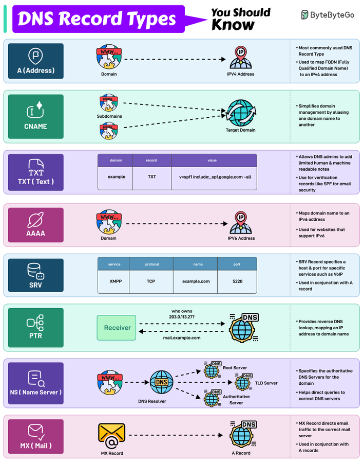

# record_types_should_know

**Tweet URL:** [https://x.com/alexxubyte/status/1868695105395404917](https://x.com/alexxubyte/status/1868695105395404917)

**Tweet Text:** DNS Record Types You Should Know!

**Image 1 Description:** The infographic, titled "DNS Record Types," is presented by ByteByteGo. It provides an overview of various DNS record types, their functions, and examples.

**Record Types:**

*   **A (Address)**
    *   Most commonly used DNS record type
    *   Used to map FQDNs (Fully Qualified Domain Names) to IPv4 addresses
    *   Example: www.example.com -> 192.0.2.1
*   **CNAME (Canonical Name)**
    *   Simplifies domain management by aliasing one domain name to another
    *   Example: subdomain.example.com -> example.com
*   **TXT (Text)**
    *   Allows DNS administrators to add limited human-readable notes
    *   Used for verification records like SPF for email security
*   **AAAA (IPv6 Address)**
    *   Maps domain names to IPv6 addresses
    *   Example: www.example.com -> 2001:0db8::1234
*   **SRV (Service Record)**
    *   Specifies a host and port for specific services like VoIP
    *   Used in conjunction with A records
*   **PTR (Pointer)**
    *   Provides reverse DNS lookup, mapping an IP address to its corresponding domain name
    *   Example: 192.0.2.1 -> www.example.com
*   **NS (Name Server)**
    *   Specifies authoritative DNS servers for a domain
    *   Helps direct queries to correct DNS servers
*   **MX (Mail Exchange)**
    *   Directs email traffic to the correct mail server

This infographic provides a clear and concise overview of various DNS record types, their functions, and examples. It is an excellent resource for those looking to understand how DNS works and how to manage different types of records.

