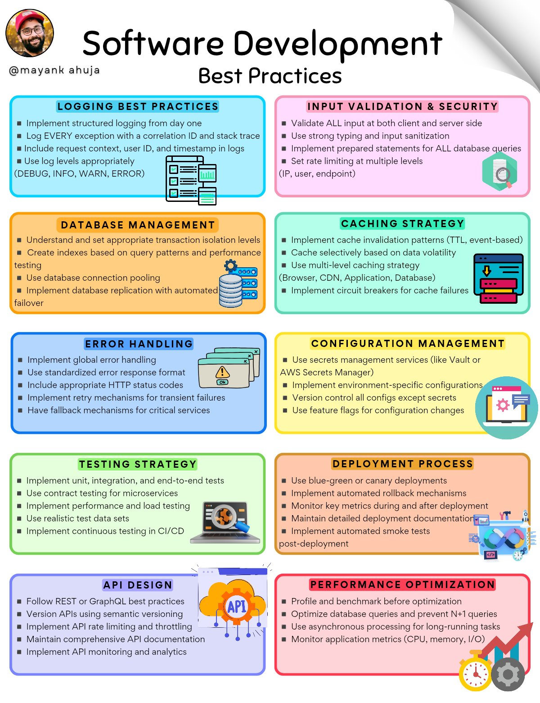

# Software Best Practices

## Description
10 Software Development Best Practices I Learned the Hard Way . 

[ If you like my efforts, please repost & follow 
@techNmak
 ]

Remember,

 Complex code = Complex bugs 

 Maintainable > Clever...

## Content
10 Software Development Best Practices I Learned the Hard Way . 

[ If you like my efforts, please repost & follow 
@techNmak
 ]

Remember,

 Complex code = Complex bugs 

 Maintainable > Clever

## Category Information

- Main Category: software_engineering
- Sub Category: best_practices
- Item Name: software_best_practices

## Source

- Original Tweet: [https://twitter.com/i/web/status/1888130153122758709](https://twitter.com/i/web/status/1888130153122758709)
- Date: 2025-02-20 15:36:34

## Media

### Media 1

**Description:** The infographic presents a comprehensive guide to software development best practices, organized into 11 distinct sections with clear headings and concise bullet points.

**Overview**

This infographic provides an extensive list of guidelines for software developers to follow when creating applications or programs. The information is presented in a visually appealing format, making it easy to read and understand.

**List of Best Practices**

* **Logging Best Practices**
	+ Implement structured logging from day one
	+ Log every exception with a correlation ID and stack trace
	+ Include request context, user ID, and timestamp in logs
	+ Use log levels appropriately (DEBUG, INFO, WARN, ERROR)
* **Input Validation & Security**
	+ Validate all input at both client and server sides
	+ Use strong typing and input sanitization
	+ Implement prepared statements for ALL database queries
	+ Set rate limiting at multiple levels (IP, user, endpoint)
* **Database Management**
	+ Understand and set appropriate transaction isolation levels
	+ Create indexes based on query patterns and performance testing
	+ Use database connection pooling
	+ Implement database replication with automated failover
* **Error Handling**
	+ Implement global error handling
	+ Use standardized error response format
	+ Include appropriate HTTP status codes
	+ Implement retry mechanisms for transient failures
	+ Have fallback mechanisms for critical services
* **Configuration Management**
	+ Use secrets management services (like Vault or AWS Secrets Manager)
	+ Implement environment-specific configurations
	+ Control all config except secrets
	+ Use feature flags for configuration changes
* **Testing Strategy**
	+ Implement unit, integration, and end-to-end tests
	+ Use contract testing for microservices
	+ Perform performance and load testing
	+ Use realistic test data sets
	+ Implement continuous testing in CI/CD pipelines
* **API Design**
	+ Follow REST or GraphQL best practices
	+ Version APIs using semantic versioning
	+ Implement API rate limiting and throttling
	+ Maintain comprehensive API documentation
	+ Implement API monitoring and analytics
* **Performance Optimization**
	+ Profile and benchmark before optimization
	+ Optimize database queries and prevent N+1 queries
	+ Use asynchronous processing for long-running tasks
	+ Monitor application metrics (CPU, memory, I/O)
* **Deployment Process**
	+ Use blue-green or canary deployments
	+ Implement automated rollback mechanisms
	+ Monitor key metrics during and after deployment
	+ Maintain detailed deployment documentation
	+ Implement automated smoke tests post-deployment

**Summary**

This infographic provides a comprehensive guide to software development best practices, covering topics such as logging, input validation, database management, error handling, configuration management, testing strategy, API design, performance optimization, and deployment process. By following these guidelines, developers can ensure the quality and reliability of their applications.

*Last updated: 2025-02-20 15:36:34*