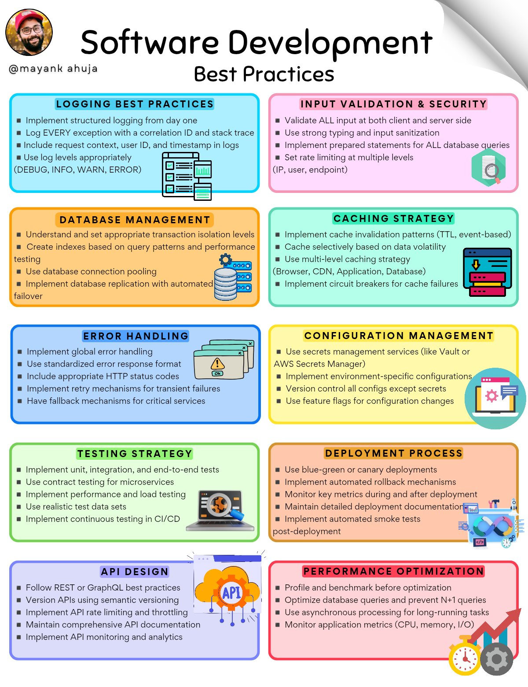

This guide provides a comprehensive list of software development best practices, covering essential topics such as logging, input validation, database management, error handling, configuration management, testing strategy, API design, performance optimization, and deployment process. By following these guidelines, developers can ensure the quality, reliability, and maintainability of their applications.

## Detailed Technical Content
### Logging Best Practices
Logging is a critical aspect of software development, providing valuable insights into application behavior and errors. The following logging best practices should be implemented:
* Implement structured logging from day one to facilitate easy log analysis and debugging.
* Log every exception with a correlation ID and stack trace to enable efficient error tracking and resolution.
* Include request context, user ID, and timestamp in logs to provide comprehensive information about application interactions.
* Use log levels appropriately (DEBUG, INFO, WARN, ERROR) to categorize log messages and facilitate filtering.

### Input Validation & Security
Input validation and security are crucial for preventing common web vulnerabilities such as SQL injection and cross-site scripting (XSS). The following best practices should be implemented:
* Validate all input at both client and server sides to ensure data integrity and prevent malicious attacks.
* Use strong typing and input sanitization to restrict user input to expected formats and values.
* Implement prepared statements for ALL database queries to prevent SQL injection attacks.
* Set rate limiting at multiple levels (IP, user, endpoint) to prevent brute-force attacks and denial-of-service (DoS) attacks.

### Database Management
Effective database management is essential for ensuring data consistency, integrity, and performance. The following best practices should be implemented:
* Understand and set appropriate transaction isolation levels to balance concurrency and data consistency.
* Create indexes based on query patterns and performance testing to optimize query execution and reduce latency.
* Use database connection pooling to improve resource utilization and reduce overhead.
* Implement database replication with automated failover to ensure high availability and disaster recovery.

### Error Handling
Error handling is a critical aspect of software development, providing a mechanism for detecting, reporting, and resolving errors. The following best practices should be implemented:
* Implement global error handling to catch and handle unexpected errors.
* Use standardized error response format to provide consistent and informative error messages.
* Include appropriate HTTP status codes to facilitate error classification and resolution.
* Implement retry mechanisms for transient failures to improve application resilience and availability.

### Configuration Management
Configuration management is essential for managing application settings, secrets, and dependencies. The following best practices should be implemented:
* Use secrets management services (like Vault or AWS Secrets Manager) to securely store and manage sensitive data.
* Implement environment-specific configurations to accommodate different deployment environments and requirements.
* Control all config except secrets using version control systems (VCS) like Git.
* Use feature flags for configuration changes to enable flexible and controlled feature rollout.

### Testing Strategy
A comprehensive testing strategy is essential for ensuring application quality, reliability, and performance. The following best practices should be implemented:
* Implement unit, integration, and end-to-end tests to cover different aspects of application functionality.
* Use contract testing for microservices to ensure interoperability and consistency.
* Perform performance and load testing to identify bottlenecks and optimize application performance.
* Use realistic test data sets to simulate real-world scenarios and improve test effectiveness.

### API Design
API design is critical for ensuring a well-structured, maintainable, and scalable application interface. The following best practices should be implemented:
* Follow REST or GraphQL best practices to ensure a consistent and standardized API design.
* Version APIs using semantic versioning to facilitate controlled API evolution and backwards compatibility.
* Implement API rate limiting and throttling to prevent abuse and ensure fair usage.
* Maintain comprehensive API documentation to facilitate API discovery, usage, and maintenance.

### Performance Optimization
Performance optimization is essential for ensuring application responsiveness, scalability, and efficiency. The following best practices should be implemented:
* Profile and benchmark before optimization to identify performance bottlenecks and areas for improvement.
* Optimize database queries and prevent N+1 queries to reduce latency and improve data retrieval efficiency.
* Use asynchronous processing for long-running tasks to improve application responsiveness and throughput.

### Deployment Process
A well-structured deployment process is critical for ensuring smooth, reliable, and efficient application rollout. The following best practices should be implemented:
* Use blue-green or canary deployments to facilitate controlled and low-risk deployment.
* Implement automated rollback mechanisms to ensure quick recovery from deployment failures.
* Monitor key metrics during and after deployment to detect issues and optimize application performance.

## Key Takeaways and Best Practices
The following key takeaways and best practices should be considered when developing software applications:
* Implement structured logging and error handling to facilitate efficient debugging and issue resolution.
* Validate all input and implement security measures to prevent common web vulnerabilities.
* Use database connection pooling, indexing, and replication to improve data management and performance.
* Implement comprehensive testing strategies, including unit, integration, and end-to-end tests.
* Follow API design best practices, including versioning, rate limiting, and documentation.
* Optimize application performance using profiling, benchmarking, and asynchronous processing.

## References
The following tools and technologies are mentioned in this guide:
* Vault: a secrets management service for securely storing and managing sensitive data.
* AWS Secrets Manager: a secrets management service for securely storing and managing sensitive data.
* Git: a version control system (VCS) for managing application code, configurations, and dependencies.
* REST: a architectural style for designing networked applications, emphasizing stateless communication and resource-based interactions.
* GraphQL: a query language for APIs, providing a flexible and efficient mechanism for retrieving and manipulating data.
## Source

- Original Tweet: [https://twitter.com/i/web/status/1888130153122758709](https://twitter.com/i/web/status/1888130153122758709)
- Date: 2025-02-20 17:55:58

## Media

### Media 1

**Description:** The infographic presents a comprehensive guide to software development best practices, organized into 11 distinct sections with clear headings and concise bullet points.

**Overview**

This infographic provides an extensive list of guidelines for software developers to follow when creating applications or programs. The information is presented in a visually appealing format, making it easy to read and understand.

**List of Best Practices**

* **Logging Best Practices**
	+ Implement structured logging from day one
	+ Log every exception with a correlation ID and stack trace
	+ Include request context, user ID, and timestamp in logs
	+ Use log levels appropriately (DEBUG, INFO, WARN, ERROR)
* **Input Validation & Security**
	+ Validate all input at both client and server sides
	+ Use strong typing and input sanitization
	+ Implement prepared statements for ALL database queries
	+ Set rate limiting at multiple levels (IP, user, endpoint)
* **Database Management**
	+ Understand and set appropriate transaction isolation levels
	+ Create indexes based on query patterns and performance testing
	+ Use database connection pooling
	+ Implement database replication with automated failover
* **Error Handling**
	+ Implement global error handling
	+ Use standardized error response format
	+ Include appropriate HTTP status codes
	+ Implement retry mechanisms for transient failures
	+ Have fallback mechanisms for critical services
* **Configuration Management**
	+ Use secrets management services (like Vault or AWS Secrets Manager)
	+ Implement environment-specific configurations
	+ Control all config except secrets
	+ Use feature flags for configuration changes
* **Testing Strategy**
	+ Implement unit, integration, and end-to-end tests
	+ Use contract testing for microservices
	+ Perform performance and load testing
	+ Use realistic test data sets
	+ Implement continuous testing in CI/CD pipelines
* **API Design**
	+ Follow REST or GraphQL best practices
	+ Version APIs using semantic versioning
	+ Implement API rate limiting and throttling
	+ Maintain comprehensive API documentation
	+ Implement API monitoring and analytics
* **Performance Optimization**
	+ Profile and benchmark before optimization
	+ Optimize database queries and prevent N+1 queries
	+ Use asynchronous processing for long-running tasks
	+ Monitor application metrics (CPU, memory, I/O)
* **Deployment Process**
	+ Use blue-green or canary deployments
	+ Implement automated rollback mechanisms
	+ Monitor key metrics during and after deployment
	+ Maintain detailed deployment documentation
	+ Implement automated smoke tests post-deployment

**Summary**

This infographic provides a comprehensive guide to software development best practices, covering topics such as logging, input validation, database management, error handling, configuration management, testing strategy, API design, performance optimization, and deployment process. By following these guidelines, developers can ensure the quality and reliability of their applications.

*Last updated: 2025-02-20 17:55:58*