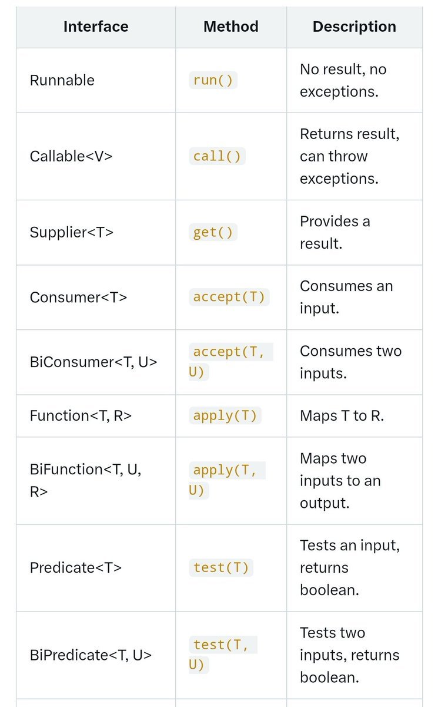

# tech_note_18706711

**Tweet URL:** [https://x.com/SumitM_X/status/1870671151082713528](https://x.com/SumitM_X/status/1870671151082713528)

**Tweet Text:** Some important Functional Interfaces that are often discussed in interviews...

**Image 1 Description:** The image presents a table that outlines various functions available in the Rust programming language, organized into three columns: "Interface", "Method", and "Description". The table is structured as follows:

*   **Columns**
    *   **Interface**: Lists different interfaces or types of functions.
    *   **Method**: Describes the specific method or function name associated with each interface.
    *   **Description**: Provides a brief explanation of what each function does.

**Interfaces and Methods**

The table includes several interfaces, such as "Runnable", "Callable<V>", "Supplier<T>", "Consumer<T>", "BiConsumer<T,U>", "Function<T,R>", "BiFunction<T,U,R>", "Predicate<T>", and "BiPredicate<T,U>". Each interface has a corresponding method listed in the second column.

**Description of Functions**

*   **Runnable**: This function does not return any value.
*   **Callable<V>**: Returns an instance of type V.
*   **Supplier<T>**: Provides a supplier object that generates values of type T on demand.
*   **Consumer<T>**: Consumes an input of type T and performs some action.
*   **BiConsumer<T,U>**: Performs an operation consuming two inputs, one of type T and the other of type U.
*   **Function<T,R>**: Applies a transformation to an input of type T and produces an output of type R.
*   **BiFunction<T,U,R>**: Applies a binary operation to two inputs, producing an output of type R.
*   **Predicate<T>**: Evaluates whether the input satisfies some condition.
*   **BiPredicate<T,U>**: Evaluates whether both inputs satisfy some conditions.

**Summary**

In summary, the table provides an overview of various functions available in Rust, including their interfaces and descriptions. These functions can be used for different purposes such as generating values, consuming inputs, applying transformations, evaluating conditions, and more.

