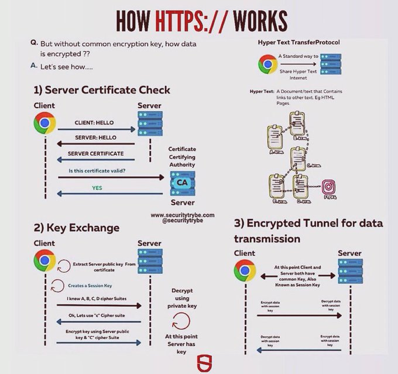

# tech_note_18708335

**Tweet URL:** [https://x.com/SecurityTrybe/status/1870833585361666405](https://x.com/SecurityTrybe/status/1870833585361666405)

**Tweet Text:** HOW HTTPS:// WORKS

**Image 1 Description:** The image is an infographic that explains how HTTPS (Hypertext Transfer Protocol Secure) works, providing a step-by-step guide on the process. The title "HOW HTTPS:// WORKS" is prominently displayed at the top.

**Step 1: Server Certificate Check**
The first step involves checking the server's certificate to ensure it is valid and trusted by the client. This process ensures that the connection between the client and server is secure.

**Step 2: Key Exchange**
Once the server's certificate has been verified, the next step is a key exchange between the client and server. This process establishes a shared secret key used for encrypting and decrypting data transmitted over the network.

**Step 3: Data Transmission**
After the key exchange is complete, data can be transmitted securely between the client and server. The data is encrypted using the shared secret key, ensuring that only authorized parties can access it.

Overall, the infographic provides a clear and concise explanation of how HTTPS works, highlighting the importance of certificate verification and key exchange in establishing secure connections over the internet. By following these steps, users can ensure their online interactions are protected from unauthorized access or eavesdropping.

