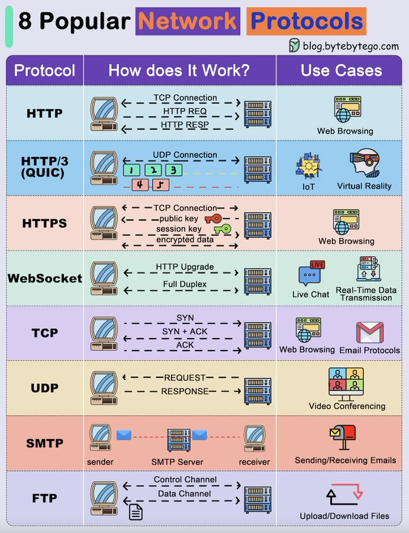

# tech_note_18756005

**Tweet URL:** [https://x.com/alexxubyte/status/1875600551146352755](https://x.com/alexxubyte/status/1875600551146352755)

**Tweet Text:** Explaining 8 Popular Network Protocols in 1 Diagram.

**Image 1 Description:** The image presents a comprehensive overview of eight popular network protocols, organized into three columns: "Protocol," "How does it work?", and "Use Cases." The protocols are listed in the first column, with each subsequent column providing detailed information about how they function and their applications.

**Protocols**

*   HTTP
*   HTTPS
*   WebSocket
*   TCP
*   UDP
*   SMTP
*   FTP

**How does it work?**

*   **HTTP**
    *   Request-Response Model: Client sends a request to the server, which responds with the requested data.
    *   Request and Response Format: HTTP requests are typically sent using GET or POST methods, while responses contain headers and body data.
*   **HTTPS**
    *   Secure Connection Establishment: HTTPS establishes a secure connection between the client and server using SSL/TLS encryption.
    *   Data Encryption: All communication is encrypted to ensure confidentiality and integrity of data.
*   **WebSocket**
    *   Bidirectional Communication: WebSocket enables bidirectional communication between clients and servers, allowing for real-time updates and notifications.
    *   Connection Establishment: WebSocket connections are established over a TCP connection.
*   **TCP**
    *   Connection-Oriented Protocol: TCP ensures reliable data transfer by establishing a connection between the client and server before transmitting data.
    *   Error Correction: TCP uses error correction mechanisms to ensure that data is delivered correctly.
*   **UDP**
    *   Connectionless Protocol: UDP does not establish a connection before transmitting data, making it suitable for applications where speed is more important than reliability.
    *   Best-Effort Delivery: UDP delivers packets in the order they are received, without ensuring delivery or retransmission of lost packets.
*   **SMTP**
    *   Email Transfer Protocol: SMTP is used to send and receive email messages between mail servers.
    *   Message Format: SMTP messages consist of a header section and a body section, containing sender and recipient information, subject lines, and message bodies.
*   **FTP**
    *   File Transfer Protocol: FTP enables the transfer of files over networks using a client-server model.
    *   Connection Establishment: FTP connections are established over a TCP connection.

**Use Cases**

*   **HTTP**
    *   Web Browsing
*   **HTTPS**
    *   Secure Online Transactions
*   **WebSocket**
    *   Real-Time Updates and Notifications
*   **TCP**
    *   Reliable Data Transfer for Critical Applications
*   **UDP**
    *   Fast Delivery of Non-Critical Data
*   **SMTP**
    *   Email Communication
*   **FTP**
    *   File Sharing and Management

In summary, the image provides a concise overview of eight popular network protocols, including their functions, how they work, and their use cases. The protocols covered are HTTP, HTTPS, WebSocket, TCP, UDP, SMTP, and FTP, each with its unique characteristics and applications.

